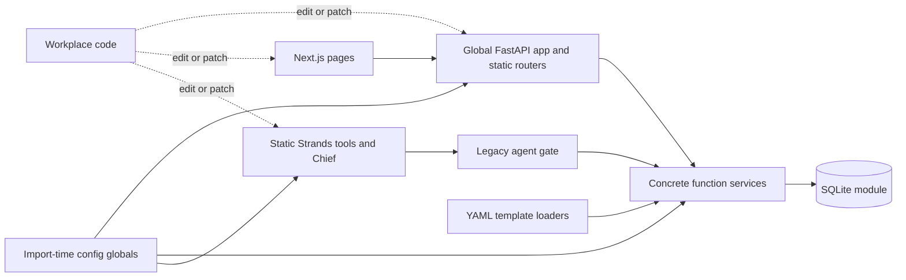
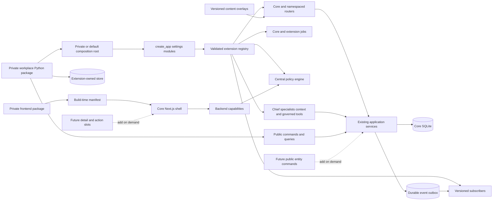

# Workplace extensibility results

Assessment date: 2026-08-11

Base branch: `main`

Base commit: `d3b0f2ebbb6437b9ba34afb398d548ec955d3ae3`

Feature branch: `feature/workplace-extensibility`

First-review commit: `8e5feec`

Second-review commit: `952ff3a`

The remediation commit and final report commit are recorded after the second
independent review.

The report commit is necessarily newer than the commit named above. Use
`git rev-parse HEAD` for the exact branch head that contains this file.

Historical assessment: `docs/WORKPLACE-EXTENSIBILITY.md`

Execution plan: `docs/exec-plans/workplace-extensibility.md`

## 1. Executive verdict

| Measure | Historical | Provisional remediated score | Explanation |
|---|---:|---:|---|
| Overall modularity | 5/10 | 8.3/10 | The application has an explicit composition root, typed concern-specific contracts, public work APIs, central policy, versioned events, isolated extension data, and build-time UI composition. Internal services still use concrete SQLite. |
| Workplace extensibility | 3/10 | 8.4/10 | A separate Atlas package exercises backend, agent, approval, data, workflow, content, frontend, and deployment extensions. Public commands and UI slots do not yet cover every core entity or screen. |
| Upgradeability without forking | 4/10 | 8.3/10 | Backend and frontend manifests declare honest compatibility ranges. Installed wheels, installed startup, two compatible core artifacts, and packed frontend packages pass contract tests. Production release history does not exist yet. |

Verdict: **Extendable with limitations**.

Skein can now support a private workplace repository without editing core for
the tested scenarios. The safest current extensions are integrations, policy,
identity mapping, governed tools, specialists, task-linked data, versioned
content, private routes, jobs, events, navigation, and dashboard cards.

A workplace still needs a core contribution for a new public command on an
unsupported entity or for a new frontend slot. Timers, parallel workflow
branches, and service-level escalation need more architecture.

These scores are candidates. The final conservative scores are the lower of
these scores and the median final-review scores. Section 14 records that
calculation after review.

### Scoring rubric

- 1–2: Static implementation. Workplace changes require core edits.
- 3–4: Some configuration seams. A long-lived fork remains likely.
- 5–6: Several real seams. Important adoption scenarios still edit core.
- 7: A private package is practical for a limited, documented set of concerns.
- 8: Representative private extensions work through versioned contracts and tests.
- 9: Broad contracts have multi-release and production evidence.
- 10: Mature ecosystem evidence exists across several independent deployments.

This feature branch cannot score above 9. It has no multi-release production
history.

## 2. Current architecture map

### Before this work



Separate directories existed, but runtime registration was static. An external
package had no supported composition root.

### Implemented architecture

Solid arrows exist now. Dashed arrows are a recommended future addition.



### Dependency direction

- Core composition owns internal services and adapters.
- A private backend imports only `app.extensions`, `app.public`, and
  `app.main.create_app`.
- Core never imports `atlas_skein` or another workplace package.
- The frontend generator imports only packages named by the deployment build.
- Extension data cannot open either Skein database path.
- Internal services still depend on the concrete `app.db` module. This remains
  an internal implementation choice, not a public extension contract.

## 3. Modularity scorecard

| Area | Current modularity | Existing extension mechanism | Coupling or limitation | Can extend without core changes? | Recommended mechanism | Priority |
|---|---:|---|---|---|---|---|
| Domain model | 4/5 | Typed task commands, views, references, and events | Public facade covers tasks first, not every entity | Yes for task-linked behavior | Public command or core contribution on demand | Medium |
| Service layer | 4/5 | `WorkItems` facade over existing services | Most internal services return dictionaries and import `app.db` | Yes for supported task work | Add narrow public facades only for real needs | Medium |
| Persistence | 4/5 | Extension-owned store and migration stream | Core database replacement is not public | Yes for private data | Separate store or external service | Medium |
| API | 4/5 | Namespaced `RouteContribution` | A private route is trusted in-process code | Yes | Backend module with explicit allowlist | Low |
| Authentication | 4/5 | Existing OIDC settings plus identity mapper | Token validator itself is core-owned | Yes for group and claim mapping | Configuration and identity contribution | Low |
| Authorization | 4/5 | Central policy plus legacy core checks | Specialized auth and webhook gates remain separate | Yes | Policy definition | Low |
| Integrations | 4/5 | Job, public work facade, events, routes | Public commands cover task work first | Yes for tested adapter | Integration adapter or external service | Medium |
| Activity and provenance | 4/5 | Shared service path and workflow activity | Arbitrary external side effects need their own receipt | Yes | Public command plus event subscriber | Low |
| Agent registration | 4/5 | `SpecialistContribution` | No dynamic untrusted agent loading | Yes | Agent plugin in trusted module | Low |
| Tool registration | 4/5 | Governed tool and MCP metadata | In-process handlers remain trusted code | Yes | Agent or tool plugin | Medium |
| Prompt configuration | 4/5 | Specialist prompts, persona overlays, context providers | Core Chief prompt is not replaced | Yes | Agent contribution or content overlay | Low |
| Playbooks | 4/5 | Versioned YAML plus four typed workflow steps | No timers or parallel branches | Yes for bounded workflows | Declarative playbook plus workflow action | Medium |
| Frontend navigation | 4/5 | Build-time manifest | Trusted build required | Yes | Frontend extension | Low |
| Frontend components | 3/5 | Stable card primitive and dashboard card slot | No detail-panel, form, or general route slot | Only for current slots | Add narrow frontend slot on demand | Medium |
| Custom fields | 4/5 | Stable IDs, sparse metadata guidance, private tables | No generic core custom-field UI | Yes outside core schema | Extension-owned data | Medium |
| Policy enforcement | 4/5 | REST route class, tools, MCP, workflows, capabilities | Auth bootstrap and signed webhooks use separate gates | Yes | Policy definition | Low |
| Deployment | 4/5 | Wheels, packed frontend package, derivative image, Kustomize | Frontend needs a compatible build-stage input | Yes | Package plus deployment overlay | Medium |
| Observability | 3/5 | Existing OpenTelemetry plus job and event receipts | No extension-specific metric registry | Partly | Existing telemetry or external collector | Low |

No area receives 5/5. The contracts have one reference package and one release
line, but not independent production consumers across releases.

## 4. Evidence from the codebase

### Confirmed findings

| Conclusion | Evidence |
|---|---|
| Application creation is explicit and backward compatible | `backend/app/main.py::create_app`, `lifespan`, and `app = create_app()` |
| Settings used for composition are immutable | `backend/app/extensions/contracts.py::AppSettings` |
| Contribution types are concern-specific | `RouteContribution`, `JobContribution`, `PolicyContribution`, `ToolContribution`, `EventContribution`, and other contracts in `backend/app/extensions/contracts.py` |
| Startup validates compatibility and collisions | `backend/app/extensions/registry.py::ExtensionRegistry.build` and `_validate_module` |
| Core routes and jobs use contribution shapes | `backend/app/extensions/core.py::core_module` and `backend/app/main.py::_job_specs` |
| Authenticated core operations use workplace policy | `backend/app/extensions/fastapi.py::PolicyAPIRoute` and `enforce_mutation_policy`; used by `routes/api.py` and `routes/private.py` |
| Identity groups can map to private roles and capabilities | `ExtensionRegistry.identity_attributes` and `extensions/fastapi.py::subject_for` |
| Existing agent authority maps into the default policy | `backend/app/extensions/policy.py::CorePolicy` and `backend/app/tools/_gate.py` |
| Contributed tools are governed | `backend/app/extensions/tools.py::execute_tool` validates schemas, agent allowlists, capabilities, policy, timeout, output, and safe errors |
| MCP tools need metadata and support durable review | `backend/app/agents/mcp_tools.py::MCPToolMetadata`, `GovernedMCPTool`, and `execute_reviewed_mcp` |
| Specialists join the Chief without private imports | `backend/app/extensions/agents.py` and `backend/app/agents/team_agent.py::build_agent` |
| Task commands are public and typed | `backend/app/public/work.py::WorkItems`, `CreateTaskCommand`, `UpdateTaskCommand`, and `TaskView` |
| All shared task writes emit safe events | `backend/app/services/work.py::_emit_task_event`; REST and built-in tools use the same service |
| Event delivery is durable, policy-gated, and idempotent | `backend/app/core_migrations/012_extension_outbox.sql` and `backend/app/public/events.py::dispatch_events` |
| Extension stores are isolated | `backend/app/extensions/data.py::ExtensionStore._make_sure_is_separate` |
| Workflow actions are typed and exact grants fail closed | `backend/app/public/workflow.py::WorkflowEngine` and `approval_fingerprint` |
| Content has explicit version validation | `backend/app/content.py`, `services/playbooks.py`, `services/personas.py`, and `services/flocks.py` |
| Frontend extensions compose before build | `frontend/scripts/compose-extensions.mjs` and `frontend/extensions/generated.ts` |
| Frontend compatibility and collisions are checked | `frontend/lib/extensions/registry.ts::registerFrontendExtensions` |
| UI contributions fail closed on capability errors | `frontend/lib/extensions/context.tsx::ExtensionProvider` |
| A separate package exercises the contracts | `examples/workplace-extension/` and `backend/tests/test_reference_workplace_extension.py` |
| Released artifacts compose without a source merge | `scripts/reference-extension-contract.sh` builds, installs in a normal virtual environment, migrates, and checks separate wheels |
| The core wheel contains migrations and stock content | `backend/pyproject.toml`, `backend/app/core_migrations`, and the installed-wheel lifespan rehearsal |

### Inferences

- A private repository can remain separate if it imports only documented
  modules and pins the declared compatibility ranges.
- Merge conflicts should be uncommon because workplace logic does not live in
  core files. Contract changes can still require private-package changes.
- A large integration should prefer an external service when it needs separate
  network policy, credentials, scaling, or failure isolation.
- SQLite remains adequate for the current outbox and extension example. This
  does not prove suitability for a much larger deployment.

### Areas not verified

- No real employer system, IdP, Jira, SAP, PLM, MES, Slack, Teams, or MCP server
  was contacted. Tests use fictional clients and contract fixtures.
- No package or image was published to an external registry.
- No production load, hostile plugin, disaster recovery, or multi-worker test
  was run for the extension scheduler and outbox.
- No compatible second released Skein version exists. The rehearsal changes
  artifact inputs and upgrades schemas, but it cannot prove a real two-release
  history.
- Kubernetes manifests were reviewed and parsed as text. No live cluster was
  available.

## 5. Genuine extension points

| Extension point | Registration and lifecycle | Allows | Does not allow | External stability |
|---|---|---|---|---|
| `SkeinModule` | Explicit tuple passed to `create_app` | Trusted module composition | Automatic discovery | Versioned and tested |
| Routes | Router in `RouteContribution`; included at factory time | Namespaced HTTP APIs | Core route replacement | Versioned and tested |
| Jobs | `JobContribution`; scheduler starts in lifespan | Timed integration work and catch-up | Separate process isolation | Versioned and tested |
| Lifecycle | Startup and shutdown callbacks | Resource setup and cleanup | Untrusted code containment | Versioned, use sparingly |
| Policy | Ordered rules in `PolicyEngine` | Permit, deny, review, reasons, obligations | Override a stronger core result | Versioned and tested |
| Identity | Mappers run after core identity validation | Roles, capabilities, attributes | Token validation bypass | Versioned and tested |
| Context | Named provider used by a specialist | Private read context | Direct agent mutation | Versioned and tested |
| Tools | Typed governed contributions | Private agent actions | Unknown write effects | Versioned and tested |
| Specialists | Registry definition | Prompt, context, tools, capability requirement | Patching Chief internals | Versioned and tested |
| Events | Versioned subscriber selection | Durable integration delivery | Synchronous core invariants | Versioned and tested |
| Migrations | Extension store plus numbered stream | Private structured data | Core database access | Versioned and tested |
| Workflow actions | Typed action registry | Bounded external calls | Arbitrary YAML code | Versioned and tested |
| Content overlays | Deployment directories and schema validator | Playbooks, personas, flocks | General custom code | Versioned content schema |
| Frontend manifest | Package list at `next build` | Navigation and manager cards | Arbitrary runtime JavaScript | Versioned and tested |

The contracts need release notes, compatibility tests, and deprecation notices
for each future change. `docs/EXTENSIONS.md` defines those rules.

## 6. Hidden coupling and fork risks

| Coupling | Requirement that exposes it | Maintenance consequence | Decoupling | Timing |
|---|---|---|---|---|
| Public commands cover tasks first | Private integration must create a blocker or decision | Extension may call REST or request a core addition | Add one typed public facade for the proven operation | When required |
| Frontend has two slots | Workplace needs a task detail panel or full manager route | Editing core UI would create a fork | Add a named slot with stable primitives and capability checks | Before that UI ships |
| Workflow state is durable only at review boundaries | A process needs timers or parallel branches | The bounded interpreter cannot express it | Add run IDs and step receipts for that proven need | Before complex workflows |
| Core internals use concrete SQLite | Workplace wants PostgreSQL as the core store | Large internal refactor is required | Define persistence ports only around proven replacement needs | Not now |
| Global config remains behind the default entry point | A process needs different model stacks per app | Some model services still use process settings | Add scoped provider settings for that proven need | When multi-app model hosting is real |
| In-process modules share process permissions | Integration is less trusted than Skein | A bug can read process files or memory | Run it as an external service with public APIs and events | Now for untrusted code |
| Approved extension work executes in the API process | The process stops after claim and before a remote side effect | Completion can be uncertain until retry | Add an idempotent worker boundary for remote high-risk actions | Before such an integration |
| Event schemas cover task changes first | Integration needs every core entity event | Polling or custom routes remain necessary | Add versioned events at the shared service path per entity | When required |
| Frontend needs build-stage core input | Private package only has a runtime image | It cannot add code after `next build` | Publish a versioned frontend build artifact or source package | Before external distribution |

The first five items are real limits, but they do not invalidate scenarios A
through H. Adding universal repository protocols or general UI slots now would
increase cost without evidence.

## 7. Recommended target architecture

The implemented design is the minimum viable target for workplace adoption.

### Ownership boundaries

Core owns these concerns:

- Domain invariants and existing application services
- Identity validation and core authorization
- Policy combination and enforcement adapters
- Public commands, queries, errors, and events
- Core schema and append-only migrations
- Extension registry validation
- Stable frontend types and UI primitives
- Compatibility and deprecation policy

The private workplace repository owns these concerns:

- Explicit composition root and module allowlist
- Organization policy and identity mappings
- Integration adapters and service credentials
- Specialist prompts, tools, and context sources
- Extension data and migration stream
- Workplace content overlays
- Frontend package and branding that current slots support
- Derivative builds and deployment overlays
- Contract tests against each pinned core release

### Runtime composition

Use explicit imports in one trusted composition root. Reject invalid versions,
dependencies, names, and collisions before serving traffic. Do not scan all
installed entry points.

### Policy

Keep one decision envelope for REST, tools, MCP, workflows, jobs, and
capability reporting. Keep core authorization checks after policy. A frontend
capability is never an enforcement decision.

### Events and integration delivery

Emit versioned events from the shared service transaction. Deliver through the
small SQLite outbox. Require subscriber idempotency. Adopt a remote broker only
if volume or independent consumers prove the need.

### Data and migrations

Keep core migrations append-only. Put structured private data in an
extension-owned database or external service. Use stable core IDs without
cross-database foreign keys. Use sparse namespaced metadata only for simple
annotations. Do not use generic EAV as a substitute for domain design.

### Frontend

Keep trusted build-time composition. Publish JavaScript and declarations from
private packages. Export only stable primitives. Add each new slot with a real
consumer and backend capability rule.

### Compatibility and testing

Use extension API versions and core version ranges. Test both range edges when
real releases exist. Keep breaking changes on a new API line. Retain a
compatibility adapter and documented deprecation period when practical.

## 8. Example repository structure

```text
skein-core/
├── backend/
│   ├── app/
│   │   ├── extensions/        # versioned composition contracts
│   │   └── public/            # commands, events, workflows, errors
│   └── app/core_migrations/   # append-only, package-owned core schema
├── frontend/
│   ├── lib/extensions/        # stable frontend contract and primitives
│   └── scripts/compose-extensions.mjs
└── docs/EXTENSIONS.md

skein-workplace/               # private repository
├── pyproject.toml              # depends on skein release range
├── extension.toml              # compatibility metadata
├── backend/
│   └── src/workplace_skein/
│       ├── app.py              # private create_app composition root
│       ├── module.py           # explicit contributions
│       ├── integrations/
│       ├── policy.py
│       └── agents/
├── data-migrations/            # private numbered stream
├── content/
│   ├── playbooks/
│   ├── personas/
│   └── flocks/
├── frontend/
│   ├── src/index.tsx
│   ├── dist/index.js
│   ├── dist/index.d.ts
│   └── package.json
├── deployment/
│   ├── Dockerfile
│   ├── kustomization.yaml
│   ├── values.yaml
│   └── secret-references.yaml
└── tests/
    ├── test_contracts.py
    ├── test_policy.py
    ├── test_migrations.py
    └── test_upgrade.py
```

The private `app.py` imports its package and calls `create_app`. No core file
names the workplace package.

## 9. Example extension implementation

Atlas is the representative end-to-end example.

### Backend registration

`examples/workplace-extension/backend/src/atlas_skein/module.py::atlas_module`
returns one `SkeinModule`. It contributes a router, job, integration, policy,
identity mapper, context source, governed tool, specialist, event subscriber,
migration stream, and workflow action.

`atlas_skein/app.py` is the private composition root:

```python
app = create_app(
    modules=(atlas_module(AtlasSettings(Path(os.environ["ATLAS_SKEIN_DATA"]))),)
)
```

### Configuration and secrets

- `ATLAS_SKEIN_DATA` selects the private database.
- The deployment Secret supplies `ATLAS_API_TOKEN`.
- The core image and package ranges are pinned in deployment and package data.
- The module list remains an explicit allowlist.

### Data ownership

Atlas owns `work_links` and `sync_runs` in `atlas-extension.db`. Its version 1
and version 2 migrations do not enter the core migration stream. Tests prove
that the core database has no `work_links` table.

### Authorization

`atlas_skein/policy.py` maps verified directory groups into roles and
capabilities. The same rule controls dashboard access, synchronization, and
regulated release review.

### Agent-tool exposure

The Atlas sync tool declares schemas, write effect, high risk, policy action,
agent allowlist, capability, timeout, errors, receipt, and provenance. The
delivery specialist names the tool and context source. Core Chief code has no
Atlas import.

### Frontend exposure

`examples/workplace-extension/frontend/index.tsx` is the single source for the
compiled package in `dist`. It adds one navigation item and one manager
dashboard card. Both use the `atlas.dashboard.view` policy action.

### Tests and deployment

- `backend/tests/test_reference_workplace_extension.py` covers backend scenarios.
- `scripts/reference-extension-contract.sh` builds and installs separate wheels.
- `scripts/reference-frontend-contract.sh` compiles, packs, and imports both
  frontend packages in a clean directory.
- `deployment/Dockerfile` layers the private wheel on a core image.
- The Kustomize patch selects the private image and external Secret.

## 10. Prioritized remediation plan

### Delivered immediate improvements

| Change | Problem addressed | Benefit | Effort | Risk | Compatibility | Sequence |
|---|---|---|---:|---:|---|---:|
| Immutable settings and app factory | Global static composition | Testable default and private roots | Medium | Medium | Default `app` retained | 1 |
| Typed registries | Static lists and imports | Explicit trusted contributions | High | Medium | Core seeded through same shapes | 2 |
| Central policy | Split authorization decisions | One workplace decision envelope | High | High | Legacy checks retained | 3 |
| Governed tools and MCP | Unclassified remote effects | Fail-safe metadata and receipts | High | High | Existing classified tools preserved | 4 |
| Public task facade | Private imports and row shapes | Stable commands and views | Medium | Medium | Existing services retained | 5 |
| Versioned outbox | No durable integration delivery | Retry and idempotency contract | High | Medium | Additive migration | 6 |
| Isolated private data | Core schema churn | Independent private migrations | Medium | Low | No core table access | 7 |
| Bounded workflow steps | Static templates only | Conditions, policy, actions, checkpoints | Medium | Medium | Legacy YAML is version 1 | 8 |
| Frontend manifest | Every UI change edited core | Trusted navigation and cards | High | Medium | Empty default manifest | 9 |
| Reference package and rehearsal | Documentation-only claims | Executable A–H evidence | High | Low | Separate artifacts | 10 |

### Foundational changes completed before adoption

- Core and extension version metadata
- Startup collision and dependency checks
- Machine-readable public errors
- Shared REST, tool, workflow, MCP, and capability policy
- Safe versioned task events from the shared write transaction
- Core wheel migration packaging
- Contract and import-boundary tests
- Extension authoring and upgrade documentation

### Enhancements that can wait

- More public entity commands and events
- More frontend slots and stable primitives
- Timers and parallel branches in long-running workflows
- A frontend build-stage distribution artifact
- Extension metrics registration
- Alternative core persistence

Add one when a real private extension cannot use the current contracts.

### Ideas that would add unnecessary complexity now

- One universal plugin base class
- Automatic execution of all package entry points
- Direct private access to core SQLite
- A generic EAV store
- Remote runtime frontend modules
- Kafka for the current event volume
- Repository interfaces around every service
- A full workflow language
- A database or microservice rewrite

## 11. Final recommendation

Skein is safe to extend today within the documented version 1 surface. A
company can maintain a private package and deployment repository on top of a
released core version.

Safe current extensions include:

- Enterprise task integrations and event subscribers
- Organization policy and OIDC group mapping
- Namespaced private APIs and jobs
- Governed tools, MCP metadata, specialists, prompts, and context
- Extension-owned structured data and migrations
- Versioned playbooks, personas, and flocks
- Policy-aware navigation and manager dashboard cards
- Backend image layering and deployment overlays

Extensions likely to need a core contribution include:

- New public operations on unsupported core entities
- New frontend routes, detail panels, forms, or global terminology
- Durable multi-day workflow execution
- A replacement core database

The recommended boundary is simple. Core owns invariants, identity validation,
policy combination, public contracts, shared UI primitives, and compatibility.
The workplace owns integrations, organization policy, private data, content,
agents, frontend contributions, secrets, and deployment composition.

The three changes with the greatest benefit are now implemented:

1. Explicit `create_app(settings, modules)` composition with validated typed contributions.
2. One policy and governed-tool boundary across human and agent entry paths.
3. Public commands, versioned events, and extension-owned data that hide core SQLite.

### Scenario results and mechanism classification

| Scenario | Today without core edits? | Mechanism | Public contracts | Private location | Upgrade risk | Result |
|---|---|---|---|---|---|---|
| A. Enterprise integration | Yes | Integration adapter, job, event subscriber | `WorkItems`, `DomainEvent`, contributions | Private Python package | Contract-version risk | Pass |
| B. Custom approval | Yes | Policy definition and durable review | `PolicyInput`, `PolicyDecision`, review result | Private policy module | Action-name and schema-version risk | Pass |
| C. Manager dashboard | Yes for navigation and card | Frontend extension | `FrontendExtension`, capability API | Private npm package | Slot and API-version risk | Pass |
| D. Specialist agent | Yes | Agent and tool plugin | Specialist, context, tool contracts | Private Python package | Contract-version risk | Pass |
| E. Custom domain data | Yes | Extension-owned data | `ExtensionStore`, stable task IDs | Private database and migrations | Identifier and contract risk | Pass |
| F. Custom playbook | Yes for bounded steps | Declarative playbook plus action plugin | Workflow schema and action contract | Private content and Python package | Schema-version risk | Pass |
| G. Enterprise auth | Yes | Configuration, identity mapper, policy | OIDC config and identity contribution | Deployment and private policy | Claim/config risk | Pass |
| H. Core upgrade | Yes within declared range | Packages, compatibility check, deployment overlay | API versions and core range | Private repository | Real release changes | Pass in local rehearsal |

### Mechanism selection by customization area

| Customization | Preferred mechanism |
|---|---|
| Environment values and endpoints | Configuration |
| Controlled rollout | Feature flag |
| Static delivery template | Declarative playbook |
| Roles, approvals, and tool restrictions | Policy definition |
| Colors and marks within current tokens | Theme or branding package when a slot exists |
| Navigation or dashboard card | Frontend extension |
| Private route or scheduled work | Backend plugin |
| Jira, GitLab, SAP, or internal system | Integration adapter or external service |
| Specialist, prompt, context, or governed tool | Agent or tool plugin |
| Reaction to committed state | Event subscriber |
| Separately trusted network boundary | External service |
| Image tags, values, volumes, and Secret references | Deployment overlay |
| New invariant or missing stable core operation | Core contribution |
| Unsupported frontend slot or core store replacement | Unsupported without architectural change |

### Packaging and operational tradeoffs

| Approach | Use | Security | Operations and maintenance |
|---|---|---|---|
| Python package | Trusted backend logic | Same process permissions as core | Simple version pin and fast calls; one failure domain |
| TypeScript/JavaScript package | Trusted build-time UI | No remote runtime code | Requires rebuild for every package change |
| Backend image layering | Install private wheel on core image | Clear artifact boundary | Easy rollback; base image must contain required runtime tools |
| Separate extension service | Large or less-trusted integration | Separate credentials and network policy | More latency, deployment, monitoring, and failure handling |
| Sidecar | Local protocol adapter | Process isolation, shared pod boundary | Coupled scaling and lifecycle |
| Runtime Python loading | Not selected | High supply-chain risk | Flexible but harder to audit and reproduce |
| Build-time composition | Selected for frontend | CSP-friendly trusted code | Deterministic but needs a build pipeline |
| Helm or Kustomize | Environment and secret references | Keeps secrets outside images | Cannot replace application contracts |
| Feature flag | Safe rollout of composed features | Does not authorize actions | Useful after the extension is already installed |

## 12. Compatibility and upgrade evidence

`extension.toml`, `SkeinModule`, and `FrontendExtension` declare API and core
version ranges. Startup and build reject incompatible inputs.

`scripts/reference-extension-contract.sh` performs this rehearsal:

1. Build a Skein wheel.
2. Build an Atlas wheel.
3. Install both into a normal virtual environment outside the source trees.
4. Confirm package versions and requirements.
5. Enter the installed application lifespan and load stock content.
6. Compose Atlas through the installed public contracts.
7. Preserve Atlas data while core moves from `0.2.0` to a separate compatible
   `0.2.1` artifact.
8. Enter the upgraded installed application lifespan and confirm private data.

The packed frontend package also passes a production build through
`SKEIN_FRONTEND_EXTENSIONS=@atlas/skein-extension`.

## 13. Verification evidence

### Baseline

- Backend: 1,572 tests passed.
- Frontend: 225 tests passed.
- Playwright: 25 tests passed.
- Lint, types, dead code, content, theme, production build, wheel, and schema
  upgrade checks passed.

### Verification after first-review remediation

| Command | Result | Duration |
|---|---|---:|
| `backend/.venv/bin/pytest -q -n auto backend/tests` | 1,635 passed | 97.02 seconds |
| `npm test` | 229 passed in 45 files | 9.44 seconds |
| `npm run build` | Production build passed | 13.32 seconds |
| `./scripts/lint.sh` | Ruff, format, mypy, vulture, content, license, theme, TypeScript, ESLint, and knip passed | 14.49 seconds |
| `./scripts/reference-extension-contract.sh` | Installed startup and `0.2.0` to `0.2.1` core upgrade passed | 7.87 seconds |
| `./scripts/reference-frontend-contract.sh` | Public and Atlas packages compiled, packed, and production-built | 15.28 seconds |
| `./scripts/upgrade-path.sh d3b0f2e...` | Schemas identical; activity chain valid | 0.52 seconds |
| `uv build --wheel --out-dir /tmp/... backend` | Core wheel passed | 0.77 seconds |
| `PW_REUSE=1 npx playwright test --reporter=dot` | 25 passed in Chrome | 134.23 seconds |

The packed Atlas frontend package also passed a separate production build.
Atlas playbook, persona, and flock validation passed.

### Verification after second-review remediation

| Command | Result | Duration |
|---|---|---:|
| `backend/.venv/bin/pytest -q -n auto backend/tests` | 1,647 passed | 102.72 seconds |
| `npm --prefix frontend test -- --run` | 229 passed in 45 files | 11.51 seconds |
| `npm run build` | Production build passed | 13.52 seconds |
| `./scripts/lint.sh` | All backend, frontend, content, license, and theme checks passed | 12.94 seconds |
| `./scripts/reference-extension-contract.sh` | Normal installed startup and additive `0.2.0` to `0.2.1` upgrade passed | 14.66 seconds |
| `./scripts/reference-frontend-contract.sh` | Clean packed consumer and derivative production build passed | 15.18 seconds |
| `./scripts/upgrade-path.sh d3b0f2e...` | Schemas identical; activity chain valid | 0.57 seconds |
| `uv build --wheel --out-dir /tmp/skein-final-dist backend` | Core wheel passed | Passed |

### Verification after third-review remediation

| Command | Result | Duration |
|---|---|---:|
| `backend/.venv/bin/pytest -q -n auto backend/tests` | 1,671 passed | 104.92 seconds |
| `npm --prefix frontend test -- --run` | 229 passed in 45 files | 15.20 seconds |
| `npm run build` | Production build passed | 16.91 seconds |
| `./scripts/lint.sh` | All backend, frontend, content, license, and theme checks passed | Passed |
| `./scripts/reference-extension-contract.sh` | Full installed `0.2.0` to `0.2.1` Atlas upgrade passed | 17.71 seconds |
| `./scripts/reference-frontend-contract.sh` | Unchanged Atlas package built on frontend hosts `0.2.0` and `0.2.1` | 43.76 seconds |
| `./scripts/upgrade-path.sh d3b0f2e...` | Schemas identical; activity chain valid | 0.51 seconds |
| `uv build --wheel --out-dir /tmp/skein-final-remediation-dist backend` | Core wheel passed | Passed |

## 14. Independent review

The first review rejected commit `8e5feec`.

| Reviewer | Modularity | Workplace | Upgradeability | Decision |
|---|---:|---:|---:|---|
| Architecture | 6.8 | 6.2 | 5.5 | Reject |
| Security | 6.8 | 5.8 | 6.8 | Reject |
| Compatibility | 6.6 | 5.9 | 5.4 | Reject |
| Adversarial extension author | 7.0 | 6.5 | 6.5 | Reject |

The reviewers found real blockers. The frontend used the wrong capability
shape. The installed wheel could not start. The upgrade script did not upgrade
core. Policy and identity context did not reach all execution paths. Tool and
workflow reviews could not resume. Specialist and MCP controls were
incomplete.

The remediation added tests for each blocker. It also added installed startup,
two-core-artifact upgrade, approval and resume, OIDC group approval, composed
job policy, specialist identity reservation, successful MCP receipts, truthful
timeout status, per-subscriber retries, and strict content validation.

The second review rejected commit `952ff3a`.

| Reviewer | Modularity | Workplace | Upgradeability | Decision |
|---|---:|---:|---:|---|
| Architecture and extension author | 7.6 | 7.3 | 7.4 | Reject |
| Security and provenance | 7.4 | 6.9 | 7.5 | Reject |
| Compatibility and reliability | 7.8 | 7.6 | 6.8 | Reject |
| Adversarial score auditor | 7.3 | 6.8 | 5.8 | Reject |

The second remediation binds approvals to exact inputs and policy results. It
adds durable MCP reviews, background pre-handler policy gates, route service
injection, authoritative task context, keyless specialist safety, and review
audiences. The installed rehearsal now uses a normal virtual environment and
an additive compatible-release migration.

The third review rejected commit `4f1374f`.

| Reviewer | Modularity | Workplace | Upgradeability | Decision |
|---|---:|---:|---:|---|
| Compatibility and reliability | 8.2 | 8.1 | 8.3 | Approve |
| Security and provenance | 7.5 | 6.8 | 7.4 | Reject |
| Extension author | 8.1 | 7.8 | 7.7 | Reject |
| Adversarial score auditor | 7.8 | 7.5 | 7.1 | Reject |

The third remediation binds core approvals to current policy and identity. It
governs keyless capture, isolates service identities, binds reviewed MCP calls
to one server, refreshes directory groups, and reports uncertain write results
truthfully. It also adds nested workflow validation, narrow lifecycle context,
versioned frontend host artifacts, and two-version frontend production builds.

The final four-reviewer report is pending.

## 15. Remaining limitations and deferred work

- Public command and event coverage is task-first.
- Frontend version 1 has navigation and manager dashboard card slots only.
- Version 1 workflow support has no timers or parallel branches.
- Core persistence remains concrete SQLite.
- In-process extensions are fully trusted code.
- Published frontend host images and archives do not have production release
  history yet. Local versioned artifacts pass the upgrade rehearsal.
- Production scale and real enterprise credentials remain unverified.

These are explicit limits, not hidden extension claims.

## 16. Explicit non-goals

This work did not add a universal plugin class, automatic entry-point loading,
direct extension access to core SQLite, EAV storage, arbitrary runtime browser
code, Kafka, a full workflow language, PostgreSQL, or a microservice rewrite.

## 17. Instructions for a real private workplace repository

1. Copy the structure in section 8, not the Skein source.
2. Pin released backend, frontend, and image inputs.
3. Declare compatible API and core ranges.
4. Import only the documented public modules and frontend alias.
5. Keep one explicit composition root and module allowlist.
6. Put structured private data in an owned store.
7. Put credentials in the deployment secret manager.
8. Run import-boundary, policy, migration, artifact, and frontend build tests.
9. Validate content in CI.
10. Rehearse every core upgrade before deployment.

Full authoring instructions are in `docs/EXTENSIONS.md`.

## 18. Hard blockers

No hard external blocker is known. Live enterprise integrations and a second
published core release were unavailable. Local fakes and two separately built
compatible core artifacts test the contract. This report does not claim
production or multi-release evidence.
