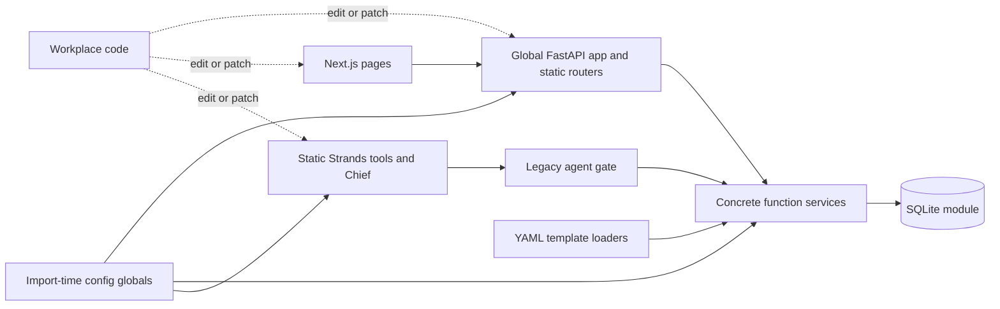
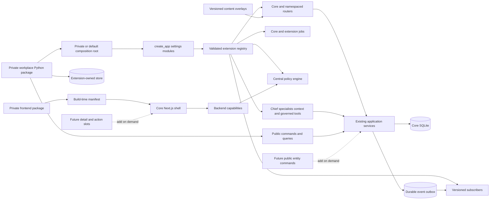

# Workplace extensibility results

Assessment date: 2026-08-11

Base branch: `main`

Base commit: `d3b0f2ebbb6437b9ba34afb398d548ec955d3ae3`

Feature branch: `feature/workplace-extensibility`

First-review commit: `8e5feec`

Second-review commit: `952ff3a`

Third-review commit: `4f1374f`

Fourth-review commit: `62e352e`

Fifth-review commit: `1a897b0`

Sixth-review commit: `d4deff1`

Seventh-review commit: `4c7a450`

Eighth-review commit: `5493d61`

The final remediation and report commits are recorded after the final
independent review.

The report commit is necessarily newer than the commit named above. Use
`git rev-parse HEAD` for the exact branch head that contains this file.

Historical assessment: `docs/WORKPLACE-EXTENSIBILITY.md`

Execution plan: `docs/exec-plans/workplace-extensibility.md`

## 1. Executive verdict

| Measure | Historical | Provisional remediated score | Explanation |
|---|---:|---:|---|
| Overall modularity | 5/10 | 8.3/10 | The application has an explicit composition root, typed concern-specific contracts, public work APIs, central policy, versioned events, isolated extension data, and build-time UI composition. Internal services still use concrete SQLite. |
| Workplace extensibility | 3/10 | 8.4/10 | A separate Atlas package exercises backend, agent, approval, data, workflow, content, frontend, and deployment extensions. Public commands and UI slots do not yet cover every core entity or screen. |
| Upgradeability without forking | 4/10 | 8.3/10 | Backend and frontend manifests declare honest compatibility ranges. Installed wheels, installed startup, two compatible core artifacts, and packed frontend packages pass contract tests. Production release history does not exist yet. |

Verdict: **Extendable with limitations**.

Skein can now support a private workplace repository without editing core for
the tested scenarios. The safest current extensions are integrations, policy,
identity mapping, governed tools, specialists, task-linked data, versioned
content, private routes, jobs, events, navigation, and dashboard cards.

A workplace still needs a core contribution for a new public command on an
unsupported entity or for a new frontend slot. Timers, parallel workflow
branches, and service-level escalation need more architecture.

These scores are candidates. The final conservative scores are the lower of
these scores and the median final-review scores. Section 14 records that
calculation after review.

### Scoring rubric

- 1–2: Static implementation. Workplace changes require core edits.
- 3–4: Some configuration seams. A long-lived fork remains likely.
- 5–6: Several real seams. Important adoption scenarios still edit core.
- 7: A private package is practical for a limited, documented set of concerns.
- 8: Representative private extensions work through versioned contracts and tests.
- 9: Broad contracts have multi-release and production evidence.
- 10: Mature ecosystem evidence exists across several independent deployments.

This feature branch cannot score above 9. It has no multi-release production
history.

## 2. Current architecture map

### Before this work



Separate directories existed, but runtime registration was static. An external
package had no supported composition root.

### Implemented architecture

Solid arrows exist now. Dashed arrows are a recommended future addition.



### Dependency direction

- Core composition owns internal services and adapters.
- A private backend imports only `app.extensions`, `app.public`, and
  `app.main.create_app`.
- Core never imports `atlas_skein` or another workplace package.
- The frontend generator imports only packages named by the deployment build.
- Extension data cannot open either Skein database path.
- Internal services still depend on the concrete `app.db` module. This remains
  an internal implementation choice, not a public extension contract.

## 3. Modularity scorecard

| Area | Current modularity | Existing extension mechanism | Coupling or limitation | Can extend without core changes? | Recommended mechanism | Priority |
|---|---:|---|---|---|---|---|
| Domain model | 4/5 | Typed task commands, views, references, and events | Public facade covers tasks first, not every entity | Yes for task-linked behavior | Public command or core contribution on demand | Medium |
| Service layer | 4/5 | `WorkItems` facade over existing services | Most internal services return dictionaries and import `app.db` | Yes for supported task work | Add narrow public facades only for real needs | Medium |
| Persistence | 4/5 | Extension-owned store and migration stream | Core database replacement is not public | Yes for private data | Separate store or external service | Medium |
| API | 4/5 | Namespaced `RouteContribution` | A private route is trusted in-process code | Yes | Backend module with explicit allowlist | Low |
| Authentication | 4/5 | Existing OIDC settings plus identity mapper | Token validator itself is core-owned | Yes for group and claim mapping | Configuration and identity contribution | Low |
| Authorization | 4/5 | Central policy plus legacy core checks | Specialized auth and webhook gates remain separate | Yes | Policy definition | Low |
| Integrations | 4/5 | Job, public work facade, events, routes | Public commands cover task work first | Yes for tested adapter | Integration adapter or external service | Medium |
| Activity and provenance | 4/5 | Shared service path and workflow activity | Arbitrary external side effects need their own receipt | Yes | Public command plus event subscriber | Low |
| Agent registration | 4/5 | `SpecialistContribution` | No dynamic untrusted agent loading | Yes | Agent plugin in trusted module | Low |
| Tool registration | 4/5 | Governed tool and MCP metadata | In-process handlers remain trusted code | Yes | Agent or tool plugin | Medium |
| Prompt configuration | 4/5 | Specialist prompts, persona overlays, context providers | Core Chief prompt is not replaced | Yes | Agent contribution or content overlay | Low |
| Playbooks | 4/5 | Versioned YAML plus four typed workflow steps | No timers or parallel branches | Yes for bounded workflows | Declarative playbook plus workflow action | Medium |
| Frontend navigation | 4/5 | Build-time manifest | Trusted build required | Yes | Frontend extension | Low |
| Frontend components | 3/5 | Stable card primitive and dashboard card slot | No detail-panel, form, or general route slot | Only for current slots | Add narrow frontend slot on demand | Medium |
| Custom fields | 4/5 | Stable IDs, sparse metadata guidance, private tables | No generic core custom-field UI | Yes outside core schema | Extension-owned data | Medium |
| Policy enforcement | 4/5 | REST, stock and contributed tools, MCP, workflows, signed integrations, capabilities | Direct routes and background work cannot resume a review | Yes | Policy definition | Low |
| Deployment | 4/5 | Wheels, packed frontend package, derivative image, Kustomize | Frontend needs a compatible build-stage input | Yes | Package plus deployment overlay | Medium |
| Observability | 3/5 | Existing OpenTelemetry plus job and event receipts | No extension-specific metric registry | Partly | Existing telemetry or external collector | Low |

No area receives 5/5. The contracts have one reference package and one release
line, but not independent production consumers across releases.

## 4. Evidence from the codebase

### Confirmed findings

| Conclusion | Evidence |
|---|---|
| Application creation is explicit and backward compatible | `backend/app/main.py::create_app`, `lifespan`, and `app = create_app()` |
| Settings used for composition are immutable | `backend/app/extensions/contracts.py::AppSettings` |
| Contribution types are concern-specific | `RouteContribution`, `JobContribution`, `PolicyContribution`, `ToolContribution`, `EventContribution`, and other contracts in `backend/app/extensions/contracts.py` |
| Startup validates compatibility and collisions | `backend/app/extensions/registry.py::ExtensionRegistry.build` and `_validate_module` |
| Core routes and jobs use contribution shapes | `backend/app/extensions/core.py::core_module` and `backend/app/main.py::_job_specs` |
| Authenticated core operations use workplace policy | `backend/app/extensions/fastapi.py::PolicyAPIRoute` and `enforce_mutation_policy`; used by `routes/api.py` and `routes/private.py` |
| Identity groups can map to private roles and capabilities | `ExtensionRegistry.identity_attributes` and `extensions/fastapi.py::subject_for` |
| Existing agent authority maps into the default policy | `backend/app/extensions/policy.py::CorePolicy` and `backend/app/tools/_gate.py` |
| Stock model-facing tools use workplace policy | `backend/app/agents/core_tools.py::GovernedCoreTool`, `govern_core_tools`, and `team_agent.py::build_agent` |
| Policy evaluates authoritative target state | `backend/app/services/policy_context.py::for_change`, `tools/_gate.py::gated_write`, and `services/review.py::_revalidate_policy` |
| Review identity assurance cannot increase | `PolicySubject.strong`, `source`, `refresh_required`, and `ExtensionRegistry.refresh_subject` |
| Contributed tools are governed | `backend/app/extensions/tools.py::execute_tool` validates schemas, agent allowlists, capabilities, policy, timeout, output, and safe errors |
| MCP tools need metadata and support durable review | `backend/app/agents/mcp_tools.py::MCPToolMetadata`, `GovernedMCPTool`, and `execute_reviewed_mcp` |
| Specialists join the Chief without private imports | `backend/app/extensions/agents.py` and `backend/app/agents/team_agent.py::build_agent` |
| Task commands are public and typed | `backend/app/public/work.py::WorkItems`, `CreateTaskCommand`, `UpdateTaskCommand`, and `TaskView` |
| All shared task writes emit safe events | `backend/app/services/work.py::_emit_task_event`; REST and built-in tools use the same service |
| Event delivery is durable, policy-gated, and idempotent | `backend/app/core_migrations/012_extension_outbox.sql` and `backend/app/public/events.py::dispatch_events` |
| Extension stores are isolated | `backend/app/extensions/data.py::ExtensionStore._make_sure_is_separate` |
| Workflow actions are typed and exact grants fail closed | `backend/app/public/workflow.py::WorkflowEngine` and `approval_fingerprint` |
| Content has explicit version validation | `backend/app/content.py`, `services/playbooks.py`, `services/personas.py`, and `services/flocks.py` |
| Frontend extensions compose before build | `frontend/scripts/compose-extensions.mjs` and `frontend/extensions/generated.ts` |
| Frontend compatibility and collisions are checked | `frontend/lib/extensions/registry.ts::registerFrontendExtensions` |
| UI contributions fail closed on capability errors | `frontend/lib/extensions/context.tsx::ExtensionProvider` |
| A separate package exercises the contracts | `examples/workplace-extension/` and `backend/tests/test_reference_workplace_extension.py` |
| Released artifacts compose without a source merge | `scripts/reference-extension-contract.sh` builds, installs in a normal virtual environment, migrates, and checks separate wheels |
| The core wheel contains migrations and stock content | `backend/pyproject.toml`, `backend/app/core_migrations`, and the installed-wheel lifespan rehearsal |

### Inferences

- A private repository can remain separate if it imports only documented
  modules and pins the declared compatibility ranges.
- Merge conflicts should be uncommon because workplace logic does not live in
  core files. Contract changes can still require private-package changes.
- A large integration should prefer an external service when it needs separate
  network policy, credentials, scaling, or failure isolation.
- SQLite remains adequate for the current outbox and extension example. This
  does not prove suitability for a much larger deployment.

### Areas not verified

- No real employer system, IdP, Jira, SAP, PLM, MES, Slack, Teams, or MCP server
  was contacted. Tests use fictional clients and contract fixtures.
- No package or image was published to an external registry.
- No production load, hostile plugin, disaster recovery, or multi-worker test
  was run for the extension scheduler and outbox.
- No compatible second released Skein version exists. The rehearsal changes
  artifact inputs and upgrades schemas, but it cannot prove a real two-release
  history.
- Standard Kustomize rendering and both derivative image builds passed. No
  live Kubernetes cluster was available.

## 5. Genuine extension points

| Extension point | Registration and lifecycle | Allows | Does not allow | External stability |
|---|---|---|---|---|
| `SkeinModule` | Explicit tuple passed to `create_app` | Trusted module composition | Automatic discovery | Versioned and tested |
| Routes | Router in `RouteContribution`; included at factory time | Namespaced HTTP APIs | Core route replacement | Versioned and tested |
| Jobs | `JobContribution`; scheduler starts in lifespan | Timed integration work and catch-up | Separate process isolation | Versioned and tested |
| Lifecycle | Startup and shutdown callbacks | Resource setup and cleanup | Untrusted code containment | Versioned, use sparingly |
| Policy | Ordered rules in `PolicyEngine` | Permit, deny, review, reasons, obligations | Override a stronger core result | Versioned and tested |
| Identity | Mappers run after core identity validation | Roles, capabilities, attributes | Token validation bypass | Versioned and tested |
| Context | Named provider used by a specialist | Private read context | Direct agent mutation | Versioned and tested |
| Tools | Typed governed contributions | Private agent actions | Unknown write effects | Versioned and tested |
| Specialists | Registry definition | Prompt, context, tools, capability requirement | Patching Chief internals | Versioned and tested |
| Events | Versioned subscriber selection | Durable integration delivery | Synchronous core invariants | Versioned and tested |
| Migrations | Extension store plus numbered stream | Private structured data | Core database access | Versioned and tested |
| Workflow actions | Typed action registry | Bounded external calls | Arbitrary YAML code | Versioned and tested |
| Content overlays | Deployment directories and schema validator | Playbooks, personas, flocks | General custom code | Versioned content schema |
| Frontend manifest | Package list at `next build` | Navigation and manager cards | Arbitrary runtime JavaScript | Versioned and tested |

The contracts need release notes, compatibility tests, and deprecation notices
for each future change. `docs/EXTENSIONS.md` defines those rules.

## 6. Hidden coupling and fork risks

| Coupling | Requirement that exposes it | Maintenance consequence | Decoupling | Timing |
|---|---|---|---|---|
| Public commands cover tasks first | Private integration must create a blocker or decision | Extension may call REST or request a core addition | Add one typed public facade for the proven operation | When required |
| Frontend has two slots | Workplace needs a task detail panel or full manager route | Editing core UI would create a fork | Add a named slot with stable primitives and capability checks | Before that UI ships |
| Workflow state is durable only at review boundaries | A process needs timers or parallel branches | The bounded interpreter cannot express it | Add run IDs and step receipts for that proven need | Before complex workflows |
| Core internals use concrete SQLite | Workplace wants PostgreSQL as the core store | Large internal refactor is required | Define persistence ports only around proven replacement needs | Not now |
| Global config remains behind the default entry point | A process needs different model stacks per app | Some model services still use process settings | Add scoped provider settings for that proven need | When multi-app model hosting is real |
| In-process modules share process permissions | Integration is less trusted than Skein | A bug can read process files or memory | Run it as an external service with public APIs and events | Now for untrusted code |
| Approved extension work executes in the API process | The process stops after claim and before a remote side effect | Completion can be uncertain until retry | Add an idempotent worker boundary for remote high-risk actions | Before such an integration |
| Event schemas cover task changes first | Integration needs every core entity event | Polling or custom routes remain necessary | Add versioned events at the shared service path per entity | When required |
| Frontend needs build-stage core input | Private package only has a runtime image | It cannot add code after `next build` | Publish a versioned frontend build artifact or source package | Before external distribution |

The first five items are real limits, but they do not invalidate scenarios A
through H. Adding universal repository protocols or general UI slots now would
increase cost without evidence.

## 7. Recommended target architecture

The implemented design is the minimum viable target for workplace adoption.

### Ownership boundaries

Core owns these concerns:

- Domain invariants and existing application services
- Identity validation and core authorization
- Policy combination and enforcement adapters
- Public commands, queries, errors, and events
- Core schema and append-only migrations
- Extension registry validation
- Stable frontend types and UI primitives
- Compatibility and deprecation policy

The private workplace repository owns these concerns:

- Explicit composition root and module allowlist
- Organization policy and identity mappings
- Integration adapters and service credentials
- Specialist prompts, tools, and context sources
- Extension data and migration stream
- Workplace content overlays
- Frontend package and branding that current slots support
- Derivative builds and deployment overlays
- Contract tests against each pinned core release

### Runtime composition

Use explicit imports in one trusted composition root. Reject invalid versions,
dependencies, names, and collisions before serving traffic. Do not scan all
installed entry points.

### Policy

Keep one decision envelope for REST, tools, MCP, workflows, jobs, and
capability reporting. Keep core authorization checks after policy. A frontend
capability is never an enforcement decision.

### Events and integration delivery

Emit versioned events from the shared service transaction. Deliver through the
small SQLite outbox. Require subscriber idempotency. Adopt a remote broker only
if volume or independent consumers prove the need.

### Data and migrations

Keep core migrations append-only. Put structured private data in an
extension-owned database or external service. Use stable core IDs without
cross-database foreign keys. Use sparse namespaced metadata only for simple
annotations. Do not use generic EAV as a substitute for domain design.

### Frontend

Keep trusted build-time composition. Publish JavaScript and declarations from
private packages. Export only stable primitives. Add each new slot with a real
consumer and backend capability rule.

### Compatibility and testing

Use extension API versions and core version ranges. Test both range edges when
real releases exist. Keep breaking changes on a new API line. Retain a
compatibility adapter and documented deprecation period when practical.

## 8. Example repository structure

```text
skein-core/
├── backend/
│   ├── app/
│   │   ├── extensions/        # versioned composition contracts
│   │   └── public/            # commands, events, workflows, errors
│   └── app/core_migrations/   # append-only, package-owned core schema
├── frontend/
│   ├── lib/extensions/        # stable frontend contract and primitives
│   └── scripts/compose-extensions.mjs
└── docs/EXTENSIONS.md

skein-workplace/               # private repository
├── pyproject.toml              # depends on skein release range
├── extension.toml              # compatibility metadata
├── backend/
│   └── src/workplace_skein/
│       ├── app.py              # private create_app composition root
│       ├── module.py           # explicit contributions
│       ├── integrations/
│       ├── policy.py
│       └── agents/
├── data-migrations/            # private numbered stream
├── content/
│   ├── playbooks/
│   ├── personas/
│   └── flocks/
├── frontend/
│   ├── src/index.tsx
│   ├── dist/index.js
│   ├── dist/index.d.ts
│   └── package.json
├── deployment/
│   ├── Dockerfile
│   ├── kustomization.yaml
│   ├── values.yaml
│   └── secret-references.yaml
└── tests/
    ├── test_contracts.py
    ├── test_policy.py
    ├── test_migrations.py
    └── test_upgrade.py
```

The private `app.py` imports its package and calls `create_app`. No core file
names the workplace package.

## 9. Example extension implementation

Atlas is the representative end-to-end example.

### Backend registration

`examples/workplace-extension/backend/src/atlas_skein/module.py::atlas_module`
returns one `SkeinModule`. It contributes a router, job, integration, policy,
identity mapper, context source, governed tool, specialist, event subscriber,
migration stream, and workflow action.

`atlas_skein/app.py` is the private composition root:

```python
app = create_app(
    modules=(atlas_module(AtlasSettings(Path(os.environ["ATLAS_SKEIN_DATA"]))),)
)
```

### Configuration and secrets

- `ATLAS_SKEIN_DATA` selects the private database.
- The deployment Secret supplies `ATLAS_API_TOKEN`.
- The core image and package ranges are pinned in deployment and package data.
- The module list remains an explicit allowlist.

### Data ownership

Atlas owns `work_links` and `sync_runs` in `atlas-extension.db`. Its version 1
and version 2 migrations do not enter the core migration stream. Tests prove
that the core database has no `work_links` table.

### Authorization

`atlas_skein/policy.py` maps verified directory groups into roles and
capabilities. The same rule controls dashboard access, synchronization, and
regulated release review.

### Agent-tool exposure

The Atlas sync tool declares schemas, write effect, high risk, policy action,
agent allowlist, capability, timeout, errors, receipt, and provenance. The
delivery specialist names the tool and context source. Core Chief code has no
Atlas import.

### Frontend exposure

`examples/workplace-extension/frontend/index.tsx` is the single source for the
compiled package in `dist`. It adds one navigation item and one manager
dashboard card. Both use the `atlas.dashboard.view` policy action.

### Tests and deployment

- `backend/tests/test_reference_workplace_extension.py` covers backend scenarios.
- `scripts/reference-extension-contract.sh` builds and installs separate wheels.
- `scripts/reference-frontend-contract.sh` compiles, packs, and imports both
  frontend packages in a clean directory.
- `deployment/Dockerfile` layers the private wheel on a core image.
- The Kustomize patch selects the private image and external Secret.

## 10. Prioritized remediation plan

### Delivered immediate improvements

| Change | Problem addressed | Benefit | Effort | Risk | Compatibility | Sequence |
|---|---|---|---:|---:|---|---:|
| Immutable settings and app factory | Global static composition | Testable default and private roots | Medium | Medium | Default `app` retained | 1 |
| Typed registries | Static lists and imports | Explicit trusted contributions | High | Medium | Core seeded through same shapes | 2 |
| Central policy | Split authorization decisions | One workplace decision envelope | High | High | Legacy checks retained | 3 |
| Governed tools and MCP | Unclassified remote effects | Fail-safe metadata and receipts | High | High | Existing classified tools preserved | 4 |
| Public task facade | Private imports and row shapes | Stable commands and views | Medium | Medium | Existing services retained | 5 |
| Versioned outbox | No durable integration delivery | Retry and idempotency contract | High | Medium | Additive migration | 6 |
| Isolated private data | Core schema churn | Independent private migrations | Medium | Low | No core table access | 7 |
| Bounded workflow steps | Static templates only | Conditions, policy, actions, checkpoints | Medium | Medium | Legacy YAML is version 1 | 8 |
| Frontend manifest | Every UI change edited core | Trusted navigation and cards | High | Medium | Empty default manifest | 9 |
| Reference package and rehearsal | Documentation-only claims | Executable A–H evidence | High | Low | Separate artifacts | 10 |

### Foundational changes completed before adoption

- Core and extension version metadata
- Startup collision and dependency checks
- Machine-readable public errors
- Shared REST, tool, workflow, MCP, and capability policy
- Safe versioned task events from the shared write transaction
- Core wheel migration packaging
- Contract and import-boundary tests
- Extension authoring and upgrade documentation

### Enhancements that can wait

- More public entity commands and events
- More frontend slots and stable primitives
- Timers and parallel branches in long-running workflows
- A frontend build-stage distribution artifact
- Extension metrics registration
- Alternative core persistence

Add one when a real private extension cannot use the current contracts.

### Ideas that would add unnecessary complexity now

- One universal plugin base class
- Automatic execution of all package entry points
- Direct private access to core SQLite
- A generic EAV store
- Remote runtime frontend modules
- Kafka for the current event volume
- Repository interfaces around every service
- A full workflow language
- A database or microservice rewrite

## 11. Final recommendation

Skein is safe to extend today within the documented version 1 surface. A
company can maintain a private package and deployment repository on top of a
released core version.

Safe current extensions include:

- Enterprise task integrations and event subscribers
- Organization policy and OIDC group mapping
- Namespaced private APIs and jobs
- Governed tools, MCP metadata, specialists, prompts, and context
- Extension-owned structured data and migrations
- Versioned playbooks, personas, and flocks
- Policy-aware navigation and manager dashboard cards
- Backend image layering and deployment overlays

Extensions likely to need a core contribution include:

- New public operations on unsupported core entities
- New frontend routes, detail panels, forms, or global terminology
- Durable multi-day workflow execution
- A replacement core database

The recommended boundary is simple. Core owns invariants, identity validation,
policy combination, public contracts, shared UI primitives, and compatibility.
The workplace owns integrations, organization policy, private data, content,
agents, frontend contributions, secrets, and deployment composition.

The three changes with the greatest benefit are now implemented:

1. Explicit `create_app(settings, modules)` composition with validated typed contributions.
2. One policy and governed-tool boundary across human and agent entry paths.
3. Public commands, versioned events, and extension-owned data that hide core SQLite.

### Scenario results and mechanism classification

| Scenario | Today without core edits? | Mechanism | Public contracts | Private location | Upgrade risk | Result |
|---|---|---|---|---|---|---|
| A. Enterprise integration | Yes | Integration adapter, job, event subscriber | `WorkItems`, `DomainEvent`, contributions | Private Python package | Contract-version risk | Pass |
| B. Custom approval | Yes | Policy definition and durable review | `PolicyInput`, `PolicyDecision`, review result | Private policy module | Action-name and schema-version risk | Pass |
| C. Manager dashboard | Yes for navigation and card | Frontend extension | `FrontendExtension`, capability API | Private npm package | Slot and API-version risk | Pass |
| D. Specialist agent | Yes | Agent and tool plugin | Specialist, context, tool contracts | Private Python package | Contract-version risk | Pass |
| E. Custom domain data | Yes | Extension-owned data | `ExtensionStore`, stable task IDs | Private database and migrations | Identifier and contract risk | Pass |
| F. Custom playbook | Yes for bounded steps | Declarative playbook plus action plugin | Workflow schema and action contract | Private content and Python package | Schema-version risk | Pass |
| G. Enterprise auth | Yes | Configuration, identity mapper, policy | OIDC config and identity contribution | Deployment and private policy | Claim/config risk | Pass |
| H. Core upgrade | Yes within declared range | Packages, compatibility check, deployment overlay | API versions and core range | Private repository | Real release changes | Pass in local rehearsal |

### Mechanism selection by customization area

| Customization | Preferred mechanism |
|---|---|
| Environment values and endpoints | Configuration |
| Controlled rollout | Feature flag |
| Static delivery template | Declarative playbook |
| Roles, approvals, and tool restrictions | Policy definition |
| Colors and marks within current tokens | Theme or branding package when a slot exists |
| Navigation or dashboard card | Frontend extension |
| Private route or scheduled work | Backend plugin |
| Jira, GitLab, SAP, or internal system | Integration adapter or external service |
| Specialist, prompt, context, or governed tool | Agent or tool plugin |
| Reaction to committed state | Event subscriber |
| Separately trusted network boundary | External service |
| Image tags, values, volumes, and Secret references | Deployment overlay |
| New invariant or missing stable core operation | Core contribution |
| Unsupported frontend slot or core store replacement | Unsupported without architectural change |

### Packaging and operational tradeoffs

| Approach | Use | Security | Operations and maintenance |
|---|---|---|---|
| Python package | Trusted backend logic | Same process permissions as core | Simple version pin and fast calls; one failure domain |
| TypeScript/JavaScript package | Trusted build-time UI | No remote runtime code | Requires rebuild for every package change |
| Backend image layering | Install private wheel on core image | Clear artifact boundary | Easy rollback; base image must contain required runtime tools |
| Separate extension service | Large or less-trusted integration | Separate credentials and network policy | More latency, deployment, monitoring, and failure handling |
| Sidecar | Local protocol adapter | Process isolation, shared pod boundary | Coupled scaling and lifecycle |
| Runtime Python loading | Not selected | High supply-chain risk | Flexible but harder to audit and reproduce |
| Build-time composition | Selected for frontend | CSP-friendly trusted code | Deterministic but needs a build pipeline |
| Helm or Kustomize | Environment and secret references | Keeps secrets outside images | Cannot replace application contracts |
| Feature flag | Safe rollout of composed features | Does not authorize actions | Useful after the extension is already installed |

## 12. Compatibility and upgrade evidence

`extension.toml`, `SkeinModule`, and `FrontendExtension` declare API and core
version ranges. Startup and build reject incompatible inputs.

`scripts/reference-extension-contract.sh` performs this rehearsal:

1. Build a Skein wheel.
2. Build an Atlas wheel.
3. Install both into a normal virtual environment outside the source trees.
4. Confirm package versions and requirements.
5. Enter the installed application lifespan and load stock content.
6. Compose Atlas through the installed public contracts.
7. Preserve Atlas data while core moves from `0.2.0` to a separate compatible
   `0.2.1` artifact.
8. Enter the upgraded installed application lifespan and confirm private data.
9. Load unchanged unversioned workplace content before and after the upgrade.
10. Compare the upgraded schema with a fresh schema from the next artifact.

The packed frontend package also passes a production build through
`SKEIN_FRONTEND_EXTENSIONS=@atlas/skein-extension`.

## 13. Verification evidence

### Baseline

- Backend: 1,572 tests passed.
- Frontend: 225 tests passed.
- Playwright: 25 tests passed.
- Lint, types, dead code, content, theme, production build, wheel, and schema
  upgrade checks passed.

### Verification after first-review remediation

| Command | Result | Duration |
|---|---|---:|
| `backend/.venv/bin/pytest -q -n auto backend/tests` | 1,635 passed | 97.02 seconds |
| `npm test` | 229 passed in 45 files | 9.44 seconds |
| `npm run build` | Production build passed | 13.32 seconds |
| `./scripts/lint.sh` | Ruff, format, mypy, vulture, content, license, theme, TypeScript, ESLint, and knip passed | 14.49 seconds |
| `./scripts/reference-extension-contract.sh` | Installed startup and `0.2.0` to `0.2.1` core upgrade passed | 7.87 seconds |
| `./scripts/reference-frontend-contract.sh` | Public and Atlas packages compiled, packed, and production-built | 15.28 seconds |
| `./scripts/upgrade-path.sh d3b0f2e...` | Schemas identical; activity chain valid | 0.52 seconds |
| `uv build --wheel --out-dir /tmp/... backend` | Core wheel passed | 0.77 seconds |
| `PW_REUSE=1 npx playwright test --reporter=dot` | 25 passed in Chrome | 134.23 seconds |

The packed Atlas frontend package also passed a separate production build.
Atlas playbook, persona, and flock validation passed.

### Verification after second-review remediation

| Command | Result | Duration |
|---|---|---:|
| `backend/.venv/bin/pytest -q -n auto backend/tests` | 1,647 passed | 102.72 seconds |
| `npm --prefix frontend test -- --run` | 229 passed in 45 files | 11.51 seconds |
| `npm run build` | Production build passed | 13.52 seconds |
| `./scripts/lint.sh` | All backend, frontend, content, license, and theme checks passed | 12.94 seconds |
| `./scripts/reference-extension-contract.sh` | Normal installed startup and compatible `0.2.0` to `0.2.1` artifact upgrade passed | 14.66 seconds |
| `./scripts/reference-frontend-contract.sh` | Clean packed consumer and derivative production build passed | 15.18 seconds |
| `./scripts/upgrade-path.sh d3b0f2e...` | Schemas identical; activity chain valid | 0.57 seconds |
| `uv build --wheel --out-dir /tmp/skein-final-dist backend` | Core wheel passed | Passed |

### Verification after third-review remediation

| Command | Result | Duration |
|---|---|---:|
| `backend/.venv/bin/pytest -q -n auto backend/tests` | 1,671 passed | 104.92 seconds |
| `npm --prefix frontend test -- --run` | 229 passed in 45 files | 15.20 seconds |
| `npm run build` | Production build passed | 16.91 seconds |
| `./scripts/lint.sh` | All backend, frontend, content, license, and theme checks passed | Passed |
| `./scripts/reference-extension-contract.sh` | Full installed `0.2.0` to `0.2.1` Atlas upgrade passed | 17.71 seconds |
| `./scripts/reference-frontend-contract.sh` | Unchanged Atlas package built on frontend hosts `0.2.0` and `0.2.1` | 43.76 seconds |
| `./scripts/upgrade-path.sh d3b0f2e...` | Schemas identical; activity chain valid | 0.51 seconds |
| `uv build --wheel --out-dir /tmp/skein-final-remediation-dist backend` | Core wheel passed | Passed |

### Verification after fifth-review remediation

| Command | Result | Duration |
|---|---|---:|
| `backend/.venv/bin/pytest -q -n auto backend/tests` | 1,697 passed | 106.74 seconds |
| `npm test -- --run` | 229 passed in 45 files | 9.72 seconds |
| `npm run build` | Production build passed | 12.05 seconds |
| `./scripts/lint.sh` | Backend, frontend, content, license, dead-code, and theme checks passed | Passed |
| `scripts/reference-extension-contract.sh` | Installed upgrade, legacy content, and fresh/upgraded schema equality passed | Passed |
| `scripts/reference-frontend-contract.sh` | Unchanged Atlas package built on two frontend hosts | Passed |
| `scripts/reference-deployment-contract.sh` | Standard Kustomize render and separate volumes passed | Passed |
| `scripts/reference-images-contract.sh` | Backend and frontend derivative images built | Passed |
| `scripts/upgrade-path.sh d3b0f2e...` | Schemas identical; activity chain valid | 0.49 seconds |
| `uv build --wheel --out-dir /tmp/skein-final-panel-dist backend` | Core wheel passed | Passed |

## 14. Independent review

The first review rejected commit `8e5feec`.

| Reviewer | Modularity | Workplace | Upgradeability | Decision |
|---|---:|---:|---:|---|
| Architecture | 6.8 | 6.2 | 5.5 | Reject |
| Security | 6.8 | 5.8 | 6.8 | Reject |
| Compatibility | 6.6 | 5.9 | 5.4 | Reject |
| Adversarial extension author | 7.0 | 6.5 | 6.5 | Reject |

The reviewers found real blockers. The frontend used the wrong capability
shape. The installed wheel could not start. The upgrade script did not upgrade
core. Policy and identity context did not reach all execution paths. Tool and
workflow reviews could not resume. Specialist and MCP controls were
incomplete.

The remediation added tests for each blocker. It also added installed startup,
two-core-artifact upgrade, approval and resume, OIDC group approval, composed
job policy, specialist identity reservation, successful MCP receipts, truthful
timeout status, per-subscriber retries, and strict content validation.

The second review rejected commit `952ff3a`.

| Reviewer | Modularity | Workplace | Upgradeability | Decision |
|---|---:|---:|---:|---|
| Architecture and extension author | 7.6 | 7.3 | 7.4 | Reject |
| Security and provenance | 7.4 | 6.9 | 7.5 | Reject |
| Compatibility and reliability | 7.8 | 7.6 | 6.8 | Reject |
| Adversarial score auditor | 7.3 | 6.8 | 5.8 | Reject |

The second remediation binds approvals to exact inputs and policy results. It
adds durable MCP reviews, background pre-handler policy gates, route service
injection, authoritative task context, keyless specialist safety, and review
audiences. The installed rehearsal now uses a normal virtual environment and
an additive compatible-release migration.

The third review rejected commit `4f1374f`.

| Reviewer | Modularity | Workplace | Upgradeability | Decision |
|---|---:|---:|---:|---|
| Compatibility and reliability | 8.2 | 8.1 | 8.3 | Approve |
| Security and provenance | 7.5 | 6.8 | 7.4 | Reject |
| Extension author | 8.1 | 7.8 | 7.7 | Reject |
| Adversarial score auditor | 7.8 | 7.5 | 7.1 | Reject |

The third remediation binds core approvals to current policy and identity. It
governs keyless capture, isolates service identities, binds reviewed MCP calls
to one server, refreshes directory groups, and reports uncertain write results
truthfully. It also adds nested workflow validation, narrow lifecycle context,
versioned frontend host artifacts, and two-version frontend production builds.

The fourth review rejected commit `62e352e`.

| Reviewer | Modularity | Workplace | Upgradeability | Decision |
|---|---:|---:|---:|---|
| Security and provenance | 7.3 | 6.2 | 7.1 | Reject |
| Extension author | 8.0 | 7.7 | 7.6 | Reject |
| Adversarial score auditor | 7.9 | 7.6 | 7.7 | Reject |

The fourth remediation closes the remaining central-policy and identity gaps.
Saved subjects retain their original authentication strength and directory
source. Target-state policy follows task, milestone, and engagement links.
Stock reads, specialized stock writes, Slack, CI, and forge now use the
composed policy. Rejection requires the current approver. MCP metadata and
model-facing names fail closed. Content validation includes contributed
actions. The standard Kustomize render and private content upgrade are now
executable contracts.

Verification after the fourth remediation:

| Command | Result | Duration |
|---|---|---:|
| `backend/.venv/bin/pytest -q -n auto backend/tests` | 1,689 passed | 108.75 seconds |
| Focused policy and integration suite | 183 passed | 13.85 seconds |
| `npm test` | Existing 229-test suite passed | Passed |
| `npm run build` | Production build passed | 13.18 seconds |
| Backend and frontend lint/type/dead-code gates | Passed | Passed |
| `scripts/reference-extension-contract.sh` | Installed Atlas `0.2.0` to `0.2.1` upgrade passed | 26.88 seconds |
| `scripts/reference-frontend-contract.sh` | Unchanged Atlas package built on two hosts | 41.29 seconds |
| `scripts/reference-deployment-contract.sh` | Standard Kustomize render passed | Passed |
| `uv build --wheel --out-dir /tmp/skein-final-dist backend` | Core wheel passed | Passed |

The final four-reviewer report is pending.

### Fifth independent review

The fifth gate reviewed commit `1a897b0`. Two reviewers completed their full
reports and rejected it. The policy-correctness reviewer found valid issues,
but an automated classifier interrupted its final report. The adversarial
review did not start because the gate had already failed.

| Reviewer | Modularity | Workplace | Upgradeability | Decision |
|---|---:|---:|---:|---|
| Architecture and extension author | 7.9 | 7.7 | 8.2 | Reject |
| Compatibility and reliability | 8.1 | 7.8 | 7.2 | Reject |

The valid findings were:

- The public task facade did not evaluate milestone relinks or unlink fallback
  against the target project.
- Deterministic `/plan` and `/remember` writes used only the broad chat or
  Slack policy action.
- Strict startup validation broke accepted unversioned workplace content.
- A failure after extension startup could skip the extension shutdown hook.
- The synthetic migration reused an existing sequence and did not compare a
  fresh next-release schema with the upgraded schema.
- The reference deployment shared storage, did not use its token, omitted
  artifact staging instructions, and did not build derivative images.

The fifth remediation uses the common authoritative target resolver in the
public facade. It gates deterministic writes by their domain actions. It keeps
legacy open-field readers for unversioned content and applies strict rules to
explicit schemas. Lifecycle cleanup now runs after every later startup
failure. The upgrade rehearsal uses migration 017, retains legacy content,
and compares fresh and upgraded schemas. Atlas now has a token-using HTTP
adapter, a separate volume, complete artifact commands, and executable image
builds.

A fresh four-reviewer gate is pending. Live Chrome validation remains blocked
until that gate passes.

### Sixth independent review

The sixth gate reviewed commit `d4deff1`.

| Reviewer | Modularity | Workplace | Upgradeability | Decision |
|---|---:|---:|---:|---|
| Architecture and extension author | 7.9 | 7.7 | 8.3 | Reject |
| Security and provenance | 7.7 | 6.8 | 8.0 | Reject |
| Compatibility and reliability | 8.2 | 8.2 | 8.2 | Approve |
| Adversarial score auditor | 7.6 | 7.1 | 8.0 | Reject |

The valid findings were:

- Unattended agent turns did not use the composed policy or extension
  registry.
- One successful profile resolver could mask a failed group resolver.
- REST playbook policy did not receive the authoritative project class.
- Contributed specialist writes named the human requester as the writer.
- One failed lifecycle shutdown callback could skip other callbacks.
- Extension rejection could use proposal-time approver grants.
- Artifact rehearsals were not continuous CI gates.

The sixth remediation closes these findings. It passes the composed registry,
policy, and agent subject into unattended turns. It separates group refresh
from profile refresh. It uses one project-aware `playbook.create` action. A
REST review now pauses before project creation. Tool handlers receive separate
requester, agent, and correlation values. Public work commands record the
execution actor. Review rejection uses current policy. Lifecycle cleanup is
fault-tolerant. CI runs all four artifact contracts.

Verification after the sixth remediation:

| Command | Result |
|---|---|
| Focused security and extension suite | 189 passed |
| `backend/.venv/bin/pytest -q -n auto backend/tests` | 1,704 passed |
| `npm test -- --run` | 229 passed in 45 files |
| `npm run build` | Production build passed |
| `./scripts/lint.sh` | All lint, type, content, and dead-code gates passed |
| `scripts/reference-extension-contract.sh` | Installed backend and upgrade passed |
| `scripts/reference-frontend-contract.sh` | Unchanged Atlas package built on two hosts |
| `scripts/reference-deployment-contract.sh` | Standard Kustomize render passed |
| Derivative image build and inspection | Four images passed |
| `scripts/upgrade-path.sh d3b0f2e...` | Schema and activity chain passed |
| Core wheel build | Passed |

A fresh four-reviewer gate is pending. Chrome remains blocked until that gate
approves the exact remediation commit.

### Seventh independent review

The seventh gate reviewed commit `4c7a450`.

| Reviewer | Modularity | Workplace | Upgradeability | Decision |
|---|---:|---:|---:|---|
| Architecture and extension author | 7.9 | 7.6 | 8.3 | Reject |
| Security and provenance | 7.8 | 7.0 | 8.1 | Reject |
| Compatibility and reliability | 8.3 | 8.4 | 8.3 | Approve |

The reviewers confirmed the composition and artifact boundaries. They found
four review-integrity defects:

- The stock agent playbook tool did not supply the selected project class.
- A playbook review did not bind the reviewed content.
- Workflow policy ran once before core work and again after commit.
- Contributed-tool rejection did not refresh the current target resource.

The seventh remediation uses one authoritative playbook resolver on all three
surfaces. Durable reviews store and compare a canonical definition digest.
Workflow preflight grants are secret and bind one exact step to the immediate
run. Tool approval and rejection run the registered resource resolver again.

New regression tests cover every reproduced failure.

Verification after the seventh remediation:

| Command | Result |
|---|---|
| Focused policy, workflow, review, agent, command, and API suite | 157 passed |
| `backend/.venv/bin/pytest -q -n auto backend/tests` | 1,711 passed |
| `npm test -- --run` | 229 passed in 45 files |
| `./scripts/lint.sh` | All lint, type, content, and dead-code gates passed |
| `npm run build` | Production build passed |
| `scripts/reference-extension-contract.sh` | Installed backend and upgrade passed |
| `scripts/reference-frontend-contract.sh` | Unchanged Atlas package built on two hosts |
| `scripts/reference-deployment-contract.sh` | Standard Kustomize render passed |
| `scripts/reference-images-contract.sh` | Four derivative images built |
| `scripts/upgrade-path.sh d3b0f2e...` | Schema and activity chain passed |
| Core wheel build | Passed |

A fresh independent review is pending. Chrome remains blocked until that gate
passes.

### Tenth independent review

Three specialists completed the review of commit `089c97c`. The authorization
reviewer hit an automated safety filter twice and returned no score.

| Reviewer | Modularity | Workplace | Upgradeability | Decision |
|---|---:|---:|---:|---|
| Architecture and extension author | 8.0 | 7.8 | 7.7 | Reject |
| Compatibility and reliability | 8.1 | 7.7 | 7.0 | Reject |
| Adversarial score auditor | 7.6 | 7.2 | 7.8 | Reject |

The review rejected the gate. Public command provenance was not bound to the
composed caller. Receipt namespaces were not module-specific. A removed
extension could leave pending work that no current reviewer could settle.
Async workflow handlers also passed registry validation.

The frontend upgrade used two commits with identical frontend trees.
Capability-based contributions did not refresh after identity changes. The
reference action had no observable effect, and the packed card had no runtime
rendering test.

The next remediation binds command context to composition, adds stale-review
cancellation, and validates workflow handlers. It also adds route and context
policy metadata. The frontend and artifact tests will use different trees and
real runtime composition. Chrome remains blocked until a new review passes.

The remediation is now implemented. Core-issued execution contexts bind
provenance and receipt namespaces. Private routes and specialist context
sources have centrally enforced policy contracts. Removed extension work can
receive an audited rejection without execution. Async workflow actions fail
at startup.

The Atlas reference action now sends an idempotent fake notification. The
frontend reloads capabilities after identity changes. Its artifact rehearsal
uses different source trees and renders the packed Atlas card through the
generated registry. The image check uses the real scheduler setting and
checks non-root runtime identities.

Targeted backend, frontend, lint, and frontend artifact checks pass. A full
verification and a fresh independent review are still required. Chrome
remains blocked.

The complete pre-review verification now passes:

| Command | Result |
|---|---|
| Full backend suite | 1,737 passed in 121.35 seconds |
| Full frontend suite | 230 passed in 45 files |
| `./scripts/lint.sh` | All gates passed |
| Frontend production build | Passed in 29.10 seconds |
| Installed backend upgrade | Unchanged Atlas wheel passed `d611d79` to the current implementation |
| Installed frontend upgrade | Different source trees and packed Atlas runtime render passed |
| Standard Kustomize render | Passed |
| Base schema and activity chain | Passed |
| Backend wheel | Built with stock content and migration 017 |
| Derivative images | Built, ran as non-root, wrote both data volumes, and stayed healthy |

The fresh review is the next gate. Chrome remains blocked.

### Eighth independent review

The eighth gate reviewed commit `5493d61`.

| Reviewer | Modularity | Workplace | Upgradeability | Decision |
|---|---:|---:|---:|---|
| Architecture and extension author | 7.8 | 7.2 | 7.4 | Reject |
| Security and policy correctness | 7.9 | 7.3 | 7.9 | Reject |
| Adversarial score audit | 7.8 | 7.0 | 6.8 | Reject |
| Compatibility and reliability | 8.3 | 8.2 | 7.7 | Reject |

The reviewers found six valid gate problems:

- Playbook approval could use new policy requirements after reviewer checks.
- Accepted legacy YAML types could fail canonical digest generation.
- Pre-digest pending playbook reviews could remain pending forever.
- Stock-tool rejection did not refresh the target project.
- Multiple identity resolvers had no explicit group-source owner.
- The Atlas scheduled adapter did not use its run ID for remote idempotency.

The eighth remediation removes the second playbook decision. It uses a tagged
canonical digest for all YAML SafeLoader values. Qualified reviewers can
reject, but not approve, a pre-digest proposal. Stock-tool verdicts use current
resource data. One identity resolver owns groups. The Atlas adapter sends the
job run ID on each remote update.

The public guide now states two version 1 limits. Non-REST playbook starts
support static templates only. Trusted extension code must test its supplied
provenance values.

Verification after the eighth remediation:

| Command | Result |
|---|---|
| Focused policy, workflow, review, playbook, composition, and reference suite | 141 passed |
| `backend/.venv/bin/pytest -q -n auto backend/tests` | 1,716 passed in 108.50 seconds |
| `npm test -- --run` | 229 passed in 45 files |
| `./scripts/lint.sh` | All lint, type, content, dead-code, license, and theme gates passed |
| `npm run build` | Production build passed in 13.84 seconds |
| `scripts/reference-extension-contract.sh` | Installed 0.2.0 to 0.2.1 upgrade and typed legacy YAML passed |
| `scripts/reference-frontend-contract.sh` | Unchanged Atlas package built on two hosts in 42.71 seconds |
| `scripts/reference-deployment-contract.sh` | Standard Kustomize render passed |
| `scripts/reference-images-contract.sh` | Four derivative images built in 18.33 seconds |
| `scripts/upgrade-path.sh d3b0f2e...` | Schema and activity chain passed |
| `uv build --wheel` | Core wheel built |

A fresh independent review is pending. Chrome remains blocked until that gate
passes.

### Ninth independent review

The ninth gate reviewed commit `8e43626`.

| Reviewer | Modularity | Workplace | Upgradeability | Decision |
|---|---:|---:|---:|---|
| Architecture and extension author | 7.9 | 7.3 | 7.1 | Reject |
| Security and policy correctness | 7.7 | 6.8 | 6.9 | Reject |
| Compatibility and reliability | 8.2 | 7.8 | 7.2 | Reject |
| Adversarial score auditor | 7.4 | 6.8 | 6.7 | Reject |

The reviewers found identity, review-scope, approval-binding, and upgrade
contract defects. Unattended and resumed stock tools used the wrong agent
identity. Crew reviews became workspace reviews. Old unbound agent proposals
bypassed current policy. Resumable executors did not use
the exact decision that qualified the reviewer. The identity contract broke
an old two-resolver package. The artifact rehearsals did not use two distinct
host implementations.

The ninth remediation closes these findings. It keeps one active identity
through policy, handler, receipt, and provenance. It binds target scope to
stock-tool reviews. It refuses unsafe legacy approval and retains safe
rejection. It passes one verdict-time decision to every resumable executor.
It preserves extension API 1.0 resolver inference. It versions content
digests and accepts the prior digest for unchanged content.

The Atlas example now uses operation-scoped idempotency keys and tolerates a
concurrent mapping insert. Backend and frontend upgrade rehearsals use commit
`5493d61` as the previous implementation and the working tree as the next
implementation. The private Atlas artifacts stay unchanged. The deployment
adds non-root volume ownership, and the image contract starts both derivative
images.

Migration 017 records the review-contract version. It blocks approval of an
old unbound proposal without blocking a current proposal.

Verification after the ninth remediation:

| Command | Result |
|---|---|
| `backend/.venv/bin/pytest -q -n auto backend/tests` | 1,729 passed in 143.11 seconds |
| Sequential backend suite | 1,729 passed in 441.47 seconds |
| `npm test` | 229 passed in 45 files |
| `./scripts/lint.sh` | All lint, type, content, dead-code, license, and theme gates passed in 21.73 seconds |
| `npm run build` | Production build passed in 13.87 seconds |
| `scripts/reference-extension-contract.sh` | Distinct installed revisions and the unchanged Atlas wheel passed in 38.13 seconds |
| `scripts/reference-frontend-contract.sh` | Distinct host revisions and the unchanged Atlas package passed in 43.14 seconds |
| `scripts/reference-deployment-contract.sh` | Standard Kustomize render passed in 0.24 seconds |
| `scripts/reference-images-contract.sh` | Derivative images started as non-root and wrote both data paths in 25.34 seconds |
| `scripts/upgrade-path.sh d3b0f2e...` | Schema and activity chain passed in 0.47 seconds |
| `uv build --wheel` | The core wheel built and included migration 017 |

A fresh independent review is pending. Chrome remains blocked until that gate
passes.

### Eleventh independent review and remediation

Four specialists reviewed commit `bf8a839`.

| Reviewer | Modularity | Workplace | Upgradeability | Decision |
|---|---:|---:|---:|---|
| Architecture | 7.9 | 7.5 | 7.8 | Reject |
| Compatibility | 8.2 | 8.2 | 8.0 | Reject |
| Extension author | 7.7 | 6.8 | 7.5 | Reject |
| Policy correctness | 7.7 | 6.6 | 8.0 | Reject |

The review found valid authority, transaction, event, idempotency, and upgrade
evidence defects. Caller-created execution contexts could mint provenance.
Policy checks and writes did not always share one transaction. Some task state
changes did not emit outbox events. Separate workflow runs could share one
action key. A removed OIDC module could strand its pending reviews.

The remediation binds execution authority to the composition root. It gives
each contribution type a separate receipt namespace. It assigns a unique,
durable run ID to each workflow. It resolves removed contracts before identity
refresh on rejection. Approval still fails closed.

Task policy and writes now share a transaction on supported public, REST,
agent, and review paths. Reviewed compound applies use a savepoint. Direct task
state changes emit versioned events in the same transaction. MCP policy uses
authoritative crew-task context. Workflow attempts have complete outcome audit
records.

The artifact documents no longer claim that the compared installed pair
crosses a new migration. The backend script proves that its two Git trees
differ. The deployment check now asserts the private frontend image.

Verification after remediation:

| Command | Result |
|---|---|
| `backend/.venv/bin/pytest -q -n auto backend/tests` | 1,745 passed in 108.63 seconds |
| `npm test -- --run` | 230 passed in 45 files |
| `./scripts/lint.sh` | All gates passed in 20.19 seconds |
| `npm run build` | Production build passed in 14.05 seconds |
| `uv build` | Backend wheel and source distribution built |
| `scripts/reference-extension-contract.sh` | Different installed core trees and unchanged Atlas wheel passed |
| `scripts/reference-frontend-contract.sh` | Different host trees and unchanged Atlas package passed |
| `scripts/reference-deployment-contract.sh` | Standard Kustomize render and private frontend image passed |
| `scripts/reference-images-contract.sh` | Derivative images started as non-root |
| `scripts/upgrade-path.sh d3b0f2e...` | Schema and activity chain passed |

The first installed-backend run stalled during a cold dependency download and
was interrupted. An offline retry lacked `setuptools>=77`. A final run used the
existing package cache and passed in 17.50 seconds. No Skein test failed in
those two environment attempts.

The final scores remain provisional. A fresh independent review must approve
the exact remediation commit. Chrome validation remains blocked until then.

### Twelfth review gate and remediation

Three specialists started a fresh review of commit `348b4f3`. They reproduced
four high-severity defects before the gate completed. Automated safety filters
interrupted their final report generation, so this round has no score table.
The reproduced findings rejected the gate.

The public facade still exposed its execution-binding method. An extension
could use that method to register a caller-created context. Rejection did not
serialize current policy and the verdict. Private services could claim core
actor names. A failed savepoint also retained deferred callbacks from work
that SQL had rolled back.

The remediation removes the binding method from `WorkItems`. An internal
identity registry now binds the exact core-created execution object. Its grant
contains the subject, actor, namespace, receipt namespace, and correlation ID.
The facade also records the complete issued command signature. Changed command
objects fail before a write.

Rejection now runs current resource resolution, qualification, and settlement
in one write transaction. A concurrent relink test proves the ordering. Private
modules cannot claim core actor names. The configured MCP actor cannot overlap
a contributed machine identity. Savepoint rollback now removes only the
callbacks created by its failed work.

Verification after this remediation:

| Command | Result |
|---|---|
| Focused boundary suite | 162 passed |
| New authority, identity, and transaction subset | 87 passed |
| `backend/.venv/bin/pytest -q -n auto backend/tests` | 1,757 passed in 149.32 seconds |
| `./scripts/lint.sh` | All gates passed in 21.83 seconds |
| Frontend unit tests | 230 passed in 45 files |
| `uv build` in `backend/` | Wheel and source distribution built |
| `npm run build` in `frontend/` | Production build passed with 23 routes |
| `scripts/reference-extension-contract.sh` | Unchanged Atlas wheel passed on two different core implementations |
| `scripts/reference-frontend-contract.sh` | Unchanged Atlas package passed on two different frontend hosts |
| `scripts/reference-deployment-contract.sh` | Standard Kustomize render passed |
| `scripts/reference-images-contract.sh` | Derivative images built and started as non-root |
| `scripts/upgrade-path.sh d3b0f2e...` | Schema and activity chain passed |

The remediation is ready for its milestone commit and exact-commit review.
Chrome remains blocked until that review passes.

### Thirteenth review gate and remediation

Three reviewers assessed commit `904af1c`. The extension-author reviewer
approved it at 8.3, 8.4, and 8.3. The compatibility reviewer approved it at
8.3, 8.4, and 8.4. The architecture reviewer rejected it at 7.9, 7.7, and 8.2
because one high-severity identity collision remained.

A private service could use a stock or overlay persona or flock slug. That
made one name refer to two owners. It could merge provenance, user history,
and policy identity. Startup now builds the folded identity roster from stock
content and deployment overlays. It rejects a service or specialist collision
before it creates machine users. Persona and flock overlay changes require an
application restart so this check runs on the complete roster.

Verification after this remediation:

| Command | Result |
|---|---|
| Identity-ownership regressions | 3 passed |
| Composition, content, specialist, reference, and public-contract suite | 129 passed |
| `backend/.venv/bin/pytest -q -n auto backend/tests` | 1,760 passed in 163.53 seconds |
| `./scripts/lint.sh` | All gates passed |
| `scripts/reference-extension-contract.sh` | Unchanged Atlas wheel passed on two different core implementations |

The exact commit and repeated independent review follow. Chrome remains
blocked.

### Seventeenth review gate and remediation

The score auditor approved commit `3b2dbd7` at 8.3 for all three measures.
The architecture reviewer scored it 8.1, 7.8, and 8.2. The extension-author
reviewer scored it 8.1, 8.0, and 8.3. Both reviewers rejected the commit.

They reproduced a check-then-insert race in machine identity reservation.
A human row could appear after the collision check but before the machine
insert. SQLite then ignored the machine insert and returned the human row.

Machine reservation is now one immediate database transaction. The same
helper reserves MCP, specialist, and private service identities. It checks the
final row kind before it returns success. A deterministic concurrency test
proves that a human claim cannot interrupt the reservation.

Verification after this remediation:

| Command | Result |
|---|---|
| Deterministic reservation and API/standalone MCP regressions | 14 passed |
| Identity, policy, MCP, workflow, public-contract, and Atlas suite | 324 passed |
| `backend/.venv/bin/pytest -q -n auto backend/tests` | 1,776 passed in 168.26 seconds |
| `./scripts/lint.sh` | All gates passed |
| `scripts/reference-extension-contract.sh` | Unchanged Atlas wheel passed on two different core implementations |

The repeated independent review follows. Chrome remains blocked until all four
reviewers approve the exact remediation commit.

### Eighteenth review gate and remediation

The architecture reviewer approved commit `c27adc9` at 8.3, 8.2, and 8.3.
The extension-author reviewer scored it 8.2, 7.9, and 8.4. The score auditor
scored it 8.1, 7.8, and 8.2. Both reviewers rejected the commit.

A human could create a case-folded variant during a machine reservation. For
example, the database could contain agent `race-owner` and human `RACE-OWNER`.
An in-flight human REST request could also receive the exact new agent row and
continue under the machine name.

All identity creation now serializes the folded-name check and insert. Strict
human and agent entry points validate the final row kind. REST and OIDC writes
use the human entry point. Agent-minting paths use the agent entry point.
Rename repeats exact and folded ownership checks inside its write transaction.

Deterministic tests cover machine-first and human-first reservations. They
also cover exact names, case variants, the REST resolver, and a concurrent
create-versus-rename operation.

Verification after this remediation:

| Command | Result |
|---|---|
| Identity, authorization, MCP, workflow, public-contract, and Atlas suite | 394 passed |
| `backend/.venv/bin/pytest -q -n auto backend/tests` | 1,779 passed in 115.38 seconds |
| `./scripts/lint.sh` | All gates passed |
| `scripts/reference-extension-contract.sh` | Unchanged Atlas wheel passed on two different core implementations |

The exact commit and repeated review follow. Chrome remains blocked.

### Twentieth review gate and remediation

The extension-author reviewer approved commit `5b196ca` at 8.4, 8.5, and 8.5.
The score auditor approved it at 8.3, 8.4, and 8.3. The architecture reviewer
rejected it at 8.1, 7.7, and 8.3 because every OIDC request acquired SQLite's
global writer lock.

Established human ownership now takes a read-only fast path. The immediate
transaction remains only for first ownership. If a first claim cannot acquire
the writer lock, the perimeter returns JSON `503` with `Retry-After: 5`.

Held-writer tests verify both cases: established OIDC reads remain available,
and first-time OIDC reads receive the retryable response.

| Command | Result |
|---|---|
| Identity, availability, privacy, policy, extension, and transaction suite | 246 passed |
| `backend/.venv/bin/pytest -q -n auto backend/tests` | 1,784 passed in 106.45 seconds |
| `./scripts/lint.sh` | All gates passed |
| `scripts/reference-extension-contract.sh` | Unchanged Atlas wheel passed on two different core implementations |

The exact commit and repeated review follow. Chrome remains blocked.

### Nineteenth review gate and remediation

The architecture reviewer approved commit `8147fea` at 8.3 for all three
measures. The score auditor rejected it at 8.2, 7.9, and 8.3 because a strong
OIDC read did not reserve durable human ownership.

The OIDC perimeter now reserves the validated human name before any handler
runs. Route dependencies reuse that reservation. Direct dependency calls use
the same strict human helper. Weak trusted-header reads remain weak and do not
create roster rows.

Deterministic tests cover exact and folded names with both human-first and
machine-first ordering. A real client test verifies that the first validated
OIDC read stores a human ownership row. The focused identity, privacy, policy,
and extension suite passed 235 tests.

| Command | Result |
|---|---|
| `backend/.venv/bin/pytest -q -n auto backend/tests` | 1,782 passed in 106.95 seconds |
| `./scripts/lint.sh` | All gates passed |
| `scripts/reference-extension-contract.sh` | Unchanged Atlas wheel passed on two different core implementations |

The exact commit and repeated review follow. Chrome remains blocked.

### Sixteenth review gate and remediation

The score auditor approved commit `dab8630` at 8.3 for all three measures. The
extension-author reviewer rejected it at 8.1, 8.0, and 8.3 because standalone
MCP could reuse an exact-name human row. A direct probe showed the MCP server
running as an agent while the roster still classified the same name as human.

`ensure_agent_identity()` now provides the strict machine reservation needed
by the built-in agent and MCP paths. The API treats a human collision as an MCP
configuration error and keeps REST available. Standalone MCP exits before
policy setup or server execution.

Verification after this remediation:

| Command | Result |
|---|---|
| Exact-human and API/standalone MCP ownership regressions | 15 passed |
| MCP, identity, policy, composition, authority, integration, memory, and privacy suite | 192 passed |
| `backend/.venv/bin/pytest -q -n auto backend/tests` | 1,775 passed in 159.53 seconds |
| `./scripts/lint.sh` | All gates passed |
| `scripts/reference-extension-contract.sh` | Unchanged Atlas wheel passed on two different core implementations |

The exact commit and repeated independent review follow. Chrome remains
blocked.

### Fifteenth review gate and remediation

The architecture and score reviewers approved commit `7644949` at or above
8.2. The extension-author reviewer rejected it at 8.2, 8.2, and 7.8 because an
invalid MCP actor stopped the API. The compatibility reviewer rejected it at
8.1, 7.8, and 8.3 because four reserved actor names were missing from runtime
validation.

One canonical reserved set now drives module and runtime validation. Invalid
contributed service or specialist ownership remains fatal. An invalid API MCP
actor disables MCP, logs the cause, and leaves REST healthy. The standalone
MCP process still exits before it creates a conflicting user.

Verification after this remediation:

| Command | Result |
|---|---|
| API and standalone ownership regressions | 15 passed |
| MCP, policy, composition, authority, integration, memory, and privacy suite | 182 passed |
| `backend/.venv/bin/pytest -q -n auto backend/tests` | 1,773 passed in 164.69 seconds |
| `./scripts/lint.sh` | All gates passed |
| `scripts/reference-extension-contract.sh` | Unchanged Atlas wheel passed on two different core implementations |

The exact commit and repeated independent review follow. Chrome remains
blocked.

### Fourteenth review gate and remediation

The architecture, compatibility, and extension-author reviewers approved
commit `b78265d` with all scores above 8. The fourth score auditor rejected it
at 8.1, 7.8, and 8.2 because the configured MCP actor could still equal a
stock or overlay persona or flock slug.

The API and standalone MCP process now call the same folded runtime ownership
validator. It covers services, specialists, the MCP actor, content identities,
and reserved core actors before either process creates a machine user.

Verification after this remediation:

| Command | Result |
|---|---|
| API and standalone MCP ownership regressions | 7 passed |
| MCP, policy, composition, authority, integration, memory, and privacy suite | 174 passed |
| `backend/.venv/bin/pytest -q -n auto backend/tests` | 1,765 passed in 164.91 seconds |
| `./scripts/lint.sh` | All gates passed |
| `scripts/reference-extension-contract.sh` | Unchanged Atlas wheel passed on two different core implementations |

The exact commit and repeated independent review follow. Chrome remains
blocked.

### Twenty-first review gate and remediation

The extension-author reviewer approved commit `89ed65d` at 8.5, 8.6, and
8.6. The score auditor rejected it at 8.2, 7.7, and 7.8. The rejected commit
assumed that every upgraded roster already had one owner for each folded name.
The historical core could violate that assumption during concurrent claims.

The remediation audits the complete roster with the same Unicode fold used at
runtime. Conflicting human and machine identities cannot authenticate, start
as contributed services, or run standalone MCP. `/health` gives operators a
safe diagnosis. Startup logs the exact rows.

The new `python -m app.identity_audit` command lists conflicts. Its explicit
rename operation preserves separate human and agent ownership. Skein never
merges those histories automatically.

The installed-wheel rehearsal now creates the legacy conflict under the
previous compatible core. It then installs the next core without changing the
Atlas wheel. The next core quarantines both rows, performs an explicit repair,
and completes the extension checks.

| Command | Result |
|---|---|
| New legacy identity and OIDC availability tests | 5 passed |
| Identity, authentication, policy, MCP, and extension suite | 243 passed |
| `backend/.venv/bin/pytest -q -n auto backend/tests` | 1,787 passed in 110.61 seconds |
| `./scripts/lint.sh` | All gates passed |
| `scripts/reference-extension-contract.sh` | Legacy collision quarantined and repaired; unchanged Atlas wheel passed two different cores |

The exact commit and fresh independent review follow. Chrome remains blocked.

The independent extension-author review rejected `a29ecf7` at 8.3, 7.9, and
8.1. The repair command impersonated the affected user. It could move an
ordinary user's private notes and record the user as the actor. The adversarial
audit also found an inherited human row that conflicted with persona content.

The supported repair is now collision-only. It refuses ordinary users and
existing targets. The core ledger records `system` and the explicit
`repair_identity_ownership` action. The private database records a separate
administrative repair audit without note content. The operation never merges
two roster histories.

The two SQLite databases cannot commit atomically. Private ownership moves
first. If the core rename fails, the operator can repeat the same command.
Regression tests exercise that recovery. The canonical audit now covers
folded duplicates, persona and flock names, and reserved core actors.

| Final remediation command | Result |
|---|---|
| Identity, authentication, privacy, provenance, policy, and extension suite | 337 passed |
| `backend/.venv/bin/pytest -q -n auto backend/tests` | 1,790 passed in 110.24 seconds |
| `./scripts/lint.sh` | All gates passed |
| `scripts/reference-extension-contract.sh` | Real repair CLI and private audit passed; unchanged Atlas wheel passed both cores |

The review of `2bcf22a` rejected the repair sequence. A reserved target could
strand private ownership before core validation. An unused core target could
also have unrelated orphaned private ownership. A separate audit found that
`agent`, `ci`, and `mcp` were in the extension registry's reserved set but not
the health and repair set.

The repair now runs all core target checks before any private move. The private
store refuses unrelated target ownership. It accepts only a matching audit
marker from the same incomplete repair. One canonical machine-name set now
drives composition, runtime reservation, human refusal, health, and repair.
`anonymous` remains the documented synthetic compatibility subject.

The first review of this remediation found that an OIDC principal and a
caller-supplied agent could still claim `anonymous`. It also found that the
generic agent reservation could mint other core actors. Strong credentials now
refuse every synthetic or machine subject. The generic agent path can reuse the
already-reserved built-in Chief, but only startup can create it. The weak absent
identity remains compatible with old unnamed records.

A second review found that the legacy `ensure_user` compatibility function
still accepted `anonymous` when its caller requested agent kind. It now permits
that name only for a human-shaped legacy record. Signed Slack also uses the
strict human reservation, so its verified username cannot claim a synthetic or
machine subject.

The next review found that browser OIDC token exchange returned success for a
reserved principal even though every authenticated API request then refused
the token. The exchange now reserves the validated human identity before it
reports success and returns 403 for synthetic or machine-owned names.

The extension-author review also found that Atlas relied on legacy inference
for its two identity resolvers. The reference package now declares one group
resolver and one profile-only resolver explicitly, as the extension guide
requires for new packages.

The next architecture review found that a persona or flock overlay could use a
core-machine slug such as `agent`. Startup now compares every content owner
with the canonical core set before any machine row is reserved. Deployment
content cannot replace a core prompt or merge its provenance with a core actor.

The next reviews found that mounted content directories could add a conflicting
identity after startup. Persona and flock discovery now uses the complete
composed machine-owner set. The identity-bearing roster is fixed for one
application lifetime. Existing files can change live, but a new slug requires
a restart. This prevents a late file from taking a core, service, specialist,
MCP, human, or agent identity. The deployment validator reports core conflicts
before startup. Composition reports private and MCP conflicts at startup.
Pending valid filenames reserve their slug immediately. They remain
non-executable until restart, but no human or delegated agent can claim the
name during that window.

The same review found two authentication-door inconsistencies. Signed Slack
requests now reject an inactive user before telemetry, policy, or work. OIDC
token exchange rejects an inactive principal before the browser reports a
successful sign-in.

Verification for this remediation:

- Focused composition, content, Slack, OIDC, persona, and specialist tests:
  233 passed.
- Pending-content REST, OIDC, Slack, rename, delegation, authority, and folded
  identity tests: 177 passed.
- Full backend suite: 1,840 passed in 111.17 seconds.
- Complete lint, type, content, dead-code, license, theme, TypeScript, ESLint,
  and frontend dead-code gate: passed.

| Target-integrity remediation command | Result |
|---|---|
| Focused repair, reservation, and ownership tests | 52 passed |
| Identity, authentication, privacy, provenance, policy, and extension suite | 365 passed |
| `backend/.venv/bin/pytest -q -n auto backend/tests` | 1,796 passed in 119.80 seconds |
| `./scripts/lint.sh` | All gates passed |
| `scripts/reference-extension-contract.sh` | Real repair CLI passed; unchanged Atlas wheel passed distinct 0.2.0 and 0.2.1 cores |

| Synthetic-identity remediation command | Result |
|---|---|
| Auth, authority, integration, repair, gate, provenance, and golden-trace tests | 230 passed |
| Reserved-name tests | 16 passed |
| OIDC sign-in, reference package, and release-contract tests | 40 passed |
| Composition, content, and identity focused tests | 252 passed |
| `backend/.venv/bin/pytest -q -n auto backend/tests` | 1,822 passed in 111.72 seconds |
| `./scripts/lint.sh` | All gates passed |
| `scripts/reference-extension-contract.sh` | Unchanged Atlas wheel passed both installed core artifacts |

## 15. Remaining limitations and deferred work

- Public command and event coverage is task-first.
- Frontend version 1 has navigation and manager dashboard card slots only.
- Version 1 workflow support has no timers or parallel branches.
- Workflow-backed private playbooks start through REST. The deterministic
  `/plan` command and stock agent tool support static templates only.
- Core persistence remains concrete SQLite.
- In-process extensions are fully trusted code.
- Core-issued route, job, event, tool, and workflow contexts bind public
  command provenance. Caller-created command contexts cannot read or write.
- Published frontend host images and archives do not have production release
  history yet. Local versioned artifacts pass the upgrade rehearsal.
- Production scale and real enterprise credentials remain unverified.

These are explicit limits, not hidden extension claims.

## 16. Explicit non-goals

This work did not add a universal plugin class, automatic entry-point loading,
direct extension access to core SQLite, EAV storage, arbitrary runtime browser
code, Kafka, a full workflow language, PostgreSQL, or a microservice rewrite.

## 17. Instructions for a real private workplace repository

1. Copy the structure in section 8, not the Skein source.
2. Pin released backend, frontend, and image inputs.
3. Declare compatible API and core ranges.
4. Import only the documented public modules and frontend alias.
5. Keep one explicit composition root and module allowlist.
6. Put structured private data in an owned store.
7. Put credentials in the deployment secret manager.
8. Run import-boundary, policy, migration, artifact, and frontend build tests.
9. Validate content in CI.
10. Rehearse every core upgrade before deployment.

Full authoring instructions are in `docs/EXTENSIONS.md`.

## 18. Hard blockers

No hard external blocker is known. Live enterprise integrations and a second
published core release were unavailable. Local fakes and two separately built
compatible core artifacts test the contract. This report does not claim
production or multi-release evidence.

## 19. Latest review remediation

The architecture review rejected commit `d83ce94`. Content could take a
pre-existing human or generic-agent identity after restart. This merged the
content prompt with unrelated authority and provenance.

Migration 018 now records the owner of each roster identity. Startup accepts
content only when the row has the `content` owner. Private services,
specialists, MCP, generic agents, humans, and the core Chief use separate
owners. A normal delegation cannot use a service or MCP identity.

The upgrade does not guess private ownership. An operator assigns each old
private row with the shell-only identity audit. The activity chain records
the decision as `system`. The unchanged private package remains separate from
core source.

| Verification | Result |
|---|---|
| Focused ownership, migration, authority, specialist, and composition tests | 180 passed |
| Complete backend suite | 1,845 passed in 112.53 seconds |
| Complete static gate | Passed |
| Installed backend extension rehearsal | Passed before the final separate-database MCP assertion |

This report retains the prior scores until the fresh independent review is
complete. Chrome validation remains blocked.

The first review of `66b6c0a` found a mounted-content race. An accepted slug
had no durable row until it performed work. A file removal could let a human
claim the name. A file restore could re-enable the content in the same
lifespan.

Startup now persists each accepted persona and flock slug as an agent with
the `content` owner. A temporary file removal does not release that identity.
The regression covers exact and folded human or generic-agent claims for both
content types. The `66b6c0a` scores are void. A fresh review follows the next
exact commit.

The complete backend suite passed 1,847 tests in 113.35 seconds. The complete
static gate also passed.

The next review rejected `9570b86`. Chief consultation treated a contributed
specialist as a generic agent after startup gave it a specialist owner. The
consult path now uses the contributed specialist owner. A real-lifespan test
reaches specialist execution, and a second test refuses a wrong owner. Scores
for `9570b86` are void.

After this remediation, all 43 specialist-consult tests passed. The complete
backend suite passed 1,849 tests in 113.48 seconds. The complete static gate
also passed.

The independent review of `c5f8c78` found one policy bypass. Public task
creation resolved project class only for workspace links. A crew member could
link a regulated crew engagement or milestone while the policy received a
caller-supplied standard class. Scores for `c5f8c78` are void.

The public facade now uses the bound actor's visibility predicate to resolve
the link. Resolution, policy, and creation stay in one write transaction.
Tests cover crew engagement and milestone links with false and empty caller
contexts. A separate test proves that an invisible link and an absent link
have the same public refusal. The focused policy and visibility suites passed
183 tests. The complete backend suite passed 1,854 tests in 112.48 seconds,
and the backend static gate passed.

The next review rejected `c85e570`. The milestone query scoped the milestone,
but its joined parent engagement was not scoped. A visible milestone could
therefore expose a hidden parent's project class through a policy result.
Scores for `c85e570` are void.

The query now requires actor-visible access to both a milestone and any parent
engagement. Missing and hidden links fail before policy with the same stable
public error. Tests cover regulated and standard hidden parents and prove that
neither class changes the refusal. The focused public-policy, visibility, and
scope suites passed 207 tests. The backend static gate passed.

The complete backend suite then passed 1,856 tests in 112.55 seconds. The
complete cross-language static gate also passed.

The next review rejected `41a3cea`. Public task update and read still used
unscoped relationship context. Hidden regulated and standard parents produced
different policy results. A concurrent relink could also change the returned
relationship after read policy ran. Scores for `41a3cea` are void.

One internal public-facade resolver now serves task create, update, read, and
idempotent replay. It scopes the task, milestone, direct engagement, and
milestone parent to the execution actor. It binds policy and the returned
snapshot to one transaction. Inaccessible relationship identifiers are not
returned. The old duplicate task-policy helper was removed. Tests cover
hidden regulated, hidden standard, and absent relationships; direct and
milestone links; service, agent, weak-human, and proved-human actors; current
policy on replay; and a coordinated concurrent relink. The focused public
contract suite passed 46 tests. The broader policy, reference-extension,
visibility, scope, and provenance suites passed 224 tests.

The complete backend suite passed 1,868 tests in 113.54 seconds. The complete
cross-language static gate also passed.

### Task relationship containment and machine read scope

The review rejected `584cc04`. A task could publish the raw ID of a narrower
engagement or milestone. Public extension queries also treated a service or
agent actor name as a scoped human viewer. This change broke Skein's existing
workspace-only rule for machine reads. Scores for `584cc04` are void.

The shared service now requires the task audience to fit inside every linked
audience. A workspace task can link only workspace work. A crew task can link
workspace work or work in the same crew. A private task can link work that its
author can read. The check includes a milestone's engagement parent.

REST, agent, and public-extension writes resolve links before policy and hold
the same write transaction through mutation. Hidden and absent links have the
same refusal. Public task queries give scoped views only to a strongly
authenticated human route context. Machine execution contexts query the
workspace tier. Read results redact relationship IDs that the reader cannot
see, including IDs in legacy rows.

Verification for this remediation:

- Focused public, REST, tool-policy, visibility, and legacy-row tests: 203
  passed.
- Focused task, public, policy, and visibility matrix: 163 passed.
- Complete backend suite: 1,883 passed in 114.96 seconds.
- Complete lint, format, type, content, dead-code, license, theme,
  TypeScript, ESLint, and frontend dead-code gate: passed.

The review of `226cd5c` found a separate read-scope defect. A workflow action
inherited the strong human requester's crew and private viewer. This behavior
violated the documented workspace-only workflow rule. Scores for `226cd5c`
are void.

Read authority is now a separate core-issued grant. The route adapter can
bind the strongly authenticated human viewer. All machine execution adapters
bind no scoped reader, even when a human starts the workflow or tool call.
The workflow regression proves that a strong human subject does not give its
private task to a workflow action. All 49 public contract tests and the
complete static gate passed after this change.

The prior scores remain unchanged until a fresh independent review passes.
Chrome validation remains blocked.
