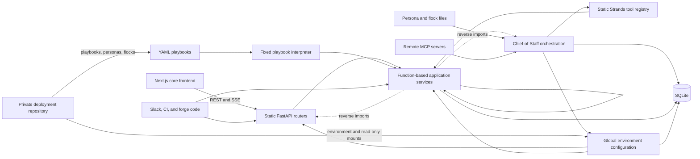
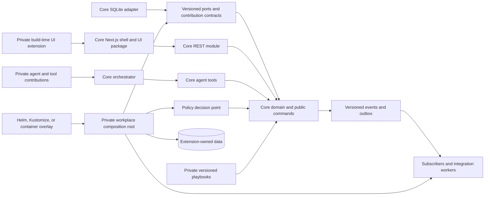

# Skein workplace extensibility assessment

Review date: 2026-08-10

Reviewed commit: `d3b0f2ebbb6437b9ba34afb398d548ec955d3ae3`

This assessment reviews actual dependency direction, runtime composition, replacement seams, and upgrade risks. Directory names alone do not affect the ratings.

The review covered the backend, frontend, agents, tools, playbooks, migrations, tests, containers, and deployment guidance. It did not change application code.

## 1. Executive verdict

| Measure | Rating | Explanation |
|---|---:|---|
| Overall modularity | **5/10** | REST and agent tools reuse the same services. However, services bind directly to SQLite, global configuration, and static registries. |
| Workplace extensibility | **3/10** | Content overlays, OIDC settings, MCP servers, and external REST clients work today. Private backend, policy, data, and UI modules lack supported contracts. |
| Upgradeability without forking | **4/10** | Deployment overlays and append-only migrations reduce conflicts. Any in-process workplace behavior or integrated UI still requires core edits or unsupported mutation. |

**Verdict: Requires architectural preparation.**

Skein has a coherent internal architecture for a small product team. It does not yet expose that architecture as a stable extension platform.

The shared service layer is a real strength. It prevents REST and core agent tools from becoming separate products.

That reuse does not make services replaceable. Most services import one concrete database module and exchange unversioned dictionaries.

A private deployment repository works today for configuration and curated content. It can also run separate integration services against the REST API.

A private package cannot safely add routes, policies, jobs, entities, core tools, or shell-integrated UI. Those changes currently create a source fork or an unsupported wrapper.

## 2. Current architecture map

### Current dependency direction



Solid arrows show intended current dependencies. Dotted arrows show current layer reversals.

The core domain is not a separate module. SQL rows, dictionaries, service functions, and route request models jointly represent it.

### Recommended dependency direction



The recommended design keeps dependency inversion at specific replacement seams. It does not add interfaces around every function.

## 3. Modularity scorecard

The current modularity column uses a five-point scale. Five means an external package has a documented and stable contract.

| Area | Current modularity | Existing extension mechanism | Coupling or limitation | Can extend without core changes? | Recommended mechanism | Priority |
|---|---:|---|---|---|---|---|
| Domain model | 2/5 | None | Dictionaries, SQL schemas, and route models share domain responsibility | No | Core contribution | Adoption blocker |
| Service layer | 3/5 | Direct Python imports | Reused by REST and tools, but bound to concrete DB functions | Partly, as an unsupported import | Backend plugin | Adoption blocker |
| Persistence | 1/5 | Data directory setting | Core fixes SQLite SQL and the migration path | No | External service | When extension data appears |
| API | 2/5 | REST API for out-of-process clients | Routers and input models are statically composed | External clients only | Backend plugin | Adoption blocker |
| Authentication | 3/5 | Configuration | Three fixed modes include useful OIDC support | Partly | Integration adapter | High |
| Authorization | 2/5 | Fixed FastAPI dependencies | Current, strong, and admin checks are hard-coded | No | Policy definition | Adoption blocker |
| Integrations | 2/5 | Specific settings, webhooks, MCP, REST | Each built-in integration has custom wiring | Partly | Integration adapter | High |
| Activity and provenance | 4/5 | Shared service write path | Strong core invariant, but action and entity maps are static | Core entities only | Event subscriber | High |
| Agent registration | 2/5 | Persona and flock overlays | Adds prompt identities, not independent agent implementations | Partly | Agent or tool plugin | Adoption blocker |
| Tool registration | 2/5 | MCP and a fixed extra-tool allowlist | Core list is static. MCP tools bypass Skein review controls | Partly, with risk | Agent or tool plugin | Adoption blocker |
| Prompt configuration | 3/5 | Persona files and pack defaults | Chief prompt and planner prompt remain static | Specialist prompts only | Configuration | Medium |
| Playbooks | 3/5 | YAML overlay | Fixed templates only. No conditions or action handlers | Fixed workflows only | Declarative playbook | Medium |
| Frontend navigation | 1/5 | None | Navigation groups are a private constant | No | Frontend extension | Adoption blocker |
| Frontend components | 2/5 | Internal source imports | Useful components are not a published package | No supported path | Frontend extension | High |
| Custom fields | 1/5 | None | Core tables and APIs have fixed schemas | No | Backend plugin | When required |
| Policy enforcement | 2/5 | Global review switch and authority matrix | Decisions lack project, role, and tool-risk context | No | Policy definition | Adoption blocker |
| Background tasks | 2/5 | Scheduler switch | An immutable tuple controls all jobs | No | Backend plugin | High |
| Error handling | 3/5 | Central FastAPI handlers | Good consistency, but no versioned extension error contract | Partly | Backend plugin | Medium |
| Deployment | 3/5 | Compose environment and content mounts | No released extension artifact or code composition contract | Content only | Deployment overlay | High |
| Observability | 3/5 | OpenTelemetry endpoint configuration | Export works, but extension spans and metrics lack a contract | Partly | Deployment overlay | Medium |

### Mechanism classification by customization area

| Customization | Best mechanism | Current support |
|---|---|---|
| Ports, URLs, limits, and provider selection | Configuration | Good for existing settings |
| Controlled rollout of installed code | Feature flag | Only isolated Boolean switches exist |
| Fixed milestones, tasks, and rituals | Declarative playbook | Supported |
| Roles, approvals, data access, and tool risk | Policy definition | Missing |
| Logos, fonts, terminology, and new visual packs | Theme or branding package | Missing |
| Pages, navigation, cards, panels, and forms | Frontend extension | Missing |
| Routes, commands, jobs, and extension services | Backend plugin | Missing |
| Jira, SAP, PLM, and similar connectors | Integration adapter | Missing in-process. External service works |
| Specialist agents and governed tools | Agent or tool plugin | Prompt-only specialists and ungoverned MCP tools exist |
| Reactions to core state changes | Event subscriber | Missing |
| Isolated workflow or integration logic | External service | Supported through REST, with contract limits |
| Images, settings, mounts, ingress, and secrets references | Deployment overlay | Partly supported |
| A generally useful new core invariant | Core contribution | Supported through normal source development |
| Arbitrary in-shell UI or in-process private behavior today | Unsupported without architectural change | Not supported |

### Frontend customization tests

| Need | Support today | Current mechanism | Best target mechanism |
|---|---|---|---|
| Add a page inside the Skein shell | No | Core `app/` source edit | Frontend extension |
| Add a navigation entry or section tab | No | Edit static arrays | Frontend extension |
| Add a dashboard card | No | Edit the dashboard page | Frontend extension |
| Add a work-item detail panel | No | Edit `TaskPeek` or another core component | Frontend extension |
| Add a command or action | No supported registration | Edit core UI and API code | Frontend extension |
| Add a role-specific view | Presentation only | Browser manager toggle | Policy definition plus frontend extension |
| Replace workplace terminology | No | Edit strings across pages and services | Theme or branding package |
| Add form fields | No | Edit page types, forms, routes, services, and schema | Frontend extension plus backend plugin |
| Add a notification surface | No | Edit core notifications and pages | Event subscriber plus frontend extension |
| Add an approval interface | Core proposals only | Edit the review page and backend registry | Policy definition plus frontend extension |
| Add a new agent experience | Persona selection only | Persona overlay | Agent or tool plugin plus frontend extension |
| Add branding | Existing color choices only | Static theme arrays and CSS | Theme or branding package |

The frontend has useful reusable components. It remains a single core application, not a host for independently registered user experiences.

### Agent and AI customization tests

| Need | Support today | Limitation | Best target mechanism |
|---|---|---|---|
| New prompt specialist | Yes | Uses current agent implementation | Configuration |
| New independent agent class | No | `build_agent()` owns construction | Agent or tool plugin |
| New core-safe tool | No | `ALL_TOOLS` and extra-tool allowlist are static | Agent or tool plugin |
| New remote MCP tool | Partly | Direct attachment lacks Skein policy and receipts | Agent or tool plugin |
| New orchestrator capability | No | Chief and nested tools are static | Core contribution or agent plugin |
| New approval rule | No | Gate input lacks workplace context | Policy definition |
| New model provider | No | Config registry and `_model()` both need edits | Integration adapter |
| New system prompt fragment | Specialist only | Chief safety and planner prompts are static | Configuration |
| New memory or context source | No | Memory composition is inside `build_agent()` | Agent or tool plugin |
| New retrieval mechanism | MCP only | No common retrieval contract or policy metadata | Integration adapter |
| New safety policy | No | Tool allowlists and gate rules are static | Policy definition |
| New agent-to-agent contract | Flocks only | Fixed parallel fan-out and optional synthesis | Agent or tool plugin |
| New checkpoint store | No | `build_agent()` selects the SQLite session repository | Integration adapter |
| New execution environment | No | Tools execute in the backend or remote MCP server | External service |
| Agent lifecycle hooks | Persistence hooks only | No public before-turn or after-tool contract | Agent or tool plugin |

### Playbook capability tests

| Workflow need | Current YAML support | Appropriate mechanism |
|---|---|---|
| Fixed tasks, milestones, relative dates, and rituals | Yes | Declarative playbook |
| Custom validation | No | Declarative schema plus backend plugin |
| Conditional logic | No | Versioned playbook step |
| External-system call | No | Registered integration adapter |
| Organization approval | No | Policy definition and approval step |
| Dynamic task generation | No | Registered action handler |
| Workplace role resolution | No | Policy definition |
| Escalation or SLA timer | No | Registered workflow timer or external service |
| Custom UI | No | Frontend extension |
| Agent participation | No explicit step | Agent or tool plugin |
| Human checkpoint | No explicit step | Policy-backed playbook step |

### Data customization tests

| Data need | Support today | Safe current workaround | Best target mechanism |
|---|---|---|---|
| Additional core fields | No | External mapping store | Namespaced metadata or core contribution |
| New entity types | No | Private service and database | Backend plugin with extension-owned data |
| Organization metadata | No general facility | Private database keyed by core ID | Bounded namespaced metadata |
| External identifiers | No first-class field | Private mapping table outside core | Integration adapter with owned data |
| Custom relationships | No | Private relation store | Extension-owned tables |
| Additional audit rules | Core actions only | External audit sink from API polling | Versioned event subscriber |
| Custom retention rules | No | External store policy | Policy definition and owned data |
| Alternative database | No | None for core state | Core contribution after a measured need |
| Extension search index | No | External search service | Event subscriber and reporting store |
| Knowledge graph | No | External graph service | Event subscriber and external service |
| Reporting store | No direct feed | REST extraction | Event subscriber and external service |

### Enterprise integration fit

| System class | Current path | Assessment | Best mechanism |
|---|---|---|---|
| OIDC identity provider | Built-in configuration | Good basic sign-in. Limited group mapping | Configuration, then identity adapter |
| Jira, ServiceNow, SAP, PLM, MES, and internal APIs | External REST service | Practical today, but API versioning is absent | Integration adapter or external service |
| GitHub and GitLab | Fixed CI and forge webhooks, MCP, or external service | Useful narrow paths. No general connector contract | Integration adapter |
| Slack | Fixed command route and outbound webhook | Working built-in, not replaceable | Integration adapter |
| Microsoft Teams and email | No built-in adapter | Requires core edit or external bridge | Integration adapter |
| Calendars | ICS feed and scheduled events | Export exists. Provider synchronization does not | Integration adapter |
| Documentation and knowledge platforms | MCP or external service | Read use is possible. Governance is incomplete | Integration adapter |
| CI/CD systems | Generic CI webhook with fixed mapping | Basic status mapping works | Integration adapter |
| Observability systems | OpenTelemetry endpoint | Export path exists | Deployment overlay |
| MCP servers | Configured remote endpoints | Broad tool discovery with weak Skein governance | Agent or tool plugin |

Use workload identities, secret-manager references, egress rules, and least-privilege scopes. Keep workplace credentials out of core source and frontend bundles.

### Policy and governance tests

| Policy need | Support today | Limitation | Best mechanism |
|---|---|---|---|
| Roles | Administrator and crew steward concepts | No general workplace roles | Policy definition |
| Permissions | Route dependency classes and service guards | Fixed in core | Policy definition |
| Approval rules | Agent authority and proposal registry | No contextual conditions | Policy definition |
| Agent permissions | Four authority levels by entity family | Fixed families and coarse context | Policy definition |
| Data access | Visibility tiers and crew membership | Strong core model, not programmable | Policy definition for extensions |
| Tool allowlists | Persona core-tool subset and fixed package allowlist | External tools lack common metadata | Agent or tool plugin |
| Audit requirements | Hash-chained core activity and provenance | Extension actions lack a contract | Event subscriber |
| Retention | Fixed constants and one pruning job | No workplace policy input | Policy definition |
| Human-review thresholds | Global flag, fixed always-review set, trust rules | Not organization-specific | Policy definition |
| Model-provider restrictions | Fixed configured provider | No policy by user, data, or project | Policy definition |
| Network restrictions | Package tools deny dangerous capabilities | MCP URLs and egress remain deployment concerns | Deployment overlay |
| Compliance controls | No general control framework | Requires core conditionals today | Policy definition plus event subscriber |

## 4. Evidence from the codebase

### Confirmed findings

#### Composition and API

- [`backend/app/main.py`](../backend/app/main.py#L206) creates a global `FastAPI` object at import time.
- The same file statically includes six routers at lines 476 through 481.
- The `lifespan()` function initializes the database, jobs, agents, telemetry, pools, MCP, and other services.
- No `create_app(settings, modules)` factory or dependency container exists.
- [`backend/app/routes/api.py`](../backend/app/routes/api.py#L58) contains 157 route decorators and many inline Pydantic input models.
- [`backend/app/routes/chat.py`](../backend/app/routes/chat.py#L40) combines commands, personas, flocks, sessions, agent construction, and SSE delivery.
- [`backend/app/routes/deps.py`](../backend/app/routes/deps.py#L100) calls `_resolve()` the single identity swap point. Its implementation still selects three concrete modes.

An external module can import `app.main.app` and call `include_router()`. Skein does not define this mutation as a supported lifecycle contract.

#### Services, domain, and persistence

- [`backend/tests/test_write_path_boundary.py`](../backend/tests/test_write_path_boundary.py) enforces shared services as the REST and tool write path.
- That test proves useful reuse and provenance discipline. It does not prove substitution.
- Most service modules import [`backend/app/db.py`](../backend/app/db.py) directly and contain hand-written SQL.
- `db.connect()` opens `sqlite3.Connection` and applies SQLite PRAGMAs at line 181.
- `db.MIGRATIONS_DIR` points to one core directory at line 18.
- `db.init_db()` loads only files from that directory at line 244.
- SQLite-specific usage includes FTS5, `julianday`, PRAGMAs, `sqlite_master`, and Boolean expressions inside `SUM()`.
- Services return dictionaries instead of stable domain objects or published command results.
- [`backend/app/services/tuning.py`](../backend/app/services/tuning.py#L144) imports `routes.chat` and `agents.team_agent` inside service functions.
- [`backend/app/services/delegation.py`](../backend/app/services/delegation.py#L9) and `handoff.py` import agent identity state.

These reverse imports make route and agent implementation details part of service behavior.

#### Static registration and security inventories

- [`backend/app/services/jobs.py`](../backend/app/services/jobs.py#L136) defines one immutable `JOBS` tuple.
- [`backend/app/services/insights.py`](../backend/app/services/insights.py#L1273) defines one fixed `RULES` tuple.
- [`backend/app/services/review.py`](../backend/app/services/review.py#L11) builds a private action registry.
- The review module also maintains target, diff, creation-parent, and untargeted maps.
- [`backend/app/services/scope.py`](../backend/app/services/scope.py#L489) classifies every table through static `CLASSIFIED` and `UNSCOPED` dictionaries.
- [`backend/app/services/admin.py`](../backend/app/services/admin.py#L58) uses a fixed table export inventory.
- [`backend/app/services/search.py`](../backend/app/services/search.py#L49) maps each indexed entity to a table.
- [`backend/app/services/provenance.py`](../backend/app/services/provenance.py#L97) uses fixed entity and activity maps.
- Tests intentionally fail when a core table or writer is absent from these inventories.

Those tests protect security and completeness. They also prove that a new table or entity requires coordinated core edits.

#### Events, jobs, integrations, and errors

- [`backend/app/db.py`](../backend/app/db.py#L28) exposes `on_commit()` for transaction-local callbacks.
- That callback queue is not a public domain-event contract. It has no schema, subscriber registry, retry, or replay.
- [`backend/app/services/digest.py`](../backend/app/services/digest.py#L148) exposes one narrow `set_narrator()` callback.
- [`backend/app/services/notifications.py`](../backend/app/services/notifications.py) posts directly to one configured Slack webhook.
- [`backend/app/routes/webhooks.py`](../backend/app/routes/webhooks.py) owns fixed CI and forge routes and payload parsing.
- [`backend/app/main.py`](../backend/app/main.py#L365) centralizes database, permission, validation, rate, and unexpected error handling.
- Extensions can register another FastAPI handler only by mutating the global app or changing core composition.
- The core error bodies are consistent. They do not yet define versioned machine-readable extension error codes.

#### Authentication, authorization, and approval

- [`backend/app/config.py`](../backend/app/config.py#L783) fixes authentication modes to `trusted-header`, `api-key`, and `oidc`.
- OIDC supports issuer, audience, claims, client settings, and one administrator group.
- [`backend/app/routes/deps.py`](../backend/app/routes/deps.py#L300) exposes `CurrentUser`, `StrongUser`, and `AdminUser` dependencies.
- No general role mapping or policy decision point exists.
- [`frontend/components/manage-toggle.tsx`](../frontend/components/manage-toggle.tsx#L5) states that manager mode is scope control, not authorization.
- [`backend/app/services/delegation.py`](../backend/app/services/delegation.py#L13) fixes authority to four levels.
- [`backend/app/tools/_gate.py`](../backend/app/tools/_gate.py#L27) hard-codes always-reviewed actions and entity families.
- `gated_write()` uses agent authority and one global `SKEIN_AGENT_REVIEW` switch.

The gate does not receive project type, human role, data class, tool risk, or workplace approval policy.

#### Agents and AI

- [`backend/app/tools/__init__.py`](../backend/app/tools/__init__.py#L69) defines one static `ALL_TOOLS` list.
- [`backend/app/agents/team_agent.py`](../backend/app/agents/team_agent.py#L89) selects model provider classes through hard-coded branches.
- Provider metadata is also hard-coded in [`backend/app/config.py`](../backend/app/config.py#L78).
- `build_agent()` owns Chief, planner, specialist, memory, tool, MCP, and session composition.
- [`backend/app/services/personas.py`](../backend/app/services/personas.py#L190) excludes external and MCP tools from persona allowlist validation.
- [`backend/app/agents/extra_tools.py`](../backend/app/agents/extra_tools.py#L24) permits only a fixed set of package tools.
- [`backend/app/agents/mcp_tools.py`](../backend/app/agents/mcp_tools.py#L25) discovers remote MCP tools from configured servers.
- MCP tools join the Strands tool list directly. They do not pass through Skein's `gated_write()` contract.
- MCP bearer tokens are values inside one JSON environment setting.
- [`backend/app/agents/session_store.py`](../backend/app/agents/session_store.py) provides Strands session hooks for SQLite persistence.

The keyless fallback is genuine. A bad model configuration preserves deterministic REST behavior and reports the provider fault.

#### Playbooks and workflows

- [`backend/app/services/playbooks.py`](../backend/app/services/playbooks.py#L1) calls playbooks deterministic templates.
- An overlay file joins the roster or replaces a stock file with the same slug.
- `instantiate()` creates an engagement, milestones, tasks, and scheduled rituals.
- The interpreter recognizes fixed dates, priorities, text, and project classification.
- It defines no condition, branch, action-handler, approval, role, SLA, escalation, or human-checkpoint contract.
- [`backend/playbooks/prototype.yaml`](../backend/playbooks/prototype.yaml) demonstrates the current fixed template shape.

The YAML files are configuration inputs. They are not executable extension packages or a general workflow language.

#### Frontend

- [`frontend/app/layout.tsx`](../frontend/app/layout.tsx#L65) hard-codes metadata, fonts, the navigation, and global shell components.
- [`frontend/components/nav.tsx`](../frontend/components/nav.tsx#L22) defines private static navigation groups.
- [`frontend/components/section-tabs.tsx`](../frontend/components/section-tabs.tsx#L8) defines private static tab sets.
- [`frontend/lib/theme.ts`](../frontend/lib/theme.ts#L27) contains the static theme pack and colorway registries.
- Pages make 143 direct `api()` calls across `frontend/app` and `frontend/components`.
- Dashboard, settings, My Day, and agents pages each contain approximately 900 to 1,638 lines.
- Reusable components exist, including `Card`, `TaskPeek`, `StatusRegion`, and visibility controls.
- The frontend package is private and publishes no UI or extension package.

A separate workplace frontend can consume REST. It cannot join the core shell, routes, or navigation through a stable contract.

#### Deployment and release

- [`deploy/README.md`](../deploy/README.md) explicitly recommends one private deployment repository per site.
- That repository can own environment files, Compose overrides, and content overlays.
- [`docker-compose.yml`](../docker-compose.yml) includes commented read-only mounts for playbooks, personas, and flocks.
- [`backend/Dockerfile`](../backend/Dockerfile) installs the core wheel and runs as a non-root user.
- [`frontend/Dockerfile`](../frontend/Dockerfile) bakes public configuration into the build.
- [`scripts/upgrade-path.sh`](../scripts/upgrade-path.sh) compares upgraded and fresh schemas and verifies the activity chain.
- [`backend/pyproject.toml`](../backend/pyproject.toml#L1) declares version `0.1.0` and no extension entry points.
- The frontend package is version `0.1.0`, private, and not a workspace package.
- The reviewed repository has no `v*` release tag.

The current upgrade process has good migration safeguards. It lacks released extension contracts and compatibility metadata.

### Inferences

- SQLite and one in-process scheduler fit a small internal team better than a highly available enterprise service.
- A wrapper application can mutate the imported FastAPI object, but router order and startup behavior remain unstable.
- Direct imports of service functions can work for one private package, but any refactor can break that package.
- An external integration service is the safest present code extension because process boundaries limit coupling.
- A separate workplace frontend can stay fork-free behind the same ingress. It will duplicate shell, auth, and design integration.
- MCP provides broad external capability. Its current authorization and provenance gap makes write-capable MCP tools unsuitable for sensitive actions.

### Areas not verified

- The input did not specify employee count, request volume, availability objectives, or disaster-recovery objectives.
- The input did not specify compliance, retention, records-management, or data-residency rules.
- The review did not use a live OIDC provider, directory, MCP server, or enterprise network.
- The repository contains no published wheel reference, container registry, Helm chart, or compatibility policy.
- The review did not include a private workplace repository for an upgrade rehearsal.
- The review did not benchmark SQLite contention or multi-instance operation.

### Verification performed

Focused tests passed without source changes:

```text
11 passed: write-path boundary, packaging, and playbook tests
11 passed: route identity and agent gate coverage tests
```

## 5. Genuine extension points

| Extension point | Contract and registration | Lifecycle | Allows | Does not allow | External stability |
|---|---|---|---|---|---|
| Environment configuration | Module-level `SKEIN_*` variables | Read mostly at import and startup | Existing providers, auth, limits, scheduler, endpoints | New behavior or replacement implementations | Operationally useful, but not a typed public API |
| Playbook overlay | `SKEIN_PLAYBOOKS_DIR`, filename slug, YAML fields | Read from mounted files | Fixed engagements, milestones, tasks, rituals | Conditions, calls, policies, custom UI | Useful. Add schema versioning and published validation |
| Persona overlay | `SKEIN_PERSONAS_DIR`, Markdown frontmatter, `pack.json` | Read from mounted files | Prompts, model, temperature, core-tool subset | Custom implementation, context source, external-tool allowlist | Useful. Add schema versioning |
| Flock overlay | `SKEIN_FLOCKS_DIR`, YAML members | Read from mounted files | Fixed specialist fan-out and optional synthesis | Custom graph, lifecycle, or execution environment | Useful for the fixed model |
| OIDC configuration | Issuer, audience, claims, PKCE client, one admin group | Startup configuration and request validation | Enterprise sign-in with standard claims | General group-role mapping or custom policy | Good built-in adapter, not replaceable |
| Remote MCP servers | `SKEIN_MCP_SERVERS` JSON | Process-wide lazy connection and shutdown | Remote agent tools | Skein approval, provenance, fine tool policy | Powerful but unsafe for sensitive writes |
| Extra Strands tools | `SKEIN_EXTRA_TOOLS` names | Cached process-wide load | Selected read-oriented package tools | Private tool modules | Stable only for the fixed allowlist |
| Digest narrator | `services.digest.set_narrator(callable)` | Registered during FastAPI startup | One optional narration function | General events or subscribers | Real narrow seam, but unversioned |
| REST API | HTTP and generated OpenAPI | Out-of-process | External apps and integration workers | In-shell UI, atomic cross-system writes, stable event delivery | Best present code boundary. Versioning is absent |
| Compose content overlay | Environment and read-only mounts | Deployment startup | Site content, ports, volumes, secrets injection | In-process code or frontend composition | Documented and practical |
| OpenTelemetry endpoint | Endpoint configuration | Startup | Export Strands telemetry | Custom application observability contract | Useful deployment setting |

The playbook, persona, and flock loaders are the strongest existing extension points. They are narrow, explicit, and easy to secure.

The REST API is the strongest code boundary. It needs versioning, service identities, and contract tests before long-term external reliance.

The registered provider and authentication selections resemble replacement. Adding another choice still requires core code.

Persistence, policy, core services, background scheduling, and the frontend shell are not replaceable through supported contracts.

## 6. Hidden coupling and fork risks

| Coupling | Workplace requirement that exposes it | Maintenance consequence | Decoupling approach | Timing |
|---|---|---|---|---|
| Global app and static router imports | Add a private API module | Wrapper mutation or core edit depends on import order | Add an application factory and explicit module list | Now |
| Static startup and job tuple | Add an integration poller | Core edits touch lifecycle and health reporting | Add typed job contributions at startup | Before workplace integrations |
| Concrete SQLite calls in services | Use PostgreSQL or extension-owned tables | Broad SQL rewrite and coupled migrations | Keep core SQLite now. Add narrow repositories only at real replacement seams | On demand for database replacement |
| Fixed table security inventories | Add a workplace entity table | Core tests fail or security coverage becomes incomplete | Give extension tables an owned store and declared security metadata | Before in-process extension data |
| Private review registry with parallel maps | Add a new approved action | Several security-sensitive core maps need edits | Register typed commands with resource and policy metadata | Now |
| Global agent authority gate | Conditional manager approval | Workplace conditions leak into `_gate.py` | Introduce one policy decision contract used by REST and tools | Now |
| Static Chief and tool composition | Add a specialist with private tools | Core imports and prompt code change | Add explicit agent and tool contributions | Now |
| Direct MCP tool attachment | Add a write-capable enterprise MCP server | Actions can bypass review, receipts, and provenance | Wrap each external tool with risk metadata, policy, and receipts | Now |
| Static frontend routes and navigation | Add a manager dashboard | Core Next.js edits create repeated merge conflicts | Add build-time route and slot contributions | Before custom integrated UI |
| Internal-only UI components | Reuse core panels privately | Source imports break on refactors | Publish versioned `@skein/ui` and extension types | Before custom integrated UI |
| Fixed playbook interpreter | Add conditional approvals and system calls | YAML fields get one-off core conditionals | Add a small workflow step registry only after concrete cases exist | When Scenario F starts |
| Import-time global configuration | Test two workplace compositions | Module reloads and process-global state complicate isolation | Use an immutable settings object passed to `create_app()` | Now |
| Direct Slack implementation | Add Teams or email | Notification logic spreads across core services | Add a `NotificationSink` adapter | Before second channel |
| Service imports from routes and agents | Replace chat transport or orchestrator | Lower layers depend on upper-layer internals | Move shared limits and identity context into neutral modules | Now |
| Fixed schemas and status checks | Add classifications or states | Table rebuilds and UI changes repeat | Use extension-owned relations or a bounded metadata contract | When data need is defined |
| Browser-only manager toggle | Show role-specific manager controls | UI visibility can be mistaken for authorization | Return authorized capabilities from the backend | Now |

“Now” means before workplace adoption, not before the next small core feature.

## 7. Recommended target architecture

### Ownership boundary

| Core owns | Workplace owns |
|---|---|
| Stable work, coordination, provenance, and review semantics | Organization integrations and mappings |
| Public commands and read APIs | Private policies and role mapping |
| Core tables and core migrations | Extension tables and extension migrations |
| Default REST modules and agent tools | Private routes, tools, agents, and event handlers |
| Core UI shell, slots, and accessible components | Private cards, pages, terminology, and branding |
| Content schemas and validators | Private playbooks, personas, and flocks |
| Extension compatibility tests | Deployment manifests, secret references, and network rules |

Core services must not import workplace packages. The workplace composition root imports both core and private packages.

### Minimum composition model

Add `create_app(settings, modules)` and keep `app = create_app(...)` for compatibility. Each module contributes through typed, narrow registries.

Use separate contribution types for routes, jobs, tools, policies, events, and UI. Do not expose one unrestricted `BasePlugin` object.

Prefer explicit composition in the workplace ASGI entry point:

```python
from skein_core.application import create_app
from skein_core.settings import Settings
from skein_workplace.extension import workplace_module

app = create_app(
    Settings.load(),
    modules=[workplace_module],
)
```

An environment allowlist can select installed modules when image reuse matters. Do not scan every installed Python entry point automatically.

Each module declares a name, extension API version, and compatible core range. Startup rejects collisions and incompatible modules.

### Public backend contracts

Publish these contracts first:

- Command services for supported core mutations. Each command takes an authenticated actor, origin, and request context.
- Query services or versioned REST endpoints for supported reads.
- `IdentityProvider` for authentication-specific principal resolution.
- `PolicyDecisionPoint` for authorization and review decisions.
- `NotificationSink` for Slack, Teams, email, and later channels.
- Typed `JobContribution`, `ToolContribution`, `RouterContribution`, and `EventHandler` records.
- Stable error codes and result types. Keep human-readable text outside extension logic.

Do not publish raw database functions as an extension API. Private code must not receive unrestricted core connections.

### Policy evaluation

Use one policy input at every protected REST, tool, and workflow boundary:

```python
PolicyInput(
    subject=principal,
    action="work_item.status.update",
    resource=work_item_ref,
    context={"project_type": "regulated", "tool_risk": "high"},
)
```

Return `permit`, `deny`, or `review`, with reasons and obligations. An obligation can require a manager group or two-person approval.

Start with a Python protocol and a private implementation. Add OPA, Cedar, or another external engine only after policy operations require it.

The backend remains the enforcement point. Frontend capabilities only control presentation.

### Events and integration delivery

Emit versioned domain events after successful core transactions. Include event ID, schema version, actor, origin, resource reference, and safe change summary.

Use a small SQLite outbox for durable delivery and retry. Do not introduce Kafka for the first integration.

Subscribers receive public event data, not database rows. Sensitive fields require explicit event contracts and policy checks.

External integration workers can consume webhooks or poll the outbox API. This keeps credentials and network access outside the core process.

### Agent and tool composition

Each tool contribution needs these fields:

- Stable name and version
- Callable or external endpoint
- Read or write classification
- Risk level and required policy action
- Allowed agent identities or capabilities
- Input and output schema
- Timeout, receipt, provenance, and error behavior

Wrap MCP tools with this metadata before adding them to an agent. Deny unknown write effects by default.

Allow a workplace package to register a specialist definition, prompt fragment, context provider, and tool set. Keep Chief orchestration unaware of private classes.

Prompt composition needs ordered, named fragments. Core safety text remains non-overridable.

### Playbook evolution

Keep the current format for deterministic templates. Add a schema version before adding execution features.

For the first executable case, support a small set of typed steps:

- Create a core record
- Wait for a policy approval
- Call a registered action handler
- Evaluate a named condition
- Schedule a deadline or escalation

Handlers come from explicit backend contributions. YAML cannot name arbitrary Python imports or shell commands.

Use an external workflow service when long-running compensation, high scale, or cross-system orchestration becomes a real requirement.

### Frontend extension strategy

Use build-time composition for trusted private UI. Runtime remote JavaScript gives plugins the user's token and full page privileges.

Publish `@skein/ui` and `@skein/extension-api`. Define a small initial slot set:

- Navigation entries under a workplace group
- Manager dashboard cards
- Work-item detail panels
- Namespaced route prefixes
- Registered actions with server-supplied capability checks
- Theme tokens, product name, logo, and terminology bundle

The workplace build imports an explicit extension manifest. The core shell validates unique routes and slot identifiers.

A separate workplace frontend behind the same ingress remains a valid option. It gives stronger isolation but weaker shell integration.

### Data ownership and migrations

Keep core migrations append-only. Register extension migration streams by namespace and compatible core range.

For SQLite deployments, an extension can use a separate database file. Store stable core identifiers without direct foreign keys across files.

An in-process extension table is acceptable after migration ownership exists. Core upgrade tests must run with every registered extension migration stream.

Use namespaced JSON metadata only for sparse annotations with simple validation. Use extension-owned tables for indexed, relational, or invariant-rich data.

Do not default to an entity-attribute-value model. EAV offers flexible fields but weakens types, constraints, indexes, reports, and API contracts.

### Packaging, compatibility, and upgrades

- Publish the core Python wheel and container image with semantic versions.
- Publish versioned frontend UI and extension packages.
- Publish JSON schemas for playbooks, personas, events, and extension manifests.
- Declare a supported extension API range in every private package.
- Run core contract tests against a sample extension in core CI.
- Run the private package against the next core release before deployment.
- Upgrade by changing version pins and image tags, not merging source trees.
- Keep deprecations for at least one supported release window.

### Deployment option tradeoffs

| Approach | Best use | Operations | Security | Maintenance |
|---|---|---|---|---|
| Python extension package | Trusted routes, jobs, policies, and tools | One process and image | Full process privileges require strict review | Strong integration, strict version pin needed |
| TypeScript build package | Trusted shell-integrated UI | Rebuild frontend image | Code receives browser privileges | Good UX, compile-time compatibility |
| Container-image layering | Install private packages and assets | Simple derivative images | Normal image scanning applies | Rebuild on each core image update |
| Sidecar or separate service | Integrations and private workflow logic | More services, queues, and health checks | Strong process and network isolation | Stable HTTP or event contract reduces coupling |
| Runtime Python loading | Operator-selected installed modules | Flexible image reuse | Large supply-chain and process risk | Use only with explicit allowlists |
| Build-time composition | Backend or frontend package assembly | Deterministic artifact | Review occurs before deployment | Good default for proprietary extensions |
| Helm or Kustomize overlay | Settings, mounts, ingress, sidecars, secret references | Fits enterprise platforms | Supports service accounts and network policy | Does not add behavior by itself |
| Environment configuration | Small deployment differences | Easy but string-heavy | Secret values can leak through process configuration | Use typed validation and secret references |
| Feature flags | Controlled rollout of installed behavior | Requires flag lifecycle | Disabled code still exists in artifact | Not a substitute for an extension contract |

## 8. Example repository structure

```text
skein-core/
├── backend/
│   ├── pyproject.toml
│   ├── skein_core/
│   │   ├── application.py
│   │   ├── settings.py
│   │   ├── public/
│   │   │   ├── commands.py
│   │   │   ├── queries.py
│   │   │   ├── events.py
│   │   │   └── errors.py
│   │   ├── contracts/
│   │   │   ├── identity.py
│   │   │   ├── policy.py
│   │   │   ├── tools.py
│   │   │   ├── jobs.py
│   │   │   └── integrations.py
│   │   ├── adapters/sqlite/
│   │   ├── api/
│   │   └── agents/
│   ├── migrations/core/
│   └── tests/contracts/
├── frontend/
│   ├── app/
│   └── packages/
│       ├── ui/
│       └── extension-api/
├── schemas/
│   ├── events/
│   ├── playbooks/
│   └── extension-manifest.schema.json
└── deploy/charts/skein/

skein-workplace/
├── pyproject.toml
├── package.json
├── src/skein_workplace/
│   ├── extension.py
│   ├── asgi.py
│   ├── auth/
│   │   ├── oidc_groups.py
│   │   └── policy.py
│   ├── integrations/
│   │   └── atlas/
│   │       ├── adapter.py
│   │       ├── api.py
│   │       ├── jobs.py
│   │       └── events.py
│   ├── agents/
│   │   ├── delivery_specialist.py
│   │   └── tools.py
│   └── migrations/
│       └── workplace/
│           └── 001_atlas_links.sql
├── frontend/
│   ├── extension.tsx
│   ├── cards/atlas-delivery.tsx
│   ├── panels/atlas-link.tsx
│   └── theme/workplace.css
├── playbooks/
│   └── regulated-delivery.yaml
├── deploy/
│   ├── helm/values.yaml
│   ├── kustomize/
│   └── network-policies/
├── tests/
│   ├── contract/
│   ├── integration/
│   └── e2e/
└── containers/
    ├── backend.Dockerfile
    └── frontend.Dockerfile
```

`skein-workplace` pins released core packages. Its ASGI module composes the backend without importing internal database modules.

The private frontend build imports one explicit workplace manifest. Deployment code references secret objects, not secret values in Git.

## 9. Example extension implementation

This example adds an internal work-item system called Atlas. It uses the proposed target contracts, which do not exist today.

### Backend registration

```python
# skein_workplace/extension.py
from skein_core.contracts import Module, RouterContribution, JobContribution
from .integrations.atlas import api, jobs, tools
from .auth.policy import WorkplacePolicy

workplace_module = Module(
    name="acme-workplace",
    api_version="1",
    compatible_core=">=0.2,<0.4",
    routers=[RouterContribution(api.router, prefix="/api/extensions/acme")],
    jobs=[JobContribution("atlas-sync", jobs.sync, every_minutes=5)],
    tools=[tools.refresh_atlas_tool],
    policy=WorkplacePolicy(),
    migrations=["skein_workplace:migrations/workplace"],
    frontend_manifest="@acme/skein-extension",
)
```

The extension receives typed command and query ports. It does not receive the core SQLite connection.

### Configuration and secrets

```yaml
extensions:
  acme-workplace:
    atlas:
      base_url: https://atlas.internal.example
      token_file: /var/run/secrets/atlas/token
      project_map:
        regulated: ATLAS-R
        standard: ATLAS-S
```

The deployment mounts the token from its secret manager. The configuration file contains only a file reference.

### Data ownership

```sql
-- Extension migration stream: workplace/001_atlas_links.sql
CREATE TABLE wp_atlas_links (
    skein_work_item_id INTEGER NOT NULL,
    atlas_id TEXT NOT NULL UNIQUE,
    atlas_version TEXT NOT NULL,
    last_synced_at TEXT NOT NULL,
    PRIMARY KEY (skein_work_item_id)
);
```

The `wp_` table belongs to the workplace package. Core migrations never alter it.

### Sync, authorization, and provenance

```python
def sync(ctx: ExtensionContext) -> JobResult:
    for item in atlas.read_changed_items():
        decision = ctx.policy.decide(
            subject=ctx.service_principal("atlas-sync"),
            action="work_item.sync_from_atlas",
            resource={"project_type": item.project_type},
        )
        decision.require_permit()
        result = ctx.commands.work_items.upsert(
            ExternalWorkItem(
                system="acme.atlas",
                external_id=item.id,
                title=item.title,
                status=item.status,
            ),
            actor="integration:atlas",
            origin="integration",
        )
        links.save(result.id, item.id, item.version)
```

The core command records the actor and origin. The outbox publishes a versioned work-item event after commit.

### Agent-tool exposure

```python
refresh_atlas_tool = ToolContribution(
    name="acme_atlas_refresh",
    version="1",
    handler=refresh_one,
    effect="write",
    risk="medium",
    policy_action="integration.atlas.refresh",
    allowed_agents={"delivery-specialist"},
    timeout_seconds=20,
)
```

The common tool executor checks policy and writes a receipt. The Chief needs no private import or conditional branch.

### Frontend exposure

```tsx
// @acme/skein-extension/extension.tsx
export const extension: SkeinFrontendExtension = {
  apiVersion: "1",
  navigation: [{ href: "/workplace/atlas", label: "Atlas" }],
  dashboardCards: [
    {
      id: "acme.atlas.delivery",
      requiredCapability: "integration.atlas.read",
      component: AtlasDeliveryCard,
    },
  ],
  workItemPanels: [AtlasLinkPanel],
};
```

The backend returns capabilities for the current principal. Hiding the card does not replace server authorization.

### Tests

```python
def test_atlas_extension_contract(core_contract):
    core_contract.validate_module(workplace_module)

def test_sync_records_integration_origin(app_client, fake_atlas):
    run_registered_job("atlas-sync")
    row = app_client.get("/api/work-items?external_system=acme.atlas").json()[0]
    assert row["provenance"]["origin"] == "integration"

def test_high_risk_update_requires_manager(policy):
    decision = policy.decide(
        subject=agent("delivery-specialist"),
        action="integration.atlas.override_status",
        resource={"project_type": "regulated"},
    )
    assert decision.effect == "review"
    assert decision.approver_group == "delivery-managers"
```

The private CI also runs frontend slot tests and one end-to-end OIDC role test.

### Deployment

```dockerfile
ARG SKEIN_CORE_IMAGE
FROM ${SKEIN_CORE_IMAGE}
COPY dist/skein_workplace-*.whl /tmp/
RUN pip install --no-cache-dir /tmp/skein_workplace-*.whl
CMD ["uvicorn", "skein_workplace.asgi:app", "--host", "0.0.0.0", "--port", "8000"]
```

The frontend uses a similar build stage with pinned `@skein/ui` and `@acme/skein-extension` packages.

### Scenario tests

| Scenario | Today without core edits | Current mechanism and contract | Private location | Upgrade risk | Required improvement |
|---|---|---|---|---|---|
| A. Enterprise integration | **Partly** | External service uses REST and a personal API key. Built-in webhooks cover only fixed shapes | Private integration service and deployment repo | Medium. REST is unversioned and identity appears human | Versioned API, service principals, events, adapter contract |
| B. Custom approval workflow | **No** | Current global review switch and fixed agent authority matrix lack policy context | No supported location | Core edits create high merge and security risk | Central policy definition with review obligations |
| C. Organization dashboard | **Partly** | A separate frontend can use REST. It cannot join core navigation or dashboard | Private frontend behind ingress | Medium for REST. Low shell compatibility | Build-time frontend slots and published UI package |
| D. Specialist agent | **Partly** | Persona overlay adds prompt, model, temperature, and core-tool subset | Private persona and flock overlays | Low for documented fields | Governed agent, tool, prompt, and context contributions |
| E. Custom domain data | **Partly** | External mapping database keyed by Skein IDs | Private service database | Medium because REST IDs and shapes lack version policy | Extension-owned data contract, migration namespace, optional bounded metadata |
| F. Custom playbook | **Partly** | YAML creates fixed tasks, milestones, and rituals | Private playbook overlay | Low for current schema, which lacks a version | Versioned step types, registered actions, conditions, approvals, timers |
| G. Enterprise authentication | **Partly** | OIDC configuration maps one username claim, groups claim, and admin group | Deployment configuration | Low for basic sign-in. High for custom role rules | Identity adapter and central group-to-policy mapping |
| H. Core upgrade | **Partly** | Content overlays and external services survive source pulls | Private deployment repo | Low for content, medium for REST, high for core patches | Released contracts, semantic versions, compatibility tests, composed packages |

#### Scenario A details

Basic two-way synchronization can run today as an external service. It depends on current REST paths, request bodies, and personal API-key behavior.

The private service owns mapping state and credentials. Core upgrades can break it because the REST API has no compatibility policy.

#### Scenario B details

The current gate cannot express manager approval by project type, human role, and tool risk. A core edit must change `_gate.py` and review behavior.

The target mechanism is a policy definition. The policy returns a review obligation and names the required approver class.

#### Scenario C details

A private Next.js application can display workplace data without changing core. It remains outside the core navigation and design-system contract.

An integrated card needs a frontend extension slot and server-checked capability. Branding alone cannot solve this scenario.

#### Scenario D details

A persona file provides a new prompt specialist today. It cannot supply a private tool allowlist entry, context source, lifecycle, or execution environment.

The target agent contribution registers those parts. The Chief consumes typed specialist metadata and keeps its core implementation unchanged.

#### Scenario E details

An external mapping store is safe today. It cannot add in-core fields, search, relationships, reports, or detail panels.

Use extension-owned tables for structured classifications and relationships. Reserve namespaced metadata for sparse annotations without strong relational requirements.

#### Scenario F details

A fixed delivery plan fits the current YAML overlay. Conditions, system calls, approvals, escalation, and dynamic tasks do not.

Use registered workflow step types for the first concrete needs. Use an external workflow engine only when long-running orchestration justifies its operations.

#### Scenario G details

Standard OIDC sign-in works through configuration today. One configured group can grant administrator access.

Directory groups cannot map to general Skein roles. Custom authorization still needs a core policy layer.

#### Scenario H details

Configuration, content overlays, and isolated services avoid source merges. Private core patches, frontend edits, and static registry edits do not.

A clean upgrade needs released artifacts, public compatibility contracts, and private contract tests against each candidate core release.

## 10. Prioritized remediation plan

### Immediate low-risk improvements

| Sequence | Recommendation | Problem and benefit | Effort | Architectural risk | Backward compatibility |
|---:|---|---|---:|---|---|
| 1 | Publish a current extension capability matrix | Stops users from treating internal modules as public APIs | S | Low | None |
| 2 | Add schema versions and JSON schemas for playbooks, personas, and flocks | Makes content overlays testable across upgrades | S | Low | Existing files can default to version 1 |
| 3 | Add a validator command for every deployment overlay | Finds bad private content before startup | S | Low | Additive |
| 4 | Document the REST API compatibility policy and stable error codes | Gives external services a usable boundary | M | Low | Additive, then controlled deprecation |
| 5 | Remove service imports from `routes` and `agents` | Restores intended dependency direction | S-M | Low | Internal refactor |
| 6 | Return backend capabilities for manager and protected actions | Prevents browser toggles from appearing authoritative | M | Low | Additive |
| 7 | Model MCP credentials as secret-file references | Reduces environment leakage risk | S-M | Low | Keep legacy values for one release |

### Foundational changes required before workplace adoption

| Sequence | Recommendation | Problem and benefit | Effort | Architectural risk | Backward compatibility |
|---:|---|---|---:|---|---|
| 8 | Add immutable settings and `create_app(settings, modules)` | Enables explicit composition and isolated tests | M | Medium | Keep `app` as a default factory result |
| 9 | Add typed route, job, tool, and event contribution registries | Removes static core inclusion lists from extension paths | M-L | Medium | Seed registries from current constants |
| 10 | Add one policy decision contract across REST, tools, and workflows | Supports roles, conditional approval, and tool risk | L | Medium | Map current checks into the default policy |
| 11 | Wrap MCP and private tools with policy, receipt, timeout, and provenance metadata | Closes the largest agent extension security gap | M-L | Medium | Read-only tools can retain current behavior |
| 12 | Publish core command and query contracts | Prevents extensions from importing DB and internal services | L | Medium | Add facades before moving internals |
| 13 | Add versioned domain events and a small durable outbox | Supports isolated integrations without polling core tables | L | Medium | Existing writes remain unchanged behind command facade |
| 14 | Add extension migration namespaces or separate extension stores | Gives private data clear ownership | M | Medium | Core migration order remains append-only |
| 15 | Publish `@skein/ui` and a small build-time slot API | Enables integrated private UI without source patches | L | Medium | Core app consumes the same manifest contract |
| 16 | Release versioned wheels, images, and compatibility tests | Makes pin-and-upgrade operation real | M | Low | Additive release process |

### Enhancements that can wait for a real extension

| Recommendation | Trigger | Benefit | Effort | Risk | Compatibility |
|---|---|---|---:|---|---|
| Add `NotificationSink` implementations | A second channel after Slack | Keeps Teams or email outside core logic | M | Low | Default Slack adapter preserves behavior |
| Add executable playbook steps | First conditional workplace process | Supports registered actions and approvals | L | Medium | Version 1 templates remain static |
| Add a custom-field contract | Several confirmed sparse annotations | Avoids repeated core columns | M-L | Medium | Additive if namespaced |
| Add repository protocols or PostgreSQL | Scale or availability tests fail SQLite | Supports a different persistence adapter | XL | High | Large internal migration |
| Add search or reporting adapters | Extension data needs joint search or analytics | Keeps operational queries bounded | L | Medium | Additive projections |
| Add an external policy engine | Policy team requires central administration | Central governance and audit | L | Medium | Python policy remains default adapter |
| Add a separate workflow engine | Long-running compensation becomes necessary | Durable complex orchestration | XL | High | External service boundary limits impact |

### Architectural ideas that create unnecessary complexity now

| Avoid | Reason |
|---|---|
| One universal `BasePlugin` interface | Unrelated concerns need different security and lifecycle contracts |
| Automatic loading of every installed entry point | It expands the code supply chain and process blast radius |
| Direct plugin access to core SQLite | It bypasses invariants, policy, provenance, and migration ownership |
| A general EAV store | It weakens typing and reporting before requirements are known |
| Arbitrary runtime frontend modules | They receive browser tokens and can bypass trusted UI review |
| Kafka or a large event platform | A SQLite outbox and worker meet the first integration needs |
| Repository interfaces around every service | Most services have no alternative implementation requirement |
| A full workflow language immediately | The current template model needs only a few proven step types first |
| Organization conditionals in core services | They turn every upgrade into conflict resolution |
| Source-copy container overlays | They hide a fork inside the image build |

## 11. Final recommendation

You can extend Skein safely today within narrow boundaries.

Safe current extensions include environment settings, OIDC configuration, playbooks, personas, flocks, selected extra tools, and read-oriented MCP tools. External REST services are also practical.

Keep write-capable MCP tools out of sensitive workflows until policy and provenance wrapping exists. Keep external integration credentials outside the core environment JSON.

Changes to core routes, jobs, review rules, database entities, Chief orchestration, or the integrated frontend are likely to create a fork today.

The private repository can already own deployment manifests, content overlays, branding assets, and separate services. It cannot yet act as a supported in-process extension package.

The smallest practical extension architecture has these parts:

1. An application factory with explicit, versioned contribution registries.
2. One policy decision contract used by REST, tools, MCP wrappers, and workflows.
3. Public command and event contracts with extension-owned data and migration boundaries.
4. A small build-time frontend slot API for routes, navigation, cards, and panels.
5. Released core artifacts with compatibility tests and deprecation rules.

Keep public core code responsible for universal coordination semantics and enforcement. Keep private code responsible for organization identity mapping, policy, integrations, workflows, data, agents, and UI additions.

The three changes with the greatest extensibility benefit are:

1. **Add an explicit composition root and typed contribution registries.** This removes repeated core edits for routes, jobs, tools, and lifecycle wiring.
2. **Centralize policy decisions across human and agent actions.** This enables workplace roles, approvals, risk rules, and secure UI capabilities.
3. **Publish commands and versioned events with extension-owned data.** This enables private integrations and domain additions without direct database coupling.

After these changes, `skein-workplace` can depend on released `skein-core` artifacts. Upgrades become version-pin changes plus contract tests, not source-tree merges.
