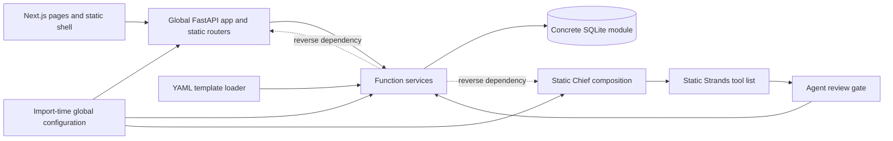
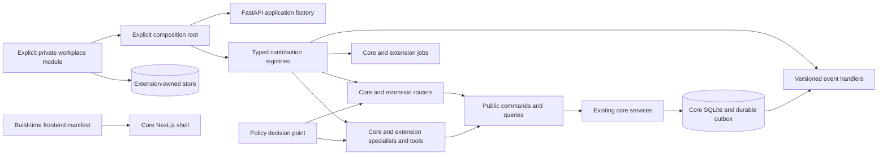

# Workplace extensibility execution plan

Status: active

## Mission

Make Skein demonstrably extensible and upgradeable without creating a workplace fork.

The implementation must preserve the deterministic core, current APIs, security controls, provenance, and content overlays.

## Repository state

- Base branch: `main`
- Base commit: `d3b0f2ebbb6437b9ba34afb398d548ec955d3ae3`
- Feature branch: `feature/workplace-extensibility`
- Historical assessment: `docs/WORKPLACE-EXTENSIBILITY.md`
- Historical scores: modularity 5/10, workplace extensibility 3/10, upgradeability 4/10
- Drift from assessed commit: none
- Pre-existing worktree item: the untracked historical assessment from the preceding architecture review

## Applicable repository instructions

`CLAUDE.md` is the instruction source for this work. This plan does not use `AGENTS.md`.

The implementation retains these constraints:

- The keyless mock-provider path remains functional.
- REST and agent tools use shared application services.
- Services keep ownership of business writes and provenance.
- Migrations remain append-only.
- Activity-chain rows remain immutable.
- Errors remain JSON and do not echo rejected input.
- Existing import paths and configuration names remain compatible.
- The main agent is the only code integrator.

## Current architecture

The directory structure separates concerns. Runtime composition still uses global objects, concrete imports, and fixed registries.

## Target architecture

The target keeps existing services where practical. Public facades protect extensions from private modules and SQLite row shapes.

## Verified baseline findings

| Finding | Status before changes | Evidence |
|---|---|---|
| FastAPI composition is global and static | Confirmed | `backend/app/main.py::app`, `lifespan`, and static `include_router` calls |
| Services are reused but not replaceable | Confirmed | Services import `app.db` and return dictionaries |
| Security registries are static | Confirmed | Review, scope, export, search, provenance, jobs, and tool lists |
| OIDC is configurable but policy is fixed | Confirmed | `routes/deps.py`, administrator list, and one OIDC administrator group |
| Specialist content overlays work | Confirmed | Playbook, persona, and flock overlay loaders |
| Private agent implementations do not compose | Confirmed | `agents/team_agent.py::build_agent` owns construction |
| MCP tool loading lacks Skein policy metadata | Confirmed | `agents/mcp_tools.py` attaches discovered tools directly |
| Frontend composition is static | Confirmed | `layout.tsx`, `nav.tsx`, `section-tabs.tsx`, and theme registries |
| Extension migrations do not exist | Confirmed | `db.MIGRATIONS_DIR` points to one core directory |
| REST is the safest current code boundary | Confirmed | Out-of-process access avoids private imports, but API versioning is absent |

## Baseline verification

| Command | Result | Duration | Notes |
|---|---|---:|---|
| `./scripts/lint.sh` | Passed | 13.74 seconds | Ruff, formatting, mypy, vulture, content validation, theme checks, TypeScript, ESLint, and knip passed |
| `backend/.venv/bin/pytest -q -n auto backend/tests` | Passed: 1,572 | 103.35 seconds | The first run found one date-dependent fixture. The corrected fixture passed alone and in the full suite. |
| `npm test` in `frontend/` | Passed: 225 | 10.45 seconds | 44 Vitest files passed. |
| `npm run build` in `frontend/` | Passed | 12.59 seconds | Production build and TypeScript check passed with network access for Google Fonts. |
| `uv build --out-dir /tmp/skein-baseline-dist backend` | Passed | Not recorded | Built the source distribution and wheel outside the worktree. |
| `scripts/upgrade-path.sh d3b0f2e...` | Passed | 0.80 seconds | Schemas matched and the activity chain verified through sequence 3. |
| `PW_REUSE=1 npx playwright test --reporter=dot` in `frontend/` | Passed: 25 | 138.05 seconds | Used the documented pre-started-server path after the host health poll stalled. |

The first backend run had 1 failure and 1,571 passes. The failing test froze the
schedule service clock at 2026-08-09 but used the real clock for fixture rows.
After UTC crossed into 2026-08-11, the row was two days old instead of three.
The fixture now uses its frozen clock for both service and database dates.

Sandboxed Starlette `TestClient` runs cannot wake a cross-thread asyncio event
loop on this host. A small standard-library diagnostic reproduced the block.
Backend HTTP tests therefore run outside the sandbox. This is an execution
environment constraint, not a Skein failure.

The first direct Playwright launch also stalled in its host-side health poll.
Both endpoints responded to `curl`. Starting the same configured fixtures
explicitly and using the documented `PW_REUSE=1` mode completed all 25 tests.

## Current write-path traces

### Human task update

1. A core page calls `frontend/lib/api.ts::api()` with `PATCH /api/tasks/{id}`.
2. `backend/app/main.py::perimeter_auth` checks the configured credential door.
3. `routes/api.py::patch_task` resolves `CurrentUser` and `ViewerDep`.
4. The route applies the shared write rate limit.
5. The route calls `services/work.py::update_task` with `origin="human"` by default.
6. The service validates status, dates, scope, assignee visibility, delegation, and relationship targets.
7. `db.execute()` writes the task through a concrete SQLite call.
8. `db.log_activity()` appends provenance activity through a second database operation.
9. The service refreshes search and mention projections, then returns a dictionary.
10. FastAPI serializes that dictionary as the response.

Current extension seam: the REST API only.

Current coupling: route models, service arguments, SQLite fields, and response dictionaries form one unversioned contract.

Transaction boundary: `update_task()` does not open a compound transaction. An ambient caller transaction can provide one.

### Agent task update

1. `tools/work.py::update_task` receives the model-selected tool arguments.
2. The tool builds a filtered payload and calls `tools/_gate.py::gated_write`.
3. The gate reads agent identity, requester identity, authority, and the global review setting.
4. A forbidden decision returns a refused receipt.
5. A review decision calls `services/review.py::propose_change`.
6. A direct decision calls the same `services/work.py::update_task` function as REST.
7. Direct service writes use `origin="agent"` and the agent identity.
8. Approved proposals call the registered service handler with `origin="agent_verified"`.
9. The gate records a wrote, queued, refused, or failed receipt.
10. The tool returns a JSON string to Strands.

Current extension seam: none for an in-process private tool. Remote MCP tools bypass this exact gate.

Current coupling: tool inclusion, review entities, authority families, and apply handlers use separate static registries.

### Playbook instantiation

1. REST uses `POST /api/playbooks/instantiate`. Agents use `start_engagement_from_playbook` through the gate.
2. The REST route resolves `CurrentUser`. The agent path resolves agent and requester context.
3. `services/playbooks.py::get_playbook` loads stock and deployment overlay YAML.
4. `playbooks.instantiate` opens `db.transaction()`.
5. `_instantiate` calls engagement, milestone, task, event, note, artifact, and activity services.
6. The ambient transaction gives all SQLite operations one commit boundary.
7. Each created entity receives the caller's actor and origin.
8. Core services append their activity rows. The playbook service appends its own summary row.
9. The service returns created entity dictionaries.

Current extension seam: static template content through `SKEIN_PLAYBOOKS_DIR`.

Current coupling: the interpreter recognizes one fixed YAML shape and directly imports concrete services.

## Assumptions

- The reference extension uses fictional Acme and Atlas names.
- Local fakes replace unavailable workplace credentials and systems.
- Explicit module composition is safer than automatic package discovery.
- One representative extension defines the first public contract surface.
- Existing global configuration remains behind a compatibility adapter.
- SQLite remains the core database.
- A SQLite outbox is sufficient for the first event contract.
- Trusted frontend extensions use build-time composition.

## Explicit non-goals

- No universal plugin base class
- No automatic execution of installed entry points
- No extension access to core SQLite connections
- No generic EAV model
- No arbitrary runtime JavaScript
- No PostgreSQL migration
- No whole-product service rewrite
- No Kafka or new distributed platform
- No repository protocol around every service
- No full workflow language
- No organization-specific condition inside core business logic

## Compatibility strategy

- Keep `app.main:app` as the default deployment entry point.
- Keep existing route paths, request fields, response fields, and configuration names.
- Build new registries from existing core registrations.
- Map current authority and review behavior into the default policy.
- Treat unversioned playbooks, personas, and flocks as schema version 1.
- Add migrations only through new numbered files.
- Add public facades before moving internal services.
- Keep current frontend pages as the default manifest.

## Milestones and dependency order

| Milestone | Depends on | Deliverable | Acceptance evidence | Status |
|---:|---|---|---|---|
| 0 | None | Baseline, traces, plan, and characterization tests | Baseline commands and plan | Complete |
| 1 | 0 | Immutable composition settings and application factory | Existing `app` and external factory tests | Complete |
| 2 | 1 | Typed module, route, job, tool, specialist, context, and handler registries | Collision and compatibility tests | Complete for current extension concerns |
| 3 | 2 | Core policy decision point and capability reporting | Existing behavior tests plus conditional workplace policy | Complete |
| 4 | 3 | Governed private and MCP tool wrappers | Policy, receipt, timeout, and provenance tests | Complete |
| 5 | 2 | Public commands, queries, results, and errors | Reference extension imports only public modules | Complete for task work |
| 6 | 5 | Versioned events and durable outbox | Delivery, retry, and idempotency tests | Complete |
| 7 | 2 | Extension-owned migration and data boundaries | Separate store and migration tests | Complete |
| 8 | 2, 3, 5 | Minimum typed workflow steps | Condition, approval, action, and checkpoint tests | Complete |
| 9 | 2 | Versioned content schemas and deployment validator | Version 1 compatibility and invalid-content tests | Complete |
| 10 | 2, 3 | Frontend extension manifest and UI primitives | External navigation and dashboard card tests | Complete |
| 11 | 3 through 10 | Atlas reference extension | Scenarios A through G | Complete |
| 12 | 11 | Package composition and upgrade rehearsal | Scenario H and derivative builds | Complete |
| 13 | All | Full verification and final documentation | CI-equivalent commands and score evidence | Complete before review |
| 14 | 13 | Four independent reviewer roles | Review reports and conservative scores | Sixth review rejected `d4deff1` |
| 15 | 14 | Review remediation and repeated verification | No blocker or high finding | Sixth remediation complete; final review pending |

## Test strategy

- Add characterization tests before each sensitive refactor.
- Use current test registries as the compatibility source.
- Add contract tests that load the reference extension through the real factory.
- Test policy through REST, tools, workflow steps, and capability responses.
- Test outbox persistence, retries, and duplicate delivery.
- Test extension migrations against fresh and upgraded stores.
- Test content validation with legacy and versioned fixtures.
- Test the core frontend and reference manifest through the same composition path.
- Run targeted checks per milestone.
- Run full CI-equivalent checks before each milestone commit.
- Run the complete backend, frontend, build, upgrade, packaging, and end-to-end checks before final review.

## Scenario evidence matrix

| Scenario | Required executable proof | Planned contract | Status |
|---|---|---|---|
| A | Atlas reads and updates work without a core registration edit | Public command, query, event, job, and integration adapter | Complete: reference integration and event test |
| B | Regulated work requires manager review by subject, action, project, and risk | Policy decision and obligations | Complete: reference policy and playbook tests |
| C | Atlas adds navigation and a manager dashboard card | Frontend manifest and capability | Complete: packed-package production build |
| D | Delivery specialist adds prompt, context, tool, and permissions | Specialist, context, tool, and policy contributions | Complete: governed reference tool and specialist test |
| E | Atlas mappings use an extension-owned store and migration | Extension data contract | Complete: isolation and upgrade tests |
| F | Delivery playbook uses a condition, approval, registered action, and checkpoint | Versioned workflow steps | Complete: reference content and API tests |
| G | OIDC groups map to workplace capabilities | Identity attributes and policy | Complete: reference identity and policy test |
| H | The extension moves across compatible core versions without source patches | Compatibility metadata and upgrade test | Complete: installed-wheel upgrade rehearsal |

## Score-to-evidence matrix

Scores can increase only when core behavior and the reference extension use the contract.

| Area | Baseline | Target | Required evidence | Current justified score |
|---|---:|---:|---|---:|
| Overall modularity | 5/10 | 8/10 | Factory, typed registries, public contracts, dependency tests | 8.3/10 candidate after remediation |
| Workplace extensibility | 3/10 | 8/10 | Scenarios A through G and private package boundary | 8.4/10 candidate after remediation |
| Upgradeability | 4/10 | 8/10 | Compatibility metadata, package build, migration and upgrade rehearsal | 8.3/10 candidate after remediation |
| Domain model | 2/5 | 4/5 | Public typed commands, queries, results, and references | 4/5 |
| Service layer | 3/5 | 4/5 | Public facade and no private extension imports | 4/5 |
| API | 2/5 | 4/5 | Router contributions and stable error contracts | 4/5 |
| Authorization | 2/5 | 4/5 | Default and workplace policy tests | 4/5 |
| Agent registration | 2/5 | 4/5 | External specialist uses real Chief composition | 4/5 |
| Tool registration | 2/5 | 4/5 | Governed external tool with receipts | 4/5 |
| Frontend navigation | 1/5 | 4/5 | External manifest drives core shell | 4/5 |
| Policy enforcement | 2/5 | 4/5 | REST, agent, workflow, and capability enforcement | 4/5 |

## Decision log

| Date | Decision | Rationale |
|---|---|---|
| 2026-08-10 | Use `CLAUDE.md` instead of `AGENTS.md` | The user specified the repository instruction source |
| 2026-08-10 | Keep the main agent as the only integrator | This avoids parallel edits and preserves coherent commits |
| 2026-08-10 | Run four specialist reviewers in waves | The user set the final review limit to four agents |
| 2026-08-10 | Keep existing services behind public facades | A full service rewrite adds risk without extension value |
| 2026-08-10 | Use explicit module lists | Automatic discovery adds supply-chain and startup risk |
| 2026-08-10 | Keep SQLite and add a small outbox | Database replacement is outside the verified requirement |
| 2026-08-10 | Use frozen fixture time for schedule-age tests | Real wall time made the baseline test depend on the UTC date |
| 2026-08-10 | Run HTTP tests outside the sandbox | The host sandbox blocks cross-thread asyncio wakeups |
| 2026-08-10 | Use Playwright's documented pre-started-server mode | The host health poll stalled although both test endpoints responded |
| 2026-08-10 | Preserve request-time auth compatibility | Superseded after review: the compatibility adapter made explicit application settings non-authoritative |
| 2026-08-10 | Require explicit, namespaced module routes | Private routes cannot collide with the core API and installed packages never execute automatically |
| 2026-08-10 | Combine policy by strongest result | A workplace permit cannot erase a core deny; deny outranks review, and review outranks permit |
| 2026-08-10 | Omit unclassified MCP tools | A remote tool with unknown effects cannot bypass Skein policy, review, and receipts |
| 2026-08-10 | Keep extension data in a separate store | This prevents private code from depending on core tables or migration order |
| 2026-08-10 | Send safe event summaries through the outbox | Subscribers receive identifiers and changed field names, not private row bodies |
| 2026-08-10 | Require subscribers to use the event ID for idempotency | A process can stop after an external side effect and before it stores the receipt |
| 2026-08-11 | Keep workflow steps limited to four types | Conditions, approvals, actions, and checkpoints cover the verified scenario |
| 2026-08-11 | Stop direct workflow-playbook instantiation | A caller without the composed action registry must not skip private steps |
| 2026-08-11 | Treat unversioned content as version 1 | Existing playbooks, personas, and flocks remain compatible |
| 2026-08-11 | Compose frontend code before the build | Trusted static imports preserve CSP controls and avoid remote runtime code |
| 2026-08-11 | Hide policy-bound UI until the backend permits it | A failed capability request must not show an action that the backend can refuse |
| 2026-08-11 | Publish JavaScript and declarations for frontend extensions | Next.js does not transpile TSX that a separate package ships from `node_modules` |
| 2026-08-11 | Include SQL migrations in the core wheel | An installed core artifact must initialize its schema without a source checkout |
| 2026-08-11 | Derive stable core REST policy actions from route templates | One route class covers current and future authenticated mutations without editing every handler |
| 2026-08-11 | Keep auth and signed webhooks on specialized gates | These calls do not have a verified human subject for workplace policy |
| 2026-08-11 | Emit task events inside the shared service transaction | REST, built-in tools, reviews, and extensions must produce the same event contract |
| 2026-08-11 | Store reviewed extension invocations outside the review queue | Reviewers need a safe summary, while the approval executor needs the exact typed call |
| 2026-08-11 | Report synchronous write timeouts as completion unknown | A thread cannot be cancelled after it starts, so a timeout is not proof that no side effect occurred |
| 2026-08-11 | Use one retry budget for each event subscriber | A tolerant subscriber must not extend another subscriber's declared retry limit |
| 2026-08-11 | Package stock content and core migrations with the wheel | An installed core artifact must start without the source tree |
| 2026-08-11 | Pass the composed registry into unattended turns | Scheduled agents must use the same tools and workplace policy as interactive agents |
| 2026-08-11 | Separate requester and execution actor | Policy uses the requester, while provenance records the specialist that performed the write |
| 2026-08-11 | Require a group result during directory refresh | A profile resolver must not preserve stale approval groups during a directory outage |
| 2026-08-11 | Use `playbook.create` on every surface | REST, deterministic chat, and agent tools need one project-aware policy action |
| 2026-08-11 | Run artifact contracts in main CI | Installed packages, deployment overlays, and derivative images need continuous checks |

## Risks

| Risk | Control | Status |
|---|---|---|
| App factory changes startup order | Characterization tests and default `app` parity | Open |
| Policy duplicates current authorization | Core authorization still runs; workplace rules can only narrow | Controlled |
| Public facade leaks internal dictionaries | Typed task views and public errors hide service dictionaries | Controlled for task work |
| Extension migrations enter core security inventories | The store refuses both Skein database paths | Controlled |
| MCP wrappers cannot infer write effects | Explicit metadata and deny-unknown default | Open |
| Next.js build-time extension imports become core hard-coding | External composition manifest and generated build input | Open |
| Scope expands into unused abstractions | Remove any contract unused by core and Acme | Open |

## Progress log

### 2026-08-10

- Read `CLAUDE.md` and the feature reference.
- Confirmed `main` and the assessed commit as the exact base.
- Preserved the historical assessment as pre-existing work.
- Created `feature/workplace-extensibility`.
- Read deployment, CI, package, roadmap, visibility, persona, and flock guidance.
- Completed current architecture and write-path traces.
- Completed the full baseline verification.
- Corrected one date-dependent test fixture without changing product behavior.
- Confirmed 1,572 backend tests, 225 frontend tests, 25 browser tests, lint,
  production build, backend packaging, and the existing upgrade rehearsal.
- Added `create_app(settings, modules)` while retaining `app.main:app`.
- Added immutable settings and registry snapshots.
- Routed built-in routers and jobs through the same contribution types used by
  external modules.
- Added startup validation for versions, namespaces, duplicate IDs and names,
  dependencies, and dependency cycles.
- Added real composition tests for a private route, lifecycle, and catch-up job.
- The first full regression run exposed request-time auth and scheduler-call
  compatibility. Both adapters were restored, and their eight focused tests pass.
- The complete backend regression suite then passed with 1,582 tests in 92.67 seconds.
- Added typed policy, identity, context, tool, and specialist contributions.
- Mapped the existing authority and review behavior into the default policy.
- Applied workplace policy to the existing agent write gate.
- Added `/api/capabilities` for capability-aware presentation.
- Added governed Strands wrappers with typed input/output, stable names,
  effects, risk, allowlists, timeouts, safe error codes, and receipt behavior.
- Added private specialist prompt, context, and tool composition without a
  private import in the Chief-of-Staff implementation.
- Added MCP governance metadata and a deny-by-omission rule for unclassified
  remote tools.
- Confirmed the full backend suite passes with 1,592 tests after this slice.
- Added typed task commands, task views, command context, and machine-readable
  public errors for extension packages.
- Kept public task writes on the existing service path and in one transaction
  with their outbox event.
- Added versioned task events, durable retries, subscriber receipts, and
  visibility filters. Event payloads contain no task body text.
- Added extension-owned SQLite stores and isolated append-only migrations.
- Added a startup migration contribution that never opens a Skein database.
- Confirmed 65 focused contract, migration, scope, and composition tests.
- Confirmed the full backend suite passes with 1,601 tests after this slice.

### 2026-08-11

- Added governed workflow-action contributions with schemas, versions,
  effects, risk, policy actions, timeouts, and safe error codes.
- Added typed condition, approval, action, and checkpoint steps.
- Connected workflow-backed playbooks to the real application registry.
- Refused direct instantiation when a workflow needs composed actions.
- Added schema version 1 validation for playbooks, personas, and flocks.
- Added `python -m app.content` for deployment repository validation.
- Confirmed 102 focused workflow, content, persona, flock, and API tests.
- The first full suite found one missing activity-feed verb. The workflow
  action now has a registered reader-facing verb.
- Confirmed the full backend suite passes with 1,610 tests after remediation.
- Added a versioned frontend extension manifest with compatibility and
  namespace checks.
- Added build-time composition through `SKEIN_FRONTEND_EXTENSIONS`.
- Added policy-aware navigation and manager dashboard card contributions.
- Exported a narrow frontend API with the shared card and authenticated API
  client.
- Confirmed 229 frontend tests, TypeScript, ESLint, knip, and the production
  build pass.
- Added the fictional Atlas private extension with a router, scheduled job,
  integration, policy, identity map, governed tool, specialist, context source,
  event subscriber, workflow action, data store, and migration stream.
- Added versioned Atlas playbook, persona, and flock overlays.
- Added a separately packed frontend extension with policy-aware navigation and
  a manager dashboard card. Its real Next.js production build passes.
- Added a derivative image, Kustomize overlay, and external Secret reference.
- Added artifact-level compatibility metadata and an installed-wheel upgrade
  rehearsal. The rehearsal found and corrected missing migrations in the core
  wheel, then passed with separate Skein and Atlas artifacts.
- Confirmed 42 focused reference and extension tests and all reference content
  validation.
- Added central policy enforcement to authenticated core and private REST
  mutations. Stable actions use the method and literal route template.
- Added deny and review regression tests that prove a refused task mutation
  does not write.
- Confirmed the complete backend suite passes with 1,619 tests after REST
  policy enforcement.
- Added the extension-author guide, feature reference, on-demand roadmap, and
  workplace repository upgrade procedure.
- Moved task event creation onto the shared service write path. Human REST,
  built-in agent, review, and integration writes now emit the same safe event.
- Added an always-present outbox delivery job. A deployment without subscribers
  marks events delivered without calling external code.
- Confirmed 48 focused event, reference, REST, scheduler, and agent-gate tests.
- Created `WORKPLACE-EXTENSIBILITY-RESULTS.md` with the current architecture,
  scorecard, evidence, A–H results, limits, and repository guidance.
- Completed the final pre-review verification: 1,620 backend tests, 229
  frontend tests, the default production build, full lint, both upgrade
  rehearsals, and 25 Chrome tests all pass.
- The first four independent reviewers rejected the first implementation.
- Fixed every blocker and high-severity finding. Added durable tool and
  workflow approval, installed-wheel startup, honest version ranges, composed
  policy for background work, specialist identity protection, MCP success
  audit, public frontend packaging, and two-core-artifact upgrade tests.
- Added per-subscriber event retries and retention. Added strict persona
  frontmatter validation.
- Confirmed 1,635 backend tests in 97.02 seconds after remediation.
- Confirmed 229 frontend tests, full lint and types, and the default production build.
- Confirmed installed-wheel startup, the `0.2.0` to `0.2.1` core upgrade,
  both package rehearsals, and the database upgrade path.
- Added an inbound MCP composition test. It proves that identity mapping and
  workplace policy apply outside the FastAPI process.

## Review findings

### First independent review

Four read-only specialists reviewed commit `8e5feec`. All four rejected it.

| Reviewer | Modularity | Workplace extensibility | Upgradeability | Decision |
|---|---:|---:|---:|---|
| Architecture and dependency direction | 6.8 | 6.2 | 5.5 | Reject |
| Security, authorization, and provenance | 6.8 | 5.8 | 6.8 | Reject |
| Compatibility and reliability | 6.6 | 5.9 | 5.4 | Reject |
| Adversarial extension author | 7.0 | 6.5 | 6.5 | Reject |

The findings below are valid and need code or executable evidence:

- The frontend reads the wrong capability response shape.
- The `0.1.0` compatibility claim includes the assessed core, which has no
  extension contracts. The rehearsal does not install two core releases.
- An installed core wheel cannot start because it omits stock content.
- The wheel puts core migrations in a generic top-level package.
- Jobs and event subscribers can use a private policy engine instead of the
  final composed policy.
- Extension mutation routes are not mechanically governed.
- Explicit `AppSettings` do not control the request authentication gate.
- Identity mappers cannot independently contribute roles and capabilities.
- Approval obligations are not stored or checked when a reviewer approves.
- Built-in agent writes discard the mapped subject and useful resource data.
- Indirect specialist consultation skips required capabilities, and contributed
  specialist names are not reserved as agent identities.
- Successful MCP writes have no durable execution record. Declared MCP errors
  and total timeouts are not enforced.
- Public task reads accept a forgeable subject instead of a verified viewer or
  registered service identity.
- Tool and workflow timeouts can report cancellation while a synchronous side
  effect continues.
- The frontend API is an internal alias. Atlas JavaScript is maintained apart
  from its TypeScript source.
- The extension-author work command example does not execute.
- Public event emission lets an extension forge core event types.
- Tool collision checks omit model-facing names owned by core tools.
- Applied extension migrations do not detect changed SQL.
- The Atlas importer needs an idempotency key and must preserve imported status.
- Playbook work is created before its approval workflow runs.

## Remediation status

The first-review remediation is implemented. The full backend and frontend
tests pass. Lint, types, production builds, installed startup, upgrade checks,
and both package rehearsals also pass. The second review starts after the
remediation commit.

Resolved findings include:

- The frontend now reads `capabilities.actions` and tests the real response.
- The backend and frontend compatibility floor is `0.2.0`.
- The installed wheel contains stock content and package-owned migrations.
- Jobs, event subscribers, public work, tools, and workflows receive the final
  composed policy and service facades.
- Namespaced mutation routes receive a mandatory composed-policy check.
- The application factory settings control the real authentication gate.
- Identity roles and capabilities aggregate across independent modules.
- Approval groups and capabilities persist and are enforced on the verdict.
- Contributed tools and playbooks create durable reviews and resume the exact
  stored invocation after a qualified approval.
- Built-in agent writes retain mapped identity and task context.
- Specialist capabilities apply to direct and Chief-mediated access. Startup
  reserves specialist identities as agents.
- Successful MCP writes create durable activity. MCP versions, capabilities,
  output schemas, declared errors, and total deadlines are enforced.
- Public task queries do not treat a forgeable name as visibility proof.
- Write deadlines return `completion_unknown` and have late-side-effect tests.
- Frontend contracts come from a buildable public package. Atlas has one TSX
  source and generated package output with a drift rehearsal.
- Event emission is internal, extension migration SQL is hashed, tool names
  cannot shadow core, Atlas imports are idempotent, and approval happens before
  playbook work is created.
- The upgrade rehearsal rejects the old `0.1.0` core, starts installed `0.2.0`,
  and moves the unchanged Atlas package to a separate `0.2.1` artifact.

### Second independent review

Four read-only specialists reviewed commit `952ff3a`. All four rejected it.

| Reviewer | Modularity | Workplace extensibility | Upgradeability | Decision |
|---|---:|---:|---:|---|
| Architecture and extension author | 7.6 | 7.3 | 7.4 | Reject |
| Security and provenance | 7.4 | 6.9 | 7.5 | Reject |
| Compatibility and reliability | 7.8 | 7.6 | 6.8 | Reject |
| Adversarial score auditor | 7.3 | 6.8 | 5.8 | Reject |

The valid gate findings are:

- A standard virtual-environment install cannot find packaged stock content.
- Workflow approvals use non-unique step names and can authorize later calls.
- Tool and workflow approvals can bypass changed review requirements.
- Reviewed workflows are not bound to the reviewed playbook content.
- MCP review decisions cannot create and resume a durable proposal.
- Jobs and event subscribers receive policy but are not gated before execution.
- The reference route reads undocumented application state for public services.
- Some inbound MCP and delegated-write paths do not use workplace policy.
- Backend and frontend extension API declarations can self-certify at runtime.
- Contributed specialists do not honor their contract in keyless mode.
- Background jobs need a supported topology or an idempotent claim.
- The repository instructions still name the old core migration directory.

Medium findings that affect the same boundaries are also in scope. These
include authoritative task context, review previews, service identity,
event deadlines, version drift checks, and truthful post-write failure status.

### Second-review remediation

The second remediation is complete on the working branch.

- Stock content now resolves from the normal virtual-environment data path.
- The installed-wheel rehearsal uses a normal virtual environment.
- The compatible `0.2.1` artifact includes an additive migration.
- Workflow grants now bind one structural path, policy result, input, action
  version, and complete workflow definition.
- Tool, workflow, and MCP approvals recheck the current identity and policy.
- MCP review decisions now create durable, resumable proposals.
- Jobs and event subscribers declare a service identity, policy action,
  effect, and risk. Skein checks policy before each handler.
- Extension jobs use a durable time-window claim across scheduler workers.
- Extension routes now receive public route services. Atlas does not read
  private application state.
- Inbound MCP reads and direct delegated writes use the composed policy.
- Backend and frontend extension compatibility values are extension-owned
  literals. A release drift test checks the package manifests.
- Keyless contributed specialists are deterministic and cannot capture work.
- Review previews have an explicit audience. Skein records the reviewer
  groups and capabilities that satisfied the verdict.
- Task policy uses the persisted engagement class and task visibility.
- Write timeouts and invalid post-write output report uncertain completion.
- `CLAUDE.md` now names `backend/app/core_migrations/`.

Verification after this remediation:

- `backend/.venv/bin/pytest -q -n auto backend/tests`: 1,647 passed in
  102.72 seconds.
- `./scripts/lint.sh`: Ruff, formatting, mypy, vulture, content, licenses,
  theme contrast, TypeScript, ESLint, and knip passed in 12.94 seconds.
- `npm --prefix frontend test -- --run`: 229 passed in 45 files.
- `npm run build` in `frontend/`: the production build passed in 13.52
  seconds.
- `scripts/reference-extension-contract.sh`: normal installed-wheel startup
  and the `0.2.0` to `0.2.1` migration upgrade passed in 14.66 seconds.
- `scripts/reference-frontend-contract.sh`: packed API, Atlas package, clean
  consumer import, and derivative production build passed in 15.18 seconds.
- `scripts/upgrade-path.sh d3b0f2e...`: schema and activity-chain upgrade
  passed in 0.57 seconds.
- `uv build --wheel --out-dir /tmp/skein-final-dist backend`: passed.

## Final results

### Third independent review

Four read-only specialists reviewed commit `4f1374f`. One approved it. Three
rejected it.

| Reviewer | Modularity | Workplace extensibility | Upgradeability | Decision |
|---|---:|---:|---:|---|
| Compatibility and reliability | 8.2 | 8.1 | 8.3 | Approve |
| Security and provenance | 7.5 | 6.8 | 7.4 | Reject |
| Extension author | 8.1 | 7.8 | 7.7 | Reject |
| Adversarial score auditor | 7.8 | 7.5 | 7.1 | Reject |

The valid gate findings are:

- Core agent proposals do not recheck current policy and identity.
- The keyless capture path can bypass workplace domain policy.
- Human names can collide with job and event service identities.
- An MCP review does not bind the selected server.
- A saved directory subject can retain inactive or removed group membership.
- Unexpected write failures can report a known failure after a late write.
- Direct routes, jobs, and events do not have a safe review-resume contract.
- Frontend upgrades lack a versioned host artifact and two-version rehearsal.
- Nested playbook steps and action references lack complete validation.
- Lifecycle handlers receive unnecessary application internals.
- The import-boundary test does not inspect plain `import` statements.

### Third-review remediation

The third remediation is implemented on the working branch.

- Core review records bind the exact policy input and command. Approval
  refreshes the requester, reloads current domain attributes, and rechecks the
  composed policy.
- Keyless agent captures use the same governed write gate as model-backed
  tools. Signed Slack captures remain human writes.
- Jobs and subscribers use explicit non-human service identities. Startup
  rejects a human-name collision. Human identity mapping cannot grant a
  service capability by name.
- MCP reviews bind the server, tool, version, and input. Same-named tools on
  different servers fail closed.
- Directory-backed review subjects need an available resolver. Inactive users
  and removed groups fail the current approval check.
- Timed-out and unexpected writes report `completion_unknown` when a late side
  effect is possible.
- Direct routes, jobs, and subscribers reject `review` with
  `POLICY_REVIEW_UNSUPPORTED`. Governed tools and workflows are the supported
  durable review surfaces.
- The repository can create a versioned frontend host archive. The container
  build has a public host stage. One unchanged Atlas package builds against
  synthetic compatible core hosts `0.2.0` and `0.2.1`.
- Content validation walks nested workflow steps and verifies registered
  workflow actions.
- Lifecycle handlers receive only the installed core version. Scheduled jobs
  do not receive application settings or secrets.
- Import-boundary tests inspect `import` and `from ... import ...` statements.
- Extension job and event handlers must be synchronous. Job execution is
  bounded, and each run window has a tested durable claim.

Verification after this remediation:

- `backend/.venv/bin/pytest -q -n auto backend/tests`: 1,671 passed in
  104.92 seconds.
- `npm --prefix frontend test -- --run`: 229 passed in 45 files.
- `./scripts/lint.sh`: all Python, TypeScript, content, license, dead-code,
  and theme checks passed.
- `npm run build` in `frontend/`: the production build passed in 16.91
  seconds.
- `scripts/reference-extension-contract.sh`: installed startup and the full
  unchanged Atlas `0.2.0` to `0.2.1` backend upgrade passed in 17.71 seconds.
- `scripts/reference-frontend-contract.sh`: the unchanged Atlas package built
  on frontend hosts `0.2.0` and `0.2.1` in 43.76 seconds.
- `scripts/upgrade-path.sh d3b0f2e...`: schema equality and the activity chain
  passed in 0.51 seconds.
- `uv build --wheel --out-dir /tmp/skein-final-remediation-dist backend`:
  the core wheel built successfully.

A new independent review and live Chrome validation are pending.

### Fourth independent review

Three read-only specialists completed a fresh review of commit `62e352e`.
All three rejected it. The compatibility reviewer had approved the preceding
artifact boundary, but the security and extension scenarios still failed.

| Reviewer | Modularity | Workplace extensibility | Upgradeability | Decision |
|---|---:|---:|---:|---|
| Security and provenance | 7.3 | 6.2 | 7.1 | Reject |
| Extension author | 8.0 | 7.7 | 7.6 | Reject |
| Adversarial score auditor | 7.9 | 7.6 | 7.7 | Reject |

The valid gate findings were:

- Review refresh could increase a weak identity to strong. An OIDC subject
  with no groups could also survive a directory outage.
- Service subjects could refresh through a human identity mapper.
- Stock Strands reads and four specialized stock writes did not use the
  composed workplace policy.
- Agent updates, review resume, and milestone-linked tasks could use the old
  project class instead of the target project class.
- Generic REST policy trusted ignored JSON context fields.
- Signed Slack, CI, and forge writes did not use the workplace policy.
- An unqualified reviewer could reject a manager-only proposal.
- MCP metadata accepted an empty policy action and malformed list fields.
  Remote tools could also shadow local model-facing names.
- A contributed tool review appeared as a refusal in the chat receipt.
- The public content command did not validate contributed workflow actions.
- The documented Kustomize overlay did not render with standard load rules.
- The frontend host archive left stale lockfile versions and test artifacts.

### Fourth-review remediation

The fourth remediation is implemented on the working branch.

- A saved policy subject now records authentication strength, source, and
  whether directory refresh is required. Refresh never increases strength.
  OIDC users refresh even when they have no groups. Service subjects resolve
  only through the service registry.
- One authoritative target-state resolver serves REST, agent writes, and
  review resume. It resolves task links through milestones and engagements.
  Ignored request fields cannot replace stored classification.
- Every stock model-facing read uses `skein.tool.<name>`. The four specialized
  stock writers also use policy and can create an exact resumable review.
- Slack, CI, and forge keep their authentication gates and then evaluate a
  stable integration policy action. Forge uses a registered service identity.
- Approval and rejection require the current configured approver. Both store
  the reviewer qualifications.
- MCP metadata requires a non-empty action and typed arrays. MCP tools cannot
  shadow local tools. Review receipts are queued, not refused.
- Contributed tool receipts distinguish queued, refused, failed, completed,
  and completion-unknown results.
- Startup and `python -m app.content` validate registered workflow actions.
- The Atlas Kustomize root now contains every generated file. A standard
  render script tests it.
- Frontend host archives update both package manifests and omit tests, build
  state, local configuration, and browser fixtures.
- The installed upgrade rehearsal loads private playbooks, personas, and
  flocks before and after the core upgrade.

Verification after this remediation:

- `backend/.venv/bin/pytest -q -n auto backend/tests`: 1,689 passed in
  108.75 seconds.
- Focused policy, review, tool, integration, content, and deployment tests:
  183 passed in 13.85 seconds.
- `npm test` in `frontend/`: passed with the existing 229-test suite.
- `npm run build` in `frontend/`: production build passed in 13.18 seconds.
- Backend lint, formatting, mypy, vulture, content, license, and theme checks
  passed. Frontend TypeScript, ESLint, and knip checks passed.
- `scripts/reference-extension-contract.sh`: installed backend and unchanged
  Atlas `0.2.0` to `0.2.1` upgrade passed in 26.88 seconds.
- `scripts/reference-frontend-contract.sh`: unchanged Atlas package built on
  frontend hosts `0.2.0` and `0.2.1` in 41.29 seconds.
- `scripts/reference-deployment-contract.sh`: standard Kustomize render passed.
- `uv build --wheel --out-dir /tmp/skein-final-dist backend`: passed.

A fresh four-specialist review is the next gate. Live Chrome validation still
waits for that review to approve the architecture.

### Fifth independent review and remediation

Architecture and compatibility reviewers completed a fresh review of
`1a897b0`. Both rejected it. The policy-correctness run was interrupted after
it reported valid deterministic-command and public-facade gaps. The
adversarial role did not start because the gate had already failed.

The remediation now does the following:

- The public work facade uses the shared target-state resolver for direct
  engagement changes, milestone relinks, and relationship unlink fallback.
- Deterministic `/plan` and `/remember` commands evaluate their domain policy
  action in web chat and signed Slack execution.
- Unversioned playbooks, personas, and flocks keep their legacy open fields.
  Explicit version 1 files use the strict schema.
- Application startup validates explicit schemas and executable workflows
  without rejecting unrelated malformed legacy overlays.
- Extension shutdown runs when any later core startup step fails.
- The installed upgrade rehearsal uses migration 017, retains base-era
  content, and compares fresh and upgraded next-release schemas.
- The Atlas deployment uses a separate persistent volume and a token-backed
  HTTP adapter. Exact artifact staging commands and an executable two-image
  build rehearsal are present.

Verification after this remediation:

- Focused public, content, lifecycle, command, and Atlas tests: 78 passed.
- Full backend suite: 1,697 passed in 106.74 seconds.
- Frontend suite: 229 passed in 45 files.
- Production frontend build: passed in 12.05 seconds.
- Full lint and type gate: passed.
- Installed backend, legacy-content, and schema-equivalence rehearsal: passed.
- Packed frontend two-host rehearsal: passed.
- Standard Kustomize render: passed.
- Backend and frontend derivative image builds: passed.
- Base database and activity-chain upgrade: passed.
- Core wheel build: passed.

The next step is a fresh four-role independent review. Chrome validation stays
blocked until every review gate passes.

### Sixth independent review and remediation

Four specialists reviewed commit `d4deff1`. The compatibility reviewer
approved it. The architecture, security, and adversarial reviewers rejected
it.

| Reviewer | Modularity | Workplace extensibility | Upgradeability | Decision |
|---|---:|---:|---:|---|
| Architecture and extension author | 7.9 | 7.7 | 8.3 | Reject |
| Security and provenance | 7.7 | 6.8 | 8.0 | Reject |
| Compatibility and reliability | 8.2 | 8.2 | 8.2 | Approve |
| Adversarial score auditor | 7.6 | 7.1 | 8.0 | Reject |

The reviewers found four high-severity defects:

- The unattended agent runner lost the composed policy and registry.
- A profile resolver could mask an unavailable group resolver.
- REST playbook policy did not receive the selected project class.
- A contributed specialist tool recorded the requester as the writer.

The compatibility reviewer also found a lifecycle cleanup defect. The
security reviewer found that extension rejection used old approver grants.

This remediation does the following:

- The core agent job passes the composed registry and policy into each turn.
  Each turn uses an explicit agent subject. Context cleanup runs in `finally`.
- Group refresh succeeds only when a resolver returns the `groups` key. An
  empty group tuple is valid. A profile-only result cannot hide an outage.
- REST, deterministic chat, and agent tools use `playbook.create`. REST loads
  the selected playbook before policy evaluation.
- A REST policy review stores the exact playbook call before any project work.
  Current policy and identity govern approval and rejection.
- A tool handler receives the requester, agent, and correlation ID separately.
  Public commands record the agent as the writer and retain the requester for
  policy evaluation.
- Extension shutdown isolates callback failures. One failed callback cannot
  skip cleanup for another module.
- The public API exports `LifecycleContext`.
- The main CI workflow runs installed backend, frontend host, deployment, and
  derivative image contracts.

Verification after this remediation:

- Focused security, review, workflow, and public-contract tests: 189 passed.
- Full backend suite: 1,704 passed in 115.41 seconds.
- Frontend suite: 229 passed in 45 files.
- Production frontend build: passed in 20.59 seconds.
- Full lint, type, dead-code, content, license, and theme gate: passed.
- Installed backend and unchanged Atlas upgrade rehearsal: passed.
- Packed frontend two-host rehearsal: passed.
- Standard Kustomize render: passed.
- Base schema and activity-chain upgrade: passed.
- Core wheel build: passed.
- Core, frontend host, Atlas backend, and Atlas frontend images: built and
  inspected successfully.

A fresh four-role review is the next gate. Chrome validation remains blocked
until that review approves the exact commit.
