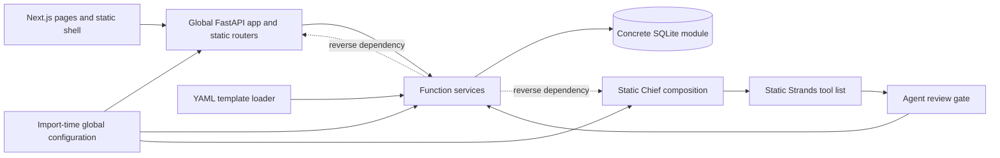
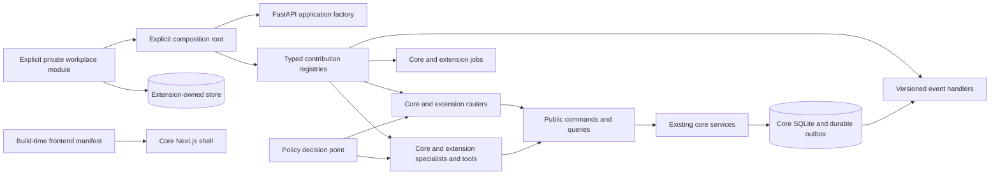

# Workplace extensibility execution plan

Status: active

## Mission

Make Skein demonstrably extensible and upgradeable without creating a workplace fork.

The implementation must preserve the deterministic core, current APIs, security controls, provenance, and content overlays.

## Repository state

- Base branch: `main`
- Base commit: `d3b0f2ebbb6437b9ba34afb398d548ec955d3ae3`
- Feature branch: `feature/workplace-extensibility`
- Historical assessment: `docs/WORKPLACE-EXTENSIBILITY.md`
- Historical scores: modularity 5/10, workplace extensibility 3/10, upgradeability 4/10
- Drift from assessed commit: none
- Pre-existing worktree item: the untracked historical assessment from the preceding architecture review

## Applicable repository instructions

`CLAUDE.md` is the instruction source for this work. This plan does not use `AGENTS.md`.

The implementation retains these constraints:

- The keyless mock-provider path remains functional.
- REST and agent tools use shared application services.
- Services keep ownership of business writes and provenance.
- Migrations remain append-only.
- Activity-chain rows remain immutable.
- Errors remain JSON and do not echo rejected input.
- Existing import paths and configuration names remain compatible.
- The main agent is the only code integrator.

## Current architecture

The directory structure separates concerns. Runtime composition still uses global objects, concrete imports, and fixed registries.

## Target architecture

The target keeps existing services where practical. Public facades protect extensions from private modules and SQLite row shapes.

## Verified baseline findings

| Finding | Status before changes | Evidence |
|---|---|---|
| FastAPI composition is global and static | Confirmed | `backend/app/main.py::app`, `lifespan`, and static `include_router` calls |
| Services are reused but not replaceable | Confirmed | Services import `app.db` and return dictionaries |
| Security registries are static | Confirmed | Review, scope, export, search, provenance, jobs, and tool lists |
| OIDC is configurable but policy is fixed | Confirmed | `routes/deps.py`, administrator list, and one OIDC administrator group |
| Specialist content overlays work | Confirmed | Playbook, persona, and flock overlay loaders |
| Private agent implementations do not compose | Confirmed | `agents/team_agent.py::build_agent` owns construction |
| MCP tool loading lacks Skein policy metadata | Confirmed | `agents/mcp_tools.py` attaches discovered tools directly |
| Frontend composition is static | Confirmed | `layout.tsx`, `nav.tsx`, `section-tabs.tsx`, and theme registries |
| Extension migrations do not exist | Confirmed | `db.MIGRATIONS_DIR` points to one core directory |
| REST is the safest current code boundary | Confirmed | Out-of-process access avoids private imports, but API versioning is absent |

## Baseline verification

| Command | Result | Duration | Notes |
|---|---|---:|---|
| `./scripts/lint.sh` | Passed | 13.74 seconds | Ruff, formatting, mypy, vulture, content validation, theme checks, TypeScript, ESLint, and knip passed |
| `backend/.venv/bin/pytest -q -n auto backend/tests` | Passed: 1,572 | 103.35 seconds | The first run found one date-dependent fixture. The corrected fixture passed alone and in the full suite. |
| `npm test` in `frontend/` | Passed: 225 | 10.45 seconds | 44 Vitest files passed. |
| `npm run build` in `frontend/` | Passed | 12.59 seconds | Production build and TypeScript check passed with network access for Google Fonts. |
| `uv build --out-dir /tmp/skein-baseline-dist backend` | Passed | Not recorded | Built the source distribution and wheel outside the worktree. |
| `scripts/upgrade-path.sh d3b0f2e...` | Passed | 0.80 seconds | Schemas matched and the activity chain verified through sequence 3. |
| `PW_REUSE=1 npx playwright test --reporter=dot` in `frontend/` | Passed: 25 | 138.05 seconds | Used the documented pre-started-server path after the host health poll stalled. |

The first backend run had 1 failure and 1,571 passes. The failing test froze the
schedule service clock at 2026-08-09 but used the real clock for fixture rows.
After UTC crossed into 2026-08-11, the row was two days old instead of three.
The fixture now uses its frozen clock for both service and database dates.

Sandboxed Starlette `TestClient` runs cannot wake a cross-thread asyncio event
loop on this host. A small standard-library diagnostic reproduced the block.
Backend HTTP tests therefore run outside the sandbox. This is an execution
environment constraint, not a Skein failure.

The first direct Playwright launch also stalled in its host-side health poll.
Both endpoints responded to `curl`. Starting the same configured fixtures
explicitly and using the documented `PW_REUSE=1` mode completed all 25 tests.

## Current write-path traces

### Human task update

1. A core page calls `frontend/lib/api.ts::api()` with `PATCH /api/tasks/{id}`.
2. `backend/app/main.py::perimeter_auth` checks the configured credential door.
3. `routes/api.py::patch_task` resolves `CurrentUser` and `ViewerDep`.
4. The route applies the shared write rate limit.
5. The route calls `services/work.py::update_task` with `origin="human"` by default.
6. The service validates status, dates, scope, assignee visibility, delegation, and relationship targets.
7. `db.execute()` writes the task through a concrete SQLite call.
8. `db.log_activity()` appends provenance activity through a second database operation.
9. The service refreshes search and mention projections, then returns a dictionary.
10. FastAPI serializes that dictionary as the response.

Current extension seam: the REST API only.

Current coupling: route models, service arguments, SQLite fields, and response dictionaries form one unversioned contract.

Transaction boundary: `update_task()` does not open a compound transaction. An ambient caller transaction can provide one.

### Agent task update

1. `tools/work.py::update_task` receives the model-selected tool arguments.
2. The tool builds a filtered payload and calls `tools/_gate.py::gated_write`.
3. The gate reads agent identity, requester identity, authority, and the global review setting.
4. A forbidden decision returns a refused receipt.
5. A review decision calls `services/review.py::propose_change`.
6. A direct decision calls the same `services/work.py::update_task` function as REST.
7. Direct service writes use `origin="agent"` and the agent identity.
8. Approved proposals call the registered service handler with `origin="agent_verified"`.
9. The gate records a wrote, queued, refused, or failed receipt.
10. The tool returns a JSON string to Strands.

Current extension seam: none for an in-process private tool. Remote MCP tools bypass this exact gate.

Current coupling: tool inclusion, review entities, authority families, and apply handlers use separate static registries.

### Playbook instantiation

1. REST uses `POST /api/playbooks/instantiate`. Agents use `start_engagement_from_playbook` through the gate.
2. The REST route resolves `CurrentUser`. The agent path resolves agent and requester context.
3. `services/playbooks.py::get_playbook` loads stock and deployment overlay YAML.
4. `playbooks.instantiate` opens `db.transaction()`.
5. `_instantiate` calls engagement, milestone, task, event, note, artifact, and activity services.
6. The ambient transaction gives all SQLite operations one commit boundary.
7. Each created entity receives the caller's actor and origin.
8. Core services append their activity rows. The playbook service appends its own summary row.
9. The service returns created entity dictionaries.

Current extension seam: static template content through `SKEIN_PLAYBOOKS_DIR`.

Current coupling: the interpreter recognizes one fixed YAML shape and directly imports concrete services.

## Assumptions

- The reference extension uses fictional Acme and Atlas names.
- Local fakes replace unavailable workplace credentials and systems.
- Explicit module composition is safer than automatic package discovery.
- One representative extension defines the first public contract surface.
- Existing global configuration remains behind a compatibility adapter.
- SQLite remains the core database.
- A SQLite outbox is sufficient for the first event contract.
- Trusted frontend extensions use build-time composition.

## Explicit non-goals

- No universal plugin base class
- No automatic execution of installed entry points
- No extension access to core SQLite connections
- No generic EAV model
- No arbitrary runtime JavaScript
- No PostgreSQL migration
- No whole-product service rewrite
- No Kafka or new distributed platform
- No repository protocol around every service
- No full workflow language
- No organization-specific condition inside core business logic

## Compatibility strategy

- Keep `app.main:app` as the default deployment entry point.
- Keep existing route paths, request fields, response fields, and configuration names.
- Build new registries from existing core registrations.
- Map current authority and review behavior into the default policy.
- Treat unversioned playbooks, personas, and flocks as schema version 1.
- Add migrations only through new numbered files.
- Add public facades before moving internal services.
- Keep current frontend pages as the default manifest.

## Milestones and dependency order

| Milestone | Depends on | Deliverable | Acceptance evidence | Status |
|---:|---|---|---|---|
| 0 | None | Baseline, traces, plan, and characterization tests | Baseline commands and plan | Complete |
| 1 | 0 | Immutable composition settings and application factory | Existing `app` and external factory tests | Complete |
| 2 | 1 | Typed module, route, job, tool, specialist, context, and handler registries | Collision and compatibility tests | Complete for current extension concerns |
| 3 | 2 | Core policy decision point and capability reporting | Existing behavior tests plus conditional workplace policy | Complete |
| 4 | 3 | Governed private and MCP tool wrappers | Policy, receipt, timeout, and provenance tests | Complete |
| 5 | 2 | Public commands, queries, results, and errors | Reference extension imports only public modules | Complete for task work |
| 6 | 5 | Versioned events and durable outbox | Delivery, retry, and idempotency tests | Complete |
| 7 | 2 | Extension-owned migration and data boundaries | Separate store and migration tests | Complete |
| 8 | 2, 3, 5 | Minimum typed workflow steps | Condition, approval, action, and checkpoint tests | Complete |
| 9 | 2 | Versioned content schemas and deployment validator | Version 1 compatibility and invalid-content tests | Complete |
| 10 | 2, 3 | Frontend extension manifest and UI primitives | External navigation and dashboard card tests | Complete |
| 11 | 3 through 10 | Atlas reference extension | Scenarios A through G | Complete |
| 12 | 11 | Package composition and upgrade rehearsal | Scenario H and derivative builds | Complete |
| 13 | All | Full verification and final documentation | CI-equivalent commands and score evidence | Complete before review |
| 14 | 13 | Four independent reviewer roles | Review reports and conservative scores | Eighth review rejected `5493d61` |
| 15 | 14 | Review remediation and repeated verification | No blocker or high finding | Eighth remediation verified; fresh review pending |

## Test strategy

- Add characterization tests before each sensitive refactor.
- Use current test registries as the compatibility source.
- Add contract tests that load the reference extension through the real factory.
- Test policy through REST, tools, workflow steps, and capability responses.
- Test outbox persistence, retries, and duplicate delivery.
- Test extension migrations against fresh and upgraded stores.
- Test content validation with legacy and versioned fixtures.
- Test the core frontend and reference manifest through the same composition path.
- Run targeted checks per milestone.
- Run full CI-equivalent checks before each milestone commit.
- Run the complete backend, frontend, build, upgrade, packaging, and end-to-end checks before final review.

## Scenario evidence matrix

| Scenario | Required executable proof | Planned contract | Status |
|---|---|---|---|
| A | Atlas reads and updates work without a core registration edit | Public command, query, event, job, and integration adapter | Complete: reference integration and event test |
| B | Regulated work requires manager review by subject, action, project, and risk | Policy decision and obligations | Complete: reference policy and playbook tests |
| C | Atlas adds navigation and a manager dashboard card | Frontend manifest and capability | Complete: packed-package production build |
| D | Delivery specialist adds prompt, context, tool, and permissions | Specialist, context, tool, and policy contributions | Complete: governed reference tool and specialist test |
| E | Atlas mappings use an extension-owned store and migration | Extension data contract | Complete: isolation and upgrade tests |
| F | Delivery playbook uses a condition, approval, registered action, and checkpoint | Versioned workflow steps | Complete: reference content and API tests |
| G | OIDC groups map to workplace capabilities | Identity attributes and policy | Complete: reference identity and policy test |
| H | The extension moves across compatible core versions without source patches | Compatibility metadata and upgrade test | Complete: installed-wheel upgrade rehearsal |

## Score-to-evidence matrix

Scores can increase only when core behavior and the reference extension use the contract.

| Area | Baseline | Target | Required evidence | Current justified score |
|---|---:|---:|---|---:|
| Overall modularity | 5/10 | 8/10 | Factory, typed registries, public contracts, dependency tests | 8.3/10 candidate after remediation |
| Workplace extensibility | 3/10 | 8/10 | Scenarios A through G and private package boundary | 8.4/10 candidate after remediation |
| Upgradeability | 4/10 | 8/10 | Compatibility metadata, package build, migration and upgrade rehearsal | 8.3/10 candidate after remediation |
| Domain model | 2/5 | 4/5 | Public typed commands, queries, results, and references | 4/5 |
| Service layer | 3/5 | 4/5 | Public facade and no private extension imports | 4/5 |
| API | 2/5 | 4/5 | Router contributions and stable error contracts | 4/5 |
| Authorization | 2/5 | 4/5 | Default and workplace policy tests | 4/5 |
| Agent registration | 2/5 | 4/5 | External specialist uses real Chief composition | 4/5 |
| Tool registration | 2/5 | 4/5 | Governed external tool with receipts | 4/5 |
| Frontend navigation | 1/5 | 4/5 | External manifest drives core shell | 4/5 |
| Policy enforcement | 2/5 | 4/5 | REST, agent, workflow, and capability enforcement | 4/5 |

## Decision log

| Date | Decision | Rationale |
|---|---|---|
| 2026-08-10 | Use `CLAUDE.md` instead of `AGENTS.md` | The user specified the repository instruction source |
| 2026-08-10 | Keep the main agent as the only integrator | This avoids parallel edits and preserves coherent commits |
| 2026-08-10 | Run four specialist reviewers in waves | The user set the final review limit to four agents |
| 2026-08-10 | Keep existing services behind public facades | A full service rewrite adds risk without extension value |
| 2026-08-10 | Use explicit module lists | Automatic discovery adds supply-chain and startup risk |
| 2026-08-10 | Keep SQLite and add a small outbox | Database replacement is outside the verified requirement |
| 2026-08-10 | Use frozen fixture time for schedule-age tests | Real wall time made the baseline test depend on the UTC date |
| 2026-08-10 | Run HTTP tests outside the sandbox | The host sandbox blocks cross-thread asyncio wakeups |
| 2026-08-10 | Use Playwright's documented pre-started-server mode | The host health poll stalled although both test endpoints responded |
| 2026-08-10 | Preserve request-time auth compatibility | Superseded after review: the compatibility adapter made explicit application settings non-authoritative |
| 2026-08-10 | Require explicit, namespaced module routes | Private routes cannot collide with the core API and installed packages never execute automatically |
| 2026-08-10 | Combine policy by strongest result | A workplace permit cannot erase a core deny; deny outranks review, and review outranks permit |
| 2026-08-10 | Omit unclassified MCP tools | A remote tool with unknown effects cannot bypass Skein policy, review, and receipts |
| 2026-08-10 | Keep extension data in a separate store | This prevents private code from depending on core tables or migration order |
| 2026-08-10 | Send safe event summaries through the outbox | Subscribers receive identifiers and changed field names, not private row bodies |
| 2026-08-10 | Require subscribers to use the event ID for idempotency | A process can stop after an external side effect and before it stores the receipt |
| 2026-08-11 | Keep workflow steps limited to four types | Conditions, approvals, actions, and checkpoints cover the verified scenario |
| 2026-08-11 | Stop direct workflow-playbook instantiation | A caller without the composed action registry must not skip private steps |
| 2026-08-11 | Treat unversioned content as version 1 | Existing playbooks, personas, and flocks remain compatible |
| 2026-08-11 | Compose frontend code before the build | Trusted static imports preserve CSP controls and avoid remote runtime code |
| 2026-08-11 | Hide policy-bound UI until the backend permits it | A failed capability request must not show an action that the backend can refuse |
| 2026-08-11 | Publish JavaScript and declarations for frontend extensions | Next.js does not transpile TSX that a separate package ships from `node_modules` |
| 2026-08-11 | Include SQL migrations in the core wheel | An installed core artifact must initialize its schema without a source checkout |
| 2026-08-11 | Derive stable core REST policy actions from route templates | One route class covers current and future authenticated mutations without editing every handler |
| 2026-08-11 | Keep auth and signed webhooks on specialized gates | These calls do not have a verified human subject for workplace policy |
| 2026-08-11 | Emit task events inside the shared service transaction | REST, built-in tools, reviews, and extensions must produce the same event contract |
| 2026-08-11 | Store reviewed extension invocations outside the review queue | Reviewers need a safe summary, while the approval executor needs the exact typed call |
| 2026-08-11 | Report synchronous write timeouts as completion unknown | A thread cannot be cancelled after it starts, so a timeout is not proof that no side effect occurred |
| 2026-08-11 | Use one retry budget for each event subscriber | A tolerant subscriber must not extend another subscriber's declared retry limit |
| 2026-08-11 | Package stock content and core migrations with the wheel | An installed core artifact must start without the source tree |
| 2026-08-11 | Pass the composed registry into unattended turns | Scheduled agents must use the same tools and workplace policy as interactive agents |
| 2026-08-11 | Separate requester and execution actor | Policy uses the requester, while provenance records the specialist that performed the write |
| 2026-08-11 | Require a group result during directory refresh | A profile resolver must not preserve stale approval groups during a directory outage |
| 2026-08-11 | Use `playbook.create` on every surface | REST, deterministic chat, and agent tools need one project-aware policy action |
| 2026-08-11 | Run artifact contracts in main CI | Installed packages, deployment overlays, and derivative images need continuous checks |
| 2026-08-11 | Use one policy decision for a playbook verdict | A second decision can name new approvers after the review service qualifies the reviewer |
| 2026-08-11 | Give one identity resolver ownership of groups | Two directory sources cannot safely mask or merge unavailable group authority |
| 2026-08-11 | Let qualified reviewers reject legacy pending work | A pre-digest proposal must not execute, but it must not remain pending forever |
| 2026-08-11 | Limit non-REST playbook starts to static templates | Only the REST composition path currently receives the private workflow action registry |

## Risks

| Risk | Control | Status |
|---|---|---|
| App factory changes startup order | Characterization tests and default `app` parity | Open |
| Policy duplicates current authorization | Core authorization still runs; workplace rules can only narrow | Controlled |
| Public facade leaks internal dictionaries | Typed task views and public errors hide service dictionaries | Controlled for task work |
| Extension migrations enter core security inventories | The store refuses both Skein database paths | Controlled |
| MCP wrappers cannot infer write effects | Explicit metadata and deny-unknown default | Open |
| Next.js build-time extension imports become core hard-coding | External composition manifest and generated build input | Open |
| Scope expands into unused abstractions | Remove any contract unused by core and Acme | Open |

## Progress log

### 2026-08-10

- Read `CLAUDE.md` and the feature reference.
- Confirmed `main` and the assessed commit as the exact base.
- Preserved the historical assessment as pre-existing work.
- Created `feature/workplace-extensibility`.
- Read deployment, CI, package, roadmap, visibility, persona, and flock guidance.
- Completed current architecture and write-path traces.
- Completed the full baseline verification.
- Corrected one date-dependent test fixture without changing product behavior.
- Confirmed 1,572 backend tests, 225 frontend tests, 25 browser tests, lint,
  production build, backend packaging, and the existing upgrade rehearsal.
- Added `create_app(settings, modules)` while retaining `app.main:app`.
- Added immutable settings and registry snapshots.
- Routed built-in routers and jobs through the same contribution types used by
  external modules.
- Added startup validation for versions, namespaces, duplicate IDs and names,
  dependencies, and dependency cycles.
- Added real composition tests for a private route, lifecycle, and catch-up job.
- The first full regression run exposed request-time auth and scheduler-call
  compatibility. Both adapters were restored, and their eight focused tests pass.
- The complete backend regression suite then passed with 1,582 tests in 92.67 seconds.
- Added typed policy, identity, context, tool, and specialist contributions.
- Mapped the existing authority and review behavior into the default policy.
- Applied workplace policy to the existing agent write gate.
- Added `/api/capabilities` for capability-aware presentation.
- Added governed Strands wrappers with typed input/output, stable names,
  effects, risk, allowlists, timeouts, safe error codes, and receipt behavior.
- Added private specialist prompt, context, and tool composition without a
  private import in the Chief-of-Staff implementation.
- Added MCP governance metadata and a deny-by-omission rule for unclassified
  remote tools.
- Confirmed the full backend suite passes with 1,592 tests after this slice.
- Added typed task commands, task views, command context, and machine-readable
  public errors for extension packages.
- Kept public task writes on the existing service path and in one transaction
  with their outbox event.
- Added versioned task events, durable retries, subscriber receipts, and
  visibility filters. Event payloads contain no task body text.
- Added extension-owned SQLite stores and isolated append-only migrations.
- Added a startup migration contribution that never opens a Skein database.
- Confirmed 65 focused contract, migration, scope, and composition tests.
- Confirmed the full backend suite passes with 1,601 tests after this slice.

### 2026-08-11

- Added governed workflow-action contributions with schemas, versions,
  effects, risk, policy actions, timeouts, and safe error codes.
- Added typed condition, approval, action, and checkpoint steps.
- Connected workflow-backed playbooks to the real application registry.
- Refused direct instantiation when a workflow needs composed actions.
- Added schema version 1 validation for playbooks, personas, and flocks.
- Added `python -m app.content` for deployment repository validation.
- Confirmed 102 focused workflow, content, persona, flock, and API tests.
- The first full suite found one missing activity-feed verb. The workflow
  action now has a registered reader-facing verb.
- Confirmed the full backend suite passes with 1,610 tests after remediation.
- Added a versioned frontend extension manifest with compatibility and
  namespace checks.
- Added build-time composition through `SKEIN_FRONTEND_EXTENSIONS`.
- Added policy-aware navigation and manager dashboard card contributions.
- Exported a narrow frontend API with the shared card and authenticated API
  client.
- Confirmed 229 frontend tests, TypeScript, ESLint, knip, and the production
  build pass.
- Added the fictional Atlas private extension with a router, scheduled job,
  integration, policy, identity map, governed tool, specialist, context source,
  event subscriber, workflow action, data store, and migration stream.
- Added versioned Atlas playbook, persona, and flock overlays.
- Added a separately packed frontend extension with policy-aware navigation and
  a manager dashboard card. Its real Next.js production build passes.
- Added a derivative image, Kustomize overlay, and external Secret reference.
- Added artifact-level compatibility metadata and an installed-wheel upgrade
  rehearsal. The rehearsal found and corrected missing migrations in the core
  wheel, then passed with separate Skein and Atlas artifacts.
- Confirmed 42 focused reference and extension tests and all reference content
  validation.
- Added central policy enforcement to authenticated core and private REST
  mutations. Stable actions use the method and literal route template.
- Added deny and review regression tests that prove a refused task mutation
  does not write.
- Confirmed the complete backend suite passes with 1,619 tests after REST
  policy enforcement.
- Added the extension-author guide, feature reference, on-demand roadmap, and
  workplace repository upgrade procedure.
- Moved task event creation onto the shared service write path. Human REST,
  built-in agent, review, and integration writes now emit the same safe event.
- Added an always-present outbox delivery job. A deployment without subscribers
  marks events delivered without calling external code.
- Confirmed 48 focused event, reference, REST, scheduler, and agent-gate tests.
- Created `WORKPLACE-EXTENSIBILITY-RESULTS.md` with the current architecture,
  scorecard, evidence, A–H results, limits, and repository guidance.
- Completed the final pre-review verification: 1,620 backend tests, 229
  frontend tests, the default production build, full lint, both upgrade
  rehearsals, and 25 Chrome tests all pass.
- The first four independent reviewers rejected the first implementation.
- Fixed every blocker and high-severity finding. Added durable tool and
  workflow approval, installed-wheel startup, honest version ranges, composed
  policy for background work, specialist identity protection, MCP success
  audit, public frontend packaging, and two-core-artifact upgrade tests.
- Added per-subscriber event retries and retention. Added strict persona
  frontmatter validation.
- Confirmed 1,635 backend tests in 97.02 seconds after remediation.
- Confirmed 229 frontend tests, full lint and types, and the default production build.
- Confirmed installed-wheel startup, the `0.2.0` to `0.2.1` core upgrade,
  both package rehearsals, and the database upgrade path.
- Added an inbound MCP composition test. It proves that identity mapping and
  workplace policy apply outside the FastAPI process.

## Review findings

### First independent review

Four read-only specialists reviewed commit `8e5feec`. All four rejected it.

| Reviewer | Modularity | Workplace extensibility | Upgradeability | Decision |
|---|---:|---:|---:|---|
| Architecture and dependency direction | 6.8 | 6.2 | 5.5 | Reject |
| Security, authorization, and provenance | 6.8 | 5.8 | 6.8 | Reject |
| Compatibility and reliability | 6.6 | 5.9 | 5.4 | Reject |
| Adversarial extension author | 7.0 | 6.5 | 6.5 | Reject |

The findings below are valid and need code or executable evidence:

- The frontend reads the wrong capability response shape.
- The `0.1.0` compatibility claim includes the assessed core, which has no
  extension contracts. The rehearsal does not install two core releases.
- An installed core wheel cannot start because it omits stock content.
- The wheel puts core migrations in a generic top-level package.
- Jobs and event subscribers can use a private policy engine instead of the
  final composed policy.
- Extension mutation routes are not mechanically governed.
- Explicit `AppSettings` do not control the request authentication gate.
- Identity mappers cannot independently contribute roles and capabilities.
- Approval obligations are not stored or checked when a reviewer approves.
- Built-in agent writes discard the mapped subject and useful resource data.
- Indirect specialist consultation skips required capabilities, and contributed
  specialist names are not reserved as agent identities.
- Successful MCP writes have no durable execution record. Declared MCP errors
  and total timeouts are not enforced.
- Public task reads accept a forgeable subject instead of a verified viewer or
  registered service identity.
- Tool and workflow timeouts can report cancellation while a synchronous side
  effect continues.
- The frontend API is an internal alias. Atlas JavaScript is maintained apart
  from its TypeScript source.
- The extension-author work command example does not execute.
- Public event emission lets an extension forge core event types.
- Tool collision checks omit model-facing names owned by core tools.
- Applied extension migrations do not detect changed SQL.
- The Atlas importer needs an idempotency key and must preserve imported status.
- Playbook work is created before its approval workflow runs.

## Remediation status

The first-review remediation is implemented. The full backend and frontend
tests pass. Lint, types, production builds, installed startup, upgrade checks,
and both package rehearsals also pass. The second review starts after the
remediation commit.

Resolved findings include:

- The frontend now reads `capabilities.actions` and tests the real response.
- The backend and frontend compatibility floor is `0.2.0`.
- The installed wheel contains stock content and package-owned migrations.
- Jobs, event subscribers, public work, tools, and workflows receive the final
  composed policy and service facades.
- Namespaced mutation routes receive a mandatory composed-policy check.
- The application factory settings control the real authentication gate.
- Identity roles and capabilities aggregate across independent modules.
- Approval groups and capabilities persist and are enforced on the verdict.
- Contributed tools and playbooks create durable reviews and resume the exact
  stored invocation after a qualified approval.
- Built-in agent writes retain mapped identity and task context.
- Specialist capabilities apply to direct and Chief-mediated access. Startup
  reserves specialist identities as agents.
- Successful MCP writes create durable activity. MCP versions, capabilities,
  output schemas, declared errors, and total deadlines are enforced.
- Public task queries do not treat a forgeable name as visibility proof.
- Write deadlines return `completion_unknown` and have late-side-effect tests.
- Frontend contracts come from a buildable public package. Atlas has one TSX
  source and generated package output with a drift rehearsal.
- Event emission is internal, extension migration SQL is hashed, tool names
  cannot shadow core, Atlas imports are idempotent, and approval happens before
  playbook work is created.
- The upgrade rehearsal rejects the old `0.1.0` core, starts installed `0.2.0`,
  and moves the unchanged Atlas package to a separate `0.2.1` artifact.

### Second independent review

Four read-only specialists reviewed commit `952ff3a`. All four rejected it.

| Reviewer | Modularity | Workplace extensibility | Upgradeability | Decision |
|---|---:|---:|---:|---|
| Architecture and extension author | 7.6 | 7.3 | 7.4 | Reject |
| Security and provenance | 7.4 | 6.9 | 7.5 | Reject |
| Compatibility and reliability | 7.8 | 7.6 | 6.8 | Reject |
| Adversarial score auditor | 7.3 | 6.8 | 5.8 | Reject |

The valid gate findings are:

- A standard virtual-environment install cannot find packaged stock content.
- Workflow approvals use non-unique step names and can authorize later calls.
- Tool and workflow approvals can bypass changed review requirements.
- Reviewed workflows are not bound to the reviewed playbook content.
- MCP review decisions cannot create and resume a durable proposal.
- Jobs and event subscribers receive policy but are not gated before execution.
- The reference route reads undocumented application state for public services.
- Some inbound MCP and delegated-write paths do not use workplace policy.
- Backend and frontend extension API declarations can self-certify at runtime.
- Contributed specialists do not honor their contract in keyless mode.
- Background jobs need a supported topology or an idempotent claim.
- The repository instructions still name the old core migration directory.

Medium findings that affect the same boundaries are also in scope. These
include authoritative task context, review previews, service identity,
event deadlines, version drift checks, and truthful post-write failure status.

### Second-review remediation

The second remediation is complete on the working branch.

- Stock content now resolves from the normal virtual-environment data path.
- The installed-wheel rehearsal uses a normal virtual environment.
- The installed artifact pair uses distinct backend implementations. The
  historical base-to-current rehearsal verifies additive migrations separately.
- Workflow grants now bind one structural path, policy result, input, action
  version, and complete workflow definition.
- Tool, workflow, and MCP approvals recheck the current identity and policy.
- MCP review decisions now create durable, resumable proposals.
- Jobs and event subscribers declare a service identity, policy action,
  effect, and risk. Skein checks policy before each handler.
- Extension jobs use a durable time-window claim across scheduler workers.
- Extension routes now receive public route services. Atlas does not read
  private application state.
- Inbound MCP reads and direct delegated writes use the composed policy.
- Backend and frontend extension compatibility values are extension-owned
  literals. A release drift test checks the package manifests.
- Keyless contributed specialists are deterministic and cannot capture work.
- Review previews have an explicit audience. Skein records the reviewer
  groups and capabilities that satisfied the verdict.
- Task policy uses the persisted engagement class and task visibility.
- Write timeouts and invalid post-write output report uncertain completion.
- `CLAUDE.md` now names `backend/app/core_migrations/`.

Verification after this remediation:

- `backend/.venv/bin/pytest -q -n auto backend/tests`: 1,647 passed in
  102.72 seconds.
- `./scripts/lint.sh`: Ruff, formatting, mypy, vulture, content, licenses,
  theme contrast, TypeScript, ESLint, and knip passed in 12.94 seconds.
- `npm --prefix frontend test -- --run`: 229 passed in 45 files.
- `npm run build` in `frontend/`: the production build passed in 13.52
  seconds.
- `scripts/reference-extension-contract.sh`: normal installed-wheel startup
  and the `0.2.0` to `0.2.1` migration upgrade passed in 14.66 seconds.
- `scripts/reference-frontend-contract.sh`: packed API, Atlas package, clean
  consumer import, and derivative production build passed in 15.18 seconds.
- `scripts/upgrade-path.sh d3b0f2e...`: schema and activity-chain upgrade
  passed in 0.57 seconds.
- `uv build --wheel --out-dir /tmp/skein-final-dist backend`: passed.

## Final results

### Third independent review

Four read-only specialists reviewed commit `4f1374f`. One approved it. Three
rejected it.

| Reviewer | Modularity | Workplace extensibility | Upgradeability | Decision |
|---|---:|---:|---:|---|
| Compatibility and reliability | 8.2 | 8.1 | 8.3 | Approve |
| Security and provenance | 7.5 | 6.8 | 7.4 | Reject |
| Extension author | 8.1 | 7.8 | 7.7 | Reject |
| Adversarial score auditor | 7.8 | 7.5 | 7.1 | Reject |

The valid gate findings are:

- Core agent proposals do not recheck current policy and identity.
- The keyless capture path can bypass workplace domain policy.
- Human names can collide with job and event service identities.
- An MCP review does not bind the selected server.
- A saved directory subject can retain inactive or removed group membership.
- Unexpected write failures can report a known failure after a late write.
- Direct routes, jobs, and events do not have a safe review-resume contract.
- Frontend upgrades lack a versioned host artifact and two-version rehearsal.
- Nested playbook steps and action references lack complete validation.
- Lifecycle handlers receive unnecessary application internals.
- The import-boundary test does not inspect plain `import` statements.

### Third-review remediation

The third remediation is implemented on the working branch.

- Core review records bind the exact policy input and command. Approval
  refreshes the requester, reloads current domain attributes, and rechecks the
  composed policy.
- Keyless agent captures use the same governed write gate as model-backed
  tools. Signed Slack captures remain human writes.
- Jobs and subscribers use explicit non-human service identities. Startup
  rejects a human-name collision. Human identity mapping cannot grant a
  service capability by name.
- MCP reviews bind the server, tool, version, and input. Same-named tools on
  different servers fail closed.
- Directory-backed review subjects need an available resolver. Inactive users
  and removed groups fail the current approval check.
- Timed-out and unexpected writes report `completion_unknown` when a late side
  effect is possible.
- Direct routes, jobs, and subscribers reject `review` with
  `POLICY_REVIEW_UNSUPPORTED`. Governed tools and workflows are the supported
  durable review surfaces.
- The repository can create a versioned frontend host archive. The container
  build has a public host stage. One unchanged Atlas package builds against
  synthetic compatible core hosts `0.2.0` and `0.2.1`.
- Content validation walks nested workflow steps and verifies registered
  workflow actions.
- Lifecycle handlers receive only the installed core version. Scheduled jobs
  do not receive application settings or secrets.
- Import-boundary tests inspect `import` and `from ... import ...` statements.
- Extension job and event handlers must be synchronous. Job execution is
  bounded, and each run window has a tested durable claim.

Verification after this remediation:

- `backend/.venv/bin/pytest -q -n auto backend/tests`: 1,671 passed in
  104.92 seconds.
- `npm --prefix frontend test -- --run`: 229 passed in 45 files.
- `./scripts/lint.sh`: all Python, TypeScript, content, license, dead-code,
  and theme checks passed.
- `npm run build` in `frontend/`: the production build passed in 16.91
  seconds.
- `scripts/reference-extension-contract.sh`: installed startup and the full
  unchanged Atlas `0.2.0` to `0.2.1` backend upgrade passed in 17.71 seconds.
- `scripts/reference-frontend-contract.sh`: the unchanged Atlas package built
  on frontend hosts `0.2.0` and `0.2.1` in 43.76 seconds.
- `scripts/upgrade-path.sh d3b0f2e...`: schema equality and the activity chain
  passed in 0.51 seconds.
- `uv build --wheel --out-dir /tmp/skein-final-remediation-dist backend`:
  the core wheel built successfully.

A new independent review and live Chrome validation are pending.

### Fourth independent review

Three read-only specialists completed a fresh review of commit `62e352e`.
All three rejected it. The compatibility reviewer had approved the preceding
artifact boundary, but the security and extension scenarios still failed.

| Reviewer | Modularity | Workplace extensibility | Upgradeability | Decision |
|---|---:|---:|---:|---|
| Security and provenance | 7.3 | 6.2 | 7.1 | Reject |
| Extension author | 8.0 | 7.7 | 7.6 | Reject |
| Adversarial score auditor | 7.9 | 7.6 | 7.7 | Reject |

The valid gate findings were:

- Review refresh could increase a weak identity to strong. An OIDC subject
  with no groups could also survive a directory outage.
- Service subjects could refresh through a human identity mapper.
- Stock Strands reads and four specialized stock writes did not use the
  composed workplace policy.
- Agent updates, review resume, and milestone-linked tasks could use the old
  project class instead of the target project class.
- Generic REST policy trusted ignored JSON context fields.
- Signed Slack, CI, and forge writes did not use the workplace policy.
- An unqualified reviewer could reject a manager-only proposal.
- MCP metadata accepted an empty policy action and malformed list fields.
  Remote tools could also shadow local model-facing names.
- A contributed tool review appeared as a refusal in the chat receipt.
- The public content command did not validate contributed workflow actions.
- The documented Kustomize overlay did not render with standard load rules.
- The frontend host archive left stale lockfile versions and test artifacts.

### Fourth-review remediation

The fourth remediation is implemented on the working branch.

- A saved policy subject now records authentication strength, source, and
  whether directory refresh is required. Refresh never increases strength.
  OIDC users refresh even when they have no groups. Service subjects resolve
  only through the service registry.
- One authoritative target-state resolver serves REST, agent writes, and
  review resume. It resolves task links through milestones and engagements.
  Ignored request fields cannot replace stored classification.
- Every stock model-facing read uses `skein.tool.<name>`. The four specialized
  stock writers also use policy and can create an exact resumable review.
- Slack, CI, and forge keep their authentication gates and then evaluate a
  stable integration policy action. Forge uses a registered service identity.
- Approval and rejection require the current configured approver. Both store
  the reviewer qualifications.
- MCP metadata requires a non-empty action and typed arrays. MCP tools cannot
  shadow local tools. Review receipts are queued, not refused.
- Contributed tool receipts distinguish queued, refused, failed, completed,
  and completion-unknown results.
- Startup and `python -m app.content` validate registered workflow actions.
- The Atlas Kustomize root now contains every generated file. A standard
  render script tests it.
- Frontend host archives update both package manifests and omit tests, build
  state, local configuration, and browser fixtures.
- The installed upgrade rehearsal loads private playbooks, personas, and
  flocks before and after the core upgrade.

Verification after this remediation:

- `backend/.venv/bin/pytest -q -n auto backend/tests`: 1,689 passed in
  108.75 seconds.
- Focused policy, review, tool, integration, content, and deployment tests:
  183 passed in 13.85 seconds.
- `npm test` in `frontend/`: passed with the existing 229-test suite.
- `npm run build` in `frontend/`: production build passed in 13.18 seconds.
- Backend lint, formatting, mypy, vulture, content, license, and theme checks
  passed. Frontend TypeScript, ESLint, and knip checks passed.
- `scripts/reference-extension-contract.sh`: installed backend and unchanged
  Atlas `0.2.0` to `0.2.1` upgrade passed in 26.88 seconds.
- `scripts/reference-frontend-contract.sh`: unchanged Atlas package built on
  frontend hosts `0.2.0` and `0.2.1` in 41.29 seconds.
- `scripts/reference-deployment-contract.sh`: standard Kustomize render passed.
- `uv build --wheel --out-dir /tmp/skein-final-dist backend`: passed.

A fresh four-specialist review is the next gate. Live Chrome validation still
waits for that review to approve the architecture.

### Fifth independent review and remediation

Architecture and compatibility reviewers completed a fresh review of
`1a897b0`. Both rejected it. The policy-correctness run was interrupted after
it reported valid deterministic-command and public-facade gaps. The
adversarial role did not start because the gate had already failed.

The remediation now does the following:

- The public work facade uses the shared target-state resolver for direct
  engagement changes, milestone relinks, and relationship unlink fallback.
- Deterministic `/plan` and `/remember` commands evaluate their domain policy
  action in web chat and signed Slack execution.
- Unversioned playbooks, personas, and flocks keep their legacy open fields.
  Explicit version 1 files use the strict schema.
- Application startup validates explicit schemas and executable workflows
  without rejecting unrelated malformed legacy overlays.
- Extension shutdown runs when any later core startup step fails.
- The installed upgrade rehearsal uses migration 017, retains base-era
  content, and compares fresh and upgraded next-release schemas.
- The Atlas deployment uses a separate persistent volume and a token-backed
  HTTP adapter. Exact artifact staging commands and an executable two-image
  build rehearsal are present.

Verification after this remediation:

- Focused public, content, lifecycle, command, and Atlas tests: 78 passed.
- Full backend suite: 1,697 passed in 106.74 seconds.
- Frontend suite: 229 passed in 45 files.
- Production frontend build: passed in 12.05 seconds.
- Full lint and type gate: passed.
- Installed backend, legacy-content, and schema-equivalence rehearsal: passed.
- Packed frontend two-host rehearsal: passed.
- Standard Kustomize render: passed.
- Backend and frontend derivative image builds: passed.
- Base database and activity-chain upgrade: passed.
- Core wheel build: passed.

The next step is a fresh four-role independent review. Chrome validation stays
blocked until every review gate passes.

### Sixth independent review and remediation

Four specialists reviewed commit `d4deff1`. The compatibility reviewer
approved it. The architecture, security, and adversarial reviewers rejected
it.

| Reviewer | Modularity | Workplace extensibility | Upgradeability | Decision |
|---|---:|---:|---:|---|
| Architecture and extension author | 7.9 | 7.7 | 8.3 | Reject |
| Security and provenance | 7.7 | 6.8 | 8.0 | Reject |
| Compatibility and reliability | 8.2 | 8.2 | 8.2 | Approve |
| Adversarial score auditor | 7.6 | 7.1 | 8.0 | Reject |

The reviewers found four high-severity defects:

- The unattended agent runner lost the composed policy and registry.
- A profile resolver could mask an unavailable group resolver.
- REST playbook policy did not receive the selected project class.
- A contributed specialist tool recorded the requester as the writer.

The compatibility reviewer also found a lifecycle cleanup defect. The
security reviewer found that extension rejection used old approver grants.

This remediation does the following:

- The core agent job passes the composed registry and policy into each turn.
  Each turn uses an explicit agent subject. Context cleanup runs in `finally`.
- Group refresh succeeds only when a resolver returns the `groups` key. An
  empty group tuple is valid. A profile-only result cannot hide an outage.
- REST, deterministic chat, and agent tools use `playbook.create`. REST loads
  the selected playbook before policy evaluation.
- A REST policy review stores the exact playbook call before any project work.
  Current policy and identity govern approval and rejection.
- A tool handler receives the requester, agent, and correlation ID separately.
  Public commands record the agent as the writer and retain the requester for
  policy evaluation.
- Extension shutdown isolates callback failures. One failed callback cannot
  skip cleanup for another module.
- The public API exports `LifecycleContext`.
- The main CI workflow runs installed backend, frontend host, deployment, and
  derivative image contracts.

Verification after this remediation:

- Focused security, review, workflow, and public-contract tests: 189 passed.
- Full backend suite: 1,704 passed in 115.41 seconds.
- Frontend suite: 229 passed in 45 files.
- Production frontend build: passed in 20.59 seconds.
- Full lint, type, dead-code, content, license, and theme gate: passed.
- Installed backend and unchanged Atlas upgrade rehearsal: passed.
- Packed frontend two-host rehearsal: passed.
- Standard Kustomize render: passed.
- Base schema and activity-chain upgrade: passed.
- Core wheel build: passed.
- Core, frontend host, Atlas backend, and Atlas frontend images: built and
  inspected successfully.

A fresh four-role review is the next gate. Chrome validation remains blocked
until that review approves the exact commit.

### Seventh independent review

Three specialists reviewed commit `4c7a450`. The compatibility reviewer
approved it. The architecture and security reviewers rejected it.

| Reviewer | Modularity | Workplace extensibility | Upgradeability | Decision |
|---|---:|---:|---:|---|
| Architecture and extension author | 7.9 | 7.6 | 8.3 | Reject |
| Security and provenance | 7.8 | 7.0 | 8.1 | Reject |
| Compatibility and reliability | 8.3 | 8.4 | 8.3 | Approve |

The valid gate findings were:

- The stock agent playbook tool omitted the selected project class.
- A durable playbook review did not bind the reviewed YAML content.
- Workflow policy ran again after core playbook work was committed.
- A contributed-tool rejection used the proposal-time resource context.

### Seventh-review remediation

This remediation is implemented on the working branch.

- REST, deterministic chat, and the stock agent tool now use one playbook
  context resolver.
- Each playbook review stores a canonical definition digest. Both verdict
  paths compare it before any write.
- Workflow preflight creates secret, exact-step grants for the immediate run.
  The run cannot receive a second policy verdict after core work exists.
- Both tool verdict paths run the registered resource resolver again.
- Reviewed tool execution retains the original correlation ID.
- New tests reproduce project-class bypass, definition drift, inner workflow
  drift, policy changes after preflight, and target drift before rejection.

Verification after this remediation:

- Focused policy, workflow, review, agent, command, and API tests: 157 passed.
- Full backend suite: 1,711 passed in 108.93 seconds.
- Frontend suite: 229 passed in 45 files.
- Full lint, type, dead-code, content, license, and theme gate: passed.
- Frontend production build: passed in 13.34 seconds.
- Installed backend and unchanged Atlas upgrade rehearsal: passed in 18.36
  seconds.
- Unchanged Atlas frontend package built on two hosts in 42.78 seconds.
- Standard Kustomize render: passed.
- Base schema and activity-chain upgrade: passed in 0.53 seconds.
- Core wheel build: passed.
- Core, frontend host, Atlas backend, and Atlas frontend images: built.

A new independent review is required. Chrome validation remains blocked until
that review approves the exact remediation commit.

### Eighth independent review

Four specialists reviewed commit `5493d61`. All four rejected the gate.

| Reviewer | Modularity | Workplace extensibility | Upgradeability | Decision |
|---|---:|---:|---:|---|
| Architecture and extension author | 7.8 | 7.2 | 7.4 | Reject |
| Security and policy correctness | 7.9 | 7.3 | 7.9 | Reject |
| Adversarial score audit | 7.8 | 7.0 | 6.8 | Reject |
| Compatibility and reliability | 8.3 | 8.2 | 7.7 | Reject |

The valid gate findings were:

- Playbook approval made a second policy decision after it qualified the
  reviewer. The second decision could require a different approver.
- The playbook digest could not encode all values accepted by legacy YAML.
- A pre-digest pending playbook could not be approved or rejected.
- A stock-tool rejection used the proposal-time project context.
- Multiple identity resolvers had no explicit owner for group authority.
- The Atlas scheduled adapter did not send its run ID as an idempotency key.

The reviewers also required clear limits for non-REST workflow starts and for
extension-supplied provenance values.

### Eighth-review remediation

This remediation is implemented and verified on the working branch.

- The review service makes one current policy decision and qualifies one
  reviewer before the playbook executor starts.
- The canonical digest tags every YAML SafeLoader value. Dates, bytes, sets,
  and mixed map keys cannot collide with strings.
- Approval fails closed for a missing digest. A qualified rejection can
  settle a legacy or stale proposal without execution.
- Stock-tool approval and rejection rebuild the resource from current data.
- One identity resolver owns groups. Profile resolvers declare
  `resolves_groups=False` and cannot return groups.
- The Atlas scheduled adapter uses the stable job run ID for remote writes.
- The authoring guide states that version 1 non-REST starts support static
  playbooks only. It also states that trusted extensions own provenance input
  accuracy.

Verification after this remediation:

- Focused policy, workflow, review, playbook, composition, and reference tests:
  141 passed.
- Full backend suite: 1,716 passed in 108.50 seconds.
- Frontend suite: 229 passed in 45 files.
- Production frontend build: passed in 13.84 seconds.
- Full lint, Python type, dead-code, content, license, theme, TypeScript, and
  frontend static-analysis gate: passed in 14.92 seconds.
- Installed backend and unchanged Atlas upgrade rehearsal: passed. Typed
  legacy YAML loaded and instantiated on installed core 0.2.0 and 0.2.1.
- Unchanged Atlas frontend package built on two hosts in 42.71 seconds.
- Standard Kustomize render: passed.
- Base schema and activity-chain upgrade: passed.
- Core wheel build: passed.
- Core, frontend host, Atlas backend, and Atlas frontend images: built in
  18.33 seconds.

A fresh four-role review is required. Chrome validation remains blocked until
that review approves the exact remediation commit.

### Ninth independent review

Four specialists reviewed commit `8e43626`. All four rejected the gate.

| Reviewer | Modularity | Workplace extensibility | Upgradeability | Decision |
|---|---:|---:|---:|---|
| Architecture and extension author | 7.9 | 7.3 | 7.1 | Reject |
| Security and policy correctness | 7.7 | 6.8 | 6.9 | Reject |
| Compatibility and reliability | 8.2 | 7.8 | 7.2 | Reject |
| Adversarial score auditor | 7.4 | 6.8 | 6.7 | Reject |

The valid gate findings were:

- Unattended contributed tools used the generic `agent` identity.
- Reviewed stock tools lost the saved agent and requester identities.
- Stock-tool reviews did not retain crew visibility.
- Legacy agent proposals without policy context bypassed current policy.
- Verdict-time policy decisions were not the grants used by executors.
- The new identity group-owner field broke compatible two-resolver packages.
- Removed playbooks left pending reviews that no reviewer could settle.
- MCP and workflow rejection did not use current action metadata.
- The upgrade rehearsal used the same implementation under two version labels.
- Atlas reused one run ID for multiple remote effects.
- The reference deployment did not prove non-root volume writes.

### Ninth-review remediation

The working branch now does the following:

- It composes contributed tools with the active agent identity.
- It restores saved agent and requester contexts for stock-tool execution.
- It stores stock-tool review visibility and crew ID from the target.
- It refuses approval of an unbound legacy agent proposal. Rejection remains
  available.
- It evaluates policy once at verdict time. The exact typed decision and
  fingerprint pass to contributed, stock, MCP, and workflow executors.
- It retains extension API 1.0 inference for resolvers that omit the new
  ownership field. New packages can declare one explicit group owner.
- It lets qualified reviewers reject missing or invalid executable content.
- It refreshes current MCP and workflow-action metadata for both verdicts.
- It versions playbook digests and accepts the previous raw digest for
  unchanged content.
- It tests the unchanged Atlas package against two distinct repository
  revisions for backend and frontend upgrades.
- It uses one idempotency key per Atlas item and status. A concurrent sync
  test verifies mapping and effect deduplication.
- It adds non-root pod security settings and container startup checks for
  both derivative images.
- It runs frontend composition only in temporary host trees.

Migration 017 now marks the review-contract version. Existing unbound rows
remain version 0 and cannot receive approval. New proposals use version 1,
which keeps current core review behavior compatible.

Verification after this remediation:

- Full backend suite: 1,729 passed in 143.11 seconds with parallel workers.
- Sequential backend suite: 1,729 passed in 441.47 seconds.
- Frontend suite: 229 passed in 45 files.
- Production frontend build: passed in 13.87 seconds.
- Full lint, type, dead-code, content, license, and theme gate: passed in
  21.73 seconds.
- Installed backend upgrade rehearsal: passed in 38.13 seconds. It used
  distinct core revisions and the unchanged Atlas wheel.
- Installed frontend upgrade rehearsal: passed in 43.14 seconds. It used
  distinct host revisions and the unchanged Atlas package.
- Standard Kustomize render: passed in 0.24 seconds.
- Derivative image startup and non-root volume writes: passed in 25.34
  seconds.
- Base schema and activity-chain upgrade: passed in 0.47 seconds.
- Core wheel build: passed and included migration 017.

A fresh four-role review is the next gate. Chrome validation remains blocked
until that review approves the exact remediation commit.

### Tenth independent review

Three specialists completed the review of commit `089c97c`. The authorization
reviewer hit an automated safety filter twice and returned no score.

| Reviewer | Modularity | Workplace extensibility | Upgradeability | Decision |
|---|---:|---:|---:|---|
| Architecture and extension author | 8.0 | 7.8 | 7.7 | Reject |
| Compatibility and reliability | 8.1 | 7.7 | 7.0 | Reject |
| Adversarial score auditor | 7.6 | 7.2 | 7.8 | Reject |

The valid gate findings were:

- Public command contexts let trusted extensions falsify actor and origin.
- Public idempotency receipts used origin instead of a required module
  namespace.
- The frontend upgrade used two commits with the same frontend tree.
- Capability-aware UI did not refresh after an identity or key change.
- A removed extension contract could leave a review permanently pending.
- Async workflow actions passed composition but did not run correctly.
- Route domain policy metadata remained an author convention.
- The reference workflow action had no observable external effect.
- Context providers had no policy, timeout, or output-size contract.
- The packed Atlas frontend had no composed runtime rendering test.
- The image contract used the wrong scheduler variable and did not inspect
  runtime user IDs.

### Tenth-review remediation plan

1. Issue command contexts from composed route, job, event, tool, and workflow
   execution boundaries.
2. Bind provenance and receipt namespaces to those issued contexts.
3. Add an audited stale-review cancellation path that never executes work.
4. Reject async workflow handlers during composition.
5. Add declared route policy metadata and central enforcement.
6. Add governed context metadata, a timeout, an output bound, and a receipt.
7. Refresh frontend capabilities after credentials or identity changes.
8. Use two frontend revisions with different normalized trees.
9. Render the packed Atlas contribution in a running host test.
10. Give the Atlas workflow action an idempotent, observable fake effect.
11. Correct the image environment variable and inspect container user IDs.

Full verification and a new four-role review follow this remediation. Chrome
validation remains blocked.

### Tenth-review remediation progress

The implementation now closes each accepted tenth-review finding:

- Composed execution contexts issue write authority. They bind subject,
  actor, actor kind, origin, contribution namespace, and correlation ID.
- Public commands reject a caller-created context. Receipt keys use the
  contribution namespace.
- A visible reviewer can settle work after its executable extension contract
  is removed. Approval remains closed.
- Private routes declare an exact action, resource, effect, and risk. Skein
  checks this contract before it calls the route.
- Context contributions declare policy, risk, capabilities, deadline, and
  output limits. Each retrieval writes a content-free receipt.
- Composition rejects an asynchronous workflow action.
- The Atlas workflow action sends one observable, idempotent fake
  notification.
- Frontend capability decisions reload after an identity or credential
  change.
- The frontend rehearsal uses source trees with different Git tree IDs. It
  renders the packed Atlas card through the generated host registry.
- The image rehearsal uses `SKEIN_SCHEDULER`, checks both runtime user IDs,
  and checks backend health after a volume write.

Targeted verification passed: 180 backend extension and policy tests, five
frontend extension tests, the complete lint gate, and the two-host frontend
artifact rehearsal. The next milestone records a compatible prior backend
implementation. Full verification follows the next commit.

Milestone `d611d79` records the complete contract change. The final working
implementation adds correlation data to context receipts. The backend upgrade
rehearsal uses `d611d79` as core 0.2.0 and the working implementation as core
0.2.1. The unchanged Atlas wheel passes both.

Pre-review verification results:

- Backend: 1,737 tests passed in 121.35 seconds.
- Frontend: 230 tests passed in 45 files.
- Frontend production build: passed in 29.10 seconds.
- Complete lint, type, content, dead-code, license, theme, TypeScript, ESLint,
  and frontend dead-code gate: passed.
- Installed backend upgrade: passed in 39.79 seconds.
- Installed frontend upgrade and packed runtime render: passed in 43.93
  seconds.
- Standard Kustomize render: passed.
- Base-to-feature schema and activity-chain upgrade: passed.
- Backend wheel: built with stock content and migration 017.
- Four derivative images: built and started in 167.53 seconds. Both processes
  were non-root. The backend wrote both data volumes and stayed healthy.

The next action is an independent four-role review of the exact committed
implementation. Chrome remains blocked until that gate passes.

### Eleventh independent review

Four specialists reviewed commit `bf8a839`. All four rejected the gate.

| Reviewer | Modularity | Workplace extensibility | Upgradeability | Decision |
|---|---:|---:|---:|---|
| Architecture | 7.9 | 7.5 | 7.8 | Reject |
| Compatibility | 8.2 | 8.2 | 8.0 | Reject |
| Extension author | 7.7 | 6.8 | 7.5 | Reject |
| Policy correctness | 7.7 | 6.6 | 8.0 | Reject |

The valid gate findings were:

- Caller-created execution contexts could mint false provenance.
- Different contribution types could share one receipt namespace.
- Separate workflow runs could share one action idempotency key.
- Removing a complete OIDC extension module could strand its review.
- Policy checks and task writes did not share one database transaction.
- MCP policy context hid crew-scoped task attributes from assigned agents.
- Some direct task state changes did not emit versioned events.
- Failed or uncertain workflow actions did not have a complete attempt audit.
- Duplicate route-operation policies could compose in an unstable order.
- Machine identity names could collide across contribution types.
- Artifact documents claimed an additive migration that the compared pair did
  not cross.
- The backend artifact script did not prove that its core trees differed.
- The deployment rehearsal did not assert the private frontend image.

### Eleventh-review remediation

The working branch now does the following:

- The composition root issues private execution authority for routes, jobs,
  tools, events, and workflow actions.
- Public command facades verify that authority before they accept a context.
- Receipt namespaces include the contribution type and stable name.
- Each workflow run gets a unique ID. Retries retain that ID.
- Rejection resolves a missing contract before it refreshes a removed identity
  provider. Approval remains closed.
- Public commands, REST task writes, governed agent writes, and review resumes
  hold current-state policy and the write in one SQLite transaction.
- Reviewed applies use a savepoint. Partial domain writes roll back while the
  durable review settlement can commit.
- MCP task policy uses authoritative project and classification context.
- Delegation, acceptance, blocker, and finding-link state changes emit task
  events in the same transaction as the change.
- Workflow actions record started, failed, uncertain, and completed outcomes.
- Composition rejects duplicate operation-policy declarations and conflicting
  specialist or service identities.
- Forge policy and activity use the same machine actor.
- Artifact documents now separate implementation upgrades from the historical
  migration rehearsal.
- The backend artifact script compares Git tree IDs.
- The deployment script checks the private frontend image.

Verification after this remediation:

- Backend: 1,745 tests passed in 108.63 seconds.
- Frontend: 230 tests passed in 45 files.
- Complete lint, type, content, dead-code, license, theme, TypeScript, ESLint,
  and frontend dead-code gate: passed in 20.19 seconds.
- Frontend production build: passed in 14.05 seconds.
- Backend wheel and source distribution: built.
- Installed backend upgrade: passed in 17.50 seconds with the unchanged Atlas
  wheel and two different core trees.
- Installed frontend upgrade: passed with the unchanged Atlas package and two
  different host trees.
- Standard Kustomize render: passed.
- Base-to-feature schema and activity-chain upgrade: passed.
- Derivative backend and frontend images started as non-root.

The first installed-backend attempt used an empty temporary package cache. Its
dependency install did not finish after six minutes, so it was interrupted.
An offline retry failed because `setuptools>=77` was not cached. The final run
used the existing package cache and passed. These were environment setup
outcomes, not Skein test failures.

A fresh four-role review is the next gate. Chrome remains blocked until that
review approves the exact remediation commit.

### Twelfth review gate

Three specialists started a fresh review of commit `348b4f3`. The gate stopped
after they reproduced high-severity findings. Their final report generation
hit an automated safety filter, so this round has no complete score table.
The reproduced evidence was sufficient to reject the gate.

The findings were:

- `WorkItems._bind_execution_context` remained reachable on the facade given
  to extensions. A private handler could register a caller-created execution
  context and select false provenance.
- Rejection did not hold policy revalidation and the verdict in one database
  transaction. A target relink could race the verdict.
- Private services could claim reserved core actor names such as `system`.
- A failed reviewed apply rolled SQL back to a savepoint. Its deferred commit
  callbacks remained queued on the outer transaction.

### Twelfth-gate remediation

The working branch now does the following:

- It removes the binding method from the public `WorkItems` object.
- An internal identity registry binds the exact core-created execution object
  to a frozen subject, actor, namespace, receipt namespace, and correlation ID.
- It records each issued command object and its complete signature. A changed
  command is rejected before policy or persistence.
- Rejection holds current resource resolution, reviewer qualification, and
  settlement in one `BEGIN IMMEDIATE` transaction.
- A deterministic concurrency test proves that a target relink waits until
  the rejection verdict commits.
- Registry validation rejects private service and specialist use of reserved
  core actor names.
- Startup rejects a configured MCP identity that overlaps a contributed
  machine identity.
- Savepoint rollback removes deferred callbacks created after the savepoint.

Verification after this remediation:

- Focused extension, policy, workflow, reference, and transaction tests: 162
  passed.
- Focused new authority, identity, and transaction tests: 87 passed.
- Full backend suite: 1,757 passed in 149.32 seconds.
- Complete lint, formatting, type, content, dead-code, license, theme,
  TypeScript, ESLint, and frontend dead-code gate: passed in 21.83 seconds.
- Frontend unit tests: 230 passed in 45 files.
- Frontend production build: passed with 23 routes.
- Backend wheel and source distribution: built successfully.
- Installed backend extension rehearsal: the unchanged Atlas wheel passed on
  two different compatible core implementations.
- Installed frontend extension rehearsal: the unchanged Atlas package passed
  on two different compatible frontend hosts.
- Standard Kustomize render: passed.
- Base-to-feature schema and activity-chain upgrade: passed.
- Derivative backend and frontend images built and started as non-root.

The remediation is ready for its milestone commit. A new four-role review will
score that exact commit. Chrome remains blocked until that review passes.

### Thirteenth review gate

Three independent reviewers assessed commit `904af1c`. The extension-author
and compatibility reviewers approved it with scores above 8. The architecture
reviewer rejected it with scores of 7.9, 7.7, and 8.2 because one high-severity
identity-ownership issue remained.

A private service identity could use a stock or overlay persona or flock slug.
For example, `code-reviewer` could name both a service and a core persona. The
two roles then shared one actor, provenance history, and user row. Specialist
names are already module-namespaced, but the same startup ownership check now
covers them for defense in depth.

The remediation validates the folded union of stock and overlay persona and
flock slugs during application startup. It rejects collisions before Skein
creates any contributed machine user. The extension guide now requires a
restart after persona or flock overlay changes.

Verification for this remediation:

- Exact, case-folded, overlay-persona, and overlay-flock ownership tests: 3
  passed.
- Composition, content, specialist, reference, and public-contract tests: 129
  passed.
- Complete lint, type, content, dead-code, license, theme, TypeScript, ESLint,
  and frontend dead-code gate: passed.
- Full backend suite: 1,760 passed in 163.53 seconds.
- Installed backend extension rehearsal: the unchanged Atlas wheel passed on
  two different compatible core implementations.

The remediation commit and repeated review follow. Chrome remains blocked
until the repeated review passes.

### Fourteenth review gate and remediation

Three reviewers approved commit `b78265d` with all scores above 8. The fourth
reviewer rejected it at 8.1, 7.8, and 8.2 because the configured MCP actor was
not part of the content identity roster. `SKEIN_MCP_USER=code-reviewer` could
still share one actor and provenance history with the stock persona.

One runtime ownership validator now covers contributed services, specialists,
the configured MCP actor, stock content, overlays, and reserved core actors.
The API startup path and the standalone MCP process both call it before they
reserve any machine user.

Verification for this remediation:

- Focused API and standalone MCP ownership tests: 7 passed.
- MCP, policy, composition, authority, integration, memory, and privacy tests:
  174 passed.
- Complete lint, type, content, dead-code, license, theme, TypeScript, ESLint,
  and frontend dead-code gate: passed.
- Full backend suite: 1,765 passed in 164.91 seconds.
- Installed backend extension rehearsal: the unchanged Atlas wheel passed on
  two different compatible core implementations.

The exact commit and repeated review follow. Chrome remains blocked.

### Latest task-relationship review and remediation

The review rejected `584cc04`. A task could have a wider audience than its
linked engagement or milestone. A workspace reader then received the hidden
parent's sequential ID. The public facade also treated a machine actor name
as a scoped read identity. This behavior conflicted with the existing
workspace-only machine rule. Scores for `584cc04` are void.

The shared task service now checks audience containment for create and
update. The check covers a direct engagement, a milestone, and the
milestone's engagement. Link resolution, policy, and mutation use one write
transaction. The REST and core-agent gates use the same actor-visible target
context. The generic REST precheck does not inspect hidden task links.

Task reads now remove an engagement or milestone ID when the reader cannot
read the linked row. This rule protects legacy rows. Public extension jobs,
events, workflows, services, MCP calls, and agent tools use the workspace
viewer for queries. Only a strongly authenticated human route context gets
crew or private reads. A command can still return the row that it just wrote
without creating a machine read identity.

The focused public, REST, policy, tool, visibility, and legacy-data tests
passed 203 tests. A second focused matrix passed 163 tests. The complete
backend suite passed 1,883 tests in 114.96 seconds. The complete static gate
passed.

The review of `226cd5c` then found that a workflow action inherited the strong
human requester's scoped read viewer. The write actor type was not a safe read
grant. Scores for `226cd5c` are void.

The core now binds read authority separately from subject and write
attribution. Only the route contribution adapter can grant a strong human
viewer. Job, event, workflow, service, MCP, and agent-tool adapters get the
workspace viewer even when a strong human started the operation. The public
contract tests include a workflow action with a strong human subject and a
private task. The query fails with the stable not-found result. All 49 public
contract tests and the complete static gate passed after this fix. A fresh
exact-commit review must pass before scores can change. Chrome remains
blocked.

The review of `f5730c6` found that the `waiting_on` relationship did not use
the containment rule. A workspace task could publish a private task, blocker,
or promise ID. The same review found that core task GET policy loaded project
context before the viewer-scoped task lookup. Scores for `f5730c6` are void.

The shared update service now applies containment to every waiting target.
Task get and list results redact hidden waiting type and ID values for legacy
rows. Core task GET skips the generic unscoped policy lookup. Its route binds
the scoped task, project policy, and returned projection in one transaction.
Tests cover all three waiting target types, legacy redaction, private
contained writes, and regulated/standard hidden task parity. The focused
visibility, policy, API, public, and task tests passed 185 tests. The complete
static gate passed. A fresh exact-commit review follows the complete backend
suite. Chrome remains blocked.

### Durable identity ownership remediation

The architecture review rejected commit `d83ce94`. A generic delegated agent
or human could exist before a matching private persona file. A restart then
activated the persona with the old row, authority, and provenance.

Migration 018 adds a durable owner to each roster row. The owner separates
humans, generic agents, content, services, specialists, MCP, and the core
Chief. Startup activates content only when the stored owner is `content`.
Delegation cannot reuse a service, specialist, or MCP row.

The migration assigns stock content and the core Chief. It cannot infer old
private ownership. The shell-only identity audit now supports explicit
`claim-content` and `claim-machine` operations. These operations accept only
an existing generic agent row and record the operator decision as `system`.

The installed upgrade rehearsal applies migration 018 before it uses the new
contracts. It claims old Atlas and MCP identities through the real audit CLI.
It does not change the Atlas wheel or patch core source.

Verification before the next review:

- The focused identity, migration, authority, specialist, and composition
  suite passed 180 tests.
- The complete backend suite passed 1,845 tests in 112.53 seconds.
- The complete static gate passed.
- The installed upgrade rehearsal passed once. A final rerun will include the
  explicit MCP claim for the separate legacy-content database.

The next exact commit and fresh independent review follow. Chrome remains
blocked until all reviewers approve.

The first review of `66b6c0a` found one remaining live-content race. Startup
accepted a new slug only in memory. If an operator removed the file, a human
could claim the name. Restoring the file made the accepted content executable
under the human row.

Startup now inserts an agent row with owner `content` for every accepted
persona and flock slug. The durable row remains while a mounted file is absent.
Exact and folded human or generic-agent claims fail. A real-lifespan test
removes and restores both content types and checks the stored owner.

The scoring for `66b6c0a` is void. A new exact commit and review will follow.

The complete backend suite passed 1,847 tests in 113.35 seconds. The complete
static gate also passed.

The next review rejected `9570b86`. Startup stored a contributed specialist as
`specialist:<name>`, but Chief consultation checked it as a generic agent.
Chief consultation now supplies the contributed owner. Stock personas retain
the `content` owner. Tests cover a permitted real-lifespan consultation and a
wrong-owner refusal. The `9570b86` scores are void.

All 43 specialist-consult tests passed after the fix. The complete backend
suite passed 1,849 tests in 113.48 seconds. The complete static gate also
passed. The next step is an independent review of one clean commit.

The independent review of `c5f8c78` found a policy bypass in public task
creation. Project-class resolution used workspace-only link queries. A crew
member could link regulated crew work while policy received a false standard
class from the command context. Scores for `c5f8c78` are void.

The public facade now resolves engagement and milestone links with the bound
actor's visibility predicate. The lookup, policy decision, and write use one
serialized transaction. Tests cover false and empty caller contexts for both
crew link types. Another test proves that invisible and absent links have the
same refusal. The focused policy and visibility suites passed 183 tests. The
complete backend suite passed 1,854 tests in 112.48 seconds, and the backend
static gate passed. A fresh review follows a clean remediation commit.

The next review rejected `c85e570`. Its milestone query applied the actor's
visibility filter to the milestone but not to its joined parent engagement.
A visible milestone could expose a hidden parent's project class through the
policy outcome. Scores for `c85e570` are void.

The link resolver now requires actor-visible access to both the milestone and
any parent engagement. Hidden and absent links fail before policy with the
same stable public error. Tests cover both regulated and standard hidden
parents. The focused public-policy, visibility, and scope suites passed 207
tests. The backend static gate passed. A fresh exact-commit review follows.

The complete backend suite then passed 1,856 tests in 112.55 seconds. The
complete cross-language static gate also passed.

The next review rejected `41a3cea`. Public task update and read still used
unscoped relationship context. Hidden regulated and standard parents produced
different policy results. A concurrent relink could also change the returned
relationship after read policy ran. Scores for `41a3cea` are void.

One internal public-facade resolver now serves task create, update, read, and
idempotent replay. It scopes the task, milestone, direct engagement, and
milestone parent to the execution actor. It binds policy and the returned
snapshot to one transaction. Inaccessible relationship identifiers are not
returned. The old duplicate task-policy helper was removed. Tests cover
hidden regulated, hidden standard, and absent relationships; direct and
milestone links; service, agent, weak-human, and proved-human actors; current
policy on replay; and a coordinated concurrent relink. The focused public
contract suite passed 46 tests. The broader policy, reference-extension,
visibility, scope, and provenance suites passed 224 tests. A fresh exact
commit and review follow the complete regression gate.

The complete backend suite passed 1,868 tests in 113.54 seconds. The complete
cross-language static gate also passed.

### Twenty-first review gate and remediation

The extension-author reviewer approved commit `89ed65d` at 8.5, 8.6, and
8.6. The score auditor rejected it at 8.2, 7.7, and 7.8. A database created by
an older core could contain two roster rows with the same Unicode-folded name.
The current exact-name fast paths accepted both rows after upgrade.

Skein now audits the complete roster by its runtime fold rule. Human and
machine entry points refuse every member of a conflicting group. The health
response reports a safe operator error without roster names. Startup logs the
exact rows for the operator. The standalone MCP process stops before it uses
an ambiguous actor.

`python -m app.identity_audit` lists conflicting rows. Its explicit `rename`
operation uses the existing provenance-aware rename service. Skein does not
merge human and agent rows automatically.

The tests cover cross-kind and same-kind conflicts, trusted-header and API-key
authentication, contributed service startup, standalone MCP, health reporting,
and repair. The installed-wheel rehearsal creates the invalid state under the
previous compatible core. The new core quarantines and repairs it before the
unchanged Atlas package continues.

Verification for this remediation:

- New focused legacy-state and OIDC availability tests: 5 passed.
- Identity, authentication, policy, MCP, and extension tests: 243 passed.
- Full backend suite: 1,787 passed in 110.61 seconds.
- Complete static gate: passed.
- Installed backend extension rehearsal: passed with two different compatible
  core implementations and one unchanged Atlas wheel.

The exact commit and fresh four-role review follow. Chrome remains blocked.

The first repair implementation in `a29ecf7` was rejected. Its command called
the user rename as if the affected person had requested it. That recorded false
human provenance and moved private ownership through the self-service path.
It also accepted ordinary accounts. A second audit found old human rows that
conflicted with later persona content but were absent from the health audit.

The final repair is a collision-only administrative operation. It refuses an
existing target, records `system` in the core ledger, and writes a separate
private administrative audit without note content. The private move commits
first. If the core step fails, the operator repeats the same idempotent repair.
The ownership audit now covers folded roster duplicates, personas, flocks, and
reserved core actors. Tests also cover ordinary-user refusal, private audit,
content and core claims, specialist startup, and retry after a core-step
failure.

Final remediation verification:

- Identity, authentication, privacy, provenance, policy, and extension suite:
  337 passed.
- Full backend suite: 1,790 passed in 110.24 seconds.
- Complete static gate: passed.
- Installed backend extension rehearsal: the real CLI repaired private and
  core ownership. The unchanged Atlas wheel then passed both core artifacts.

The review of `2bcf22a` found two more target-integrity defects. A reserved
target was rejected after private ownership moved. A target with unrelated
orphaned private ownership could merge private authors. The ownership audit
also used a smaller reserved set than extension composition.

The repair now validates every core target rule before the private commit. The
private store refuses unrelated ownership and recognizes only an audit marker
from the same incomplete repair. One shared core-machine constant now drives
module composition, runtime checks, human refusal, health, and repair.
`anonymous` remains the documented synthetic compatibility exception.

The first exact-commit review rejected this remediation. OIDC and generic agent
reservation could still claim `anonymous`, and generic reservation could mint
other core actors. Strong credentials now refuse the full machine-name set.
Only startup can create the built-in Chief row. Delegation and authority can
reuse that reserved row but cannot mint a core actor. The absent weak fallback
still uses the synthetic `anonymous` subject.

A second exact-commit review found one remaining generic-service bypass:
`ensure_user("anonymous", kind="agent")`. The compatibility helper now permits
`anonymous` only as a human-shaped legacy row. Signed Slack now uses the strict
human reservation, so its verified username cannot claim a synthetic or core
machine subject.

The next review found an OIDC browser-flow inconsistency. Token exchange could
report a successful sign-in for a reserved principal that all later requests
refused. Token exchange now reserves the validated human identity before it
returns success and refuses synthetic or machine-owned names.

The extension-author review also found that the new Atlas example used legacy
two-resolver inference. Atlas now declares its directory resolver as the group
owner and its profile resolver as profile-only.

The next architecture review found that persona and flock overlay slugs were
not compared with the canonical core-machine set. Startup now rejects any
content owner that claims a core actor before it reserves machine identities.

The next reviews found that live mounted overlays could claim both core and
composed private identities after the startup check. The application now binds
the complete machine-owner set and the accepted content roster to its lifespan.
Existing persona and flock files can change live. New identity-bearing slugs
require restart. Hot-add tests cover core, service, MCP, human, and agent names.
Pending valid filenames reserve their identity immediately, so the restart
window cannot create the collision it is designed to prevent.
Signed Slack and OIDC token exchange now refuse inactive people at their first
door. The focused composition, content, Slack, OIDC, persona, and specialist
suite passed 233 tests. The expanded identity-ingress suite passed 177 tests.
The full backend suite passed 1,840 tests in 111.17 seconds. All static gates
passed.

Verification for this remediation:

- Focused repair, reservation, and ownership tests: 52 passed.
- Identity, authentication, privacy, provenance, policy, and extension suite:
  365 passed.
- Full backend suite: 1,796 passed in 119.80 seconds.
- Complete static gate: passed.
- Installed backend extension rehearsal: the real repair CLI passed. The
  unchanged Atlas wheel passed distinct 0.2.0 and 0.2.1 core artifacts.

The exact commit and a fresh four-role review follow. Chrome remains blocked
until that review accepts the architecture.

Verification after the synthetic-identity correction:

- Auth, authority, integration, repair, gate, provenance, and golden-trace
  tests: 230
  passed.
- Reserved-name tests: 16 passed.
- OIDC sign-in, reference package, and release-contract tests: 40 passed.
- Composition, content, and identity focused tests: 252 passed.
- Full backend suite: 1,822 passed in 111.72 seconds.
- Complete static gate: passed.
- Installed backend extension rehearsal: the unchanged Atlas wheel passed
  both installed core artifacts.

### Seventeenth review gate and remediation

The score auditor approved commit `3b2dbd7` at 8.3 for all three measures.
The architecture and extension-author reviewers found one high-severity race.
The machine reservation checked for a human row before `INSERT OR IGNORE`.
A concurrent human insert could make the reservation return a human row.

The complete reservation now runs in one immediate database transaction.
It includes the collision checks, insert, and final agent-kind postcondition.
Startup uses this helper for MCP, specialist, and private service identities.
A deterministic two-thread test holds the reservation at the collision check.
It verifies that a concurrent human claim cannot create a human-owned row.

Verification for this remediation:

- Deterministic reservation and API/standalone MCP tests: 14 passed.
- Identity, policy, MCP, workflow, public-contract, and Atlas tests: 324
  passed.
- Full backend suite: 1,776 passed in 168.26 seconds.
- Complete lint, type, content, dead-code, license, theme, TypeScript, ESLint,
  and frontend dead-code gate: passed.
- Installed backend extension rehearsal: the unchanged Atlas wheel passed on
  two different compatible core implementations.

The exact commit and repeated review follow. Chrome remains blocked until all
four reviewers approve.

### Eighteenth review gate and remediation

The architecture reviewer approved commit `c27adc9` at 8.3, 8.2, and 8.3.
The extension-author and score reviewers rejected it. Their workplace scores
were 7.9 and 7.8.

The reviewers found two related concurrency gaps. A human could claim a
case-folded variant while a machine reserved its name. An in-flight human
write could also receive the new agent row after its first identity check.

All user creation now holds one immediate transaction across the folded-name
check and insert. Human and agent entry points also check the final row kind.
REST and OIDC writes use the strict human entry point. Agent-minting paths use
the strict agent entry point. Rename repeats its ownership checks inside its
write transaction.

Deterministic tests cover both winner orders, exact names, case variants, the
REST resolver, and a create-versus-rename race.

Verification for this remediation:

- Identity, authorization, MCP, workflow, public-contract, and Atlas tests:
  394 passed.
- Full backend suite: 1,779 passed in 115.38 seconds.
- Complete lint, type, content, dead-code, license, theme, TypeScript, ESLint,
  and frontend dead-code gate: passed.
- Installed backend extension rehearsal: the unchanged Atlas wheel passed on
  two different compatible core implementations.

The exact commit and fresh four-role review will follow. Chrome remains
blocked.

### Nineteenth review gate and remediation

The architecture reviewer approved commit `8147fea` at 8.3 for all three
measures. The score auditor rejected it at 8.2, 7.9, and 8.3. A validated OIDC
read checked identity ownership but did not reserve it. A new machine identity
could commit while that strong human request was in flight.

The OIDC perimeter now reserves durable human ownership before any handler
runs. Direct dependency calls use the same strict reservation. The request
records the reserved owner so route dependencies do not repeat the database
write. Weak trusted-header reads retain their no-roster-growth behavior and do
not receive strong or private-data authority.

Deterministic tests cover exact and folded names in both winner orders. A real
OIDC client test proves that a first validated read creates a human ownership
row. The focused identity, privacy, policy, and extension suite passed 235
tests.

Full backend verification passed 1,782 tests in 106.95 seconds. Complete lint,
type, content, dead-code, license, theme, TypeScript, ESLint, and frontend
dead-code gates passed. The unchanged Atlas wheel passed the installed-artifact
rehearsal on two different compatible core implementations. The exact commit
and repeated review follow. Chrome remains blocked.

### Twentieth review gate and remediation

The extension-author and score reviewers approved commit `5b196ca` above 8
for all three measures. The architecture reviewer rejected it at 8.1, 7.7,
and 8.3 because every OIDC request acquired SQLite's global writer lock.

Established human ownership now uses a read-only exact-row fast path. Only a
first identity claim enters the transaction that serializes folded ownership.
If that first claim cannot acquire the writer lock, the OIDC perimeter returns
JSON `503` with `Retry-After: 5`.

A held-writer test proves that an established OIDC read remains available. A
second held-writer test proves that a first OIDC read receives the retryable
response instead of an opaque middleware error. Focused ownership and
availability tests passed. The identity, privacy, policy, extension, and
transaction suite passed 246 tests. The full backend suite passed 1,784 tests
in 106.45 seconds. All static gates passed. The unchanged Atlas wheel passed
the installed-artifact rehearsal on two different compatible core
implementations. The exact commit and repeated review follow. Chrome remains
blocked.

### Sixteenth review gate and remediation

The score auditor approved commit `dab8630` at 8.3 for all three measures. The
extension-author reviewer rejected it at 8.1, 8.0, and 8.3 because standalone
MCP could reuse an exact-name human row. The compatibility review did not
reproduce this case, but the extension-author probe was conclusive.

A narrow `ensure_agent_identity()` reservation now rejects an exact existing
human without changing the general `ensure_user()` compatibility contract.
The API catches this error, disables only MCP, and keeps REST available. The
standalone MCP process exits before it sets policy context or runs its server.

Verification for this remediation:

- Exact-human, reserved, content, API, and standalone MCP tests: 15 passed.
- MCP, identity, policy, composition, authority, integration, memory, and
  privacy tests: 192 passed.
- Complete lint, type, content, dead-code, license, theme, TypeScript, ESLint,
  and frontend dead-code gate: passed.
- Full backend suite: 1,775 passed in 159.53 seconds.
- Installed backend extension rehearsal: the unchanged Atlas wheel passed on
  two different compatible core implementations.

The exact commit and repeated review follow. Chrome remains blocked.

### Fifteenth review gate and remediation

The architecture and score reviewers approved commit `7644949` at or above
8.2. The extension-author reviewer rejected it at 8.2, 8.2, and 7.8 because an
invalid MCP actor stopped the complete API. The compatibility reviewer rejected
it at 8.1, 7.8, and 8.3 because the runtime reserved set omitted `agent`,
`anonymous`, `ci`, and `mcp`.

The registry now defines one complete reserved machine-subject set for module
and runtime composition. The API applies fatal validation to contributed
service and specialist ownership. It treats an invalid operator MCP actor as
nonfatal, logs that MCP is unavailable, and keeps REST healthy. The standalone
MCP process still exits because it cannot operate without its actor.

Verification for this remediation:

- API and standalone stock, overlay, contributed, case-folded, and core-name
  ownership tests: 15 passed.
- MCP, policy, composition, authority, integration, memory, and privacy tests:
  182 passed.
- Complete lint, type, content, dead-code, license, theme, TypeScript, ESLint,
  and frontend dead-code gate: passed.
- Full backend suite: 1,773 passed in 164.69 seconds.
- Installed backend extension rehearsal: the unchanged Atlas wheel passed on
  two different compatible core implementations.

The exact commit and repeated review follow. Chrome remains blocked.

### Task policy and relationship review remediation

The independent review rejected `622d5a7`. Three high-severity findings were
valid. Scores for that commit are void.

A route contribution could name a resource parameter that was absent from its
path. The policy then received an empty resource ID. Startup now rejects that
contract before it serves the route.

The generic task policy exception included delegation and worklog routes. Both
routes now resolve the visible task and its project context in the handler.
The policy decision and operation use one database transaction.

A task could link one engagement directly and a milestone from another
engagement. Shared services and public commands now reject this state before
policy evaluation or mutation.

Legacy task relationships were redacted on primary task reads but not on all
composed views. Briefing, engagement brief, context pack, portfolio, weekly,
and handoff services now use one batch redaction helper.

Verification for this remediation:

- Focused extension, policy, public-command, visibility, and delegation tests:
  313 passed.
- Complete backend suite: 1,894 passed in 111.96 seconds.
- Complete static gate: passed.

The next step is a clean milestone commit and a new four-role review. Chrome
validation remains blocked until that review accepts the exact commit.

### Task coherence and issued-workflow remediation

The independent review rejected `0c32911`. The conservative scores were 8.0
for modularity, 7.5 for workplace extensibility, and 7.5 for upgradeability.
The review found these valid defects:

- A milestone relink could make a task's direct engagement and milestone
  parent disagree. Some agent and MCP policy paths then used the weaker parent.
- Wider milestones and blockers could publish identifiers for narrower work.
- The generic REST policy resolver could inspect hidden project context before
  the scoped service returned not found.
- A private caller could construct the exported workflow engine and context,
  then issue false execution authority.
- Public task policy omitted normalized command fields and the initial-status
  transition.
- The wheel did not declare its annotated public API as a PEP 561 package.
- Read-only task policy transactions used SQLite's immediate writer lock.

The remediation uses one coherence-aware task policy context. Conflicting
legacy rows fail closed. Supported milestone and blocker writes now preserve
audience containment and linked-task coherence in one transaction. Legacy read
projections remove hidden parent identifiers. Generic REST project context is
viewer-scoped. Event subscriber policy receives current project context.

Workflow execution is no longer a public construction API. The composed REST
path issues and validates the exact workflow context. Public task policy now
receives normalized requested fields. A non-`todo` create also passes the
update policy action before any write. The wheel contains `app/py.typed`, and
the installed extension rehearsal runs strict mypy against that wheel. Task
reads use a deferred read snapshot instead of `BEGIN IMMEDIATE`.

Atlas now compares mapped work before it writes. A no-change poll creates no
new activity, outbox event, or remote status update. Service identity subjects
must also use their exact normalized form.

Verification completed so far:

- Focused relationship, policy, workflow, reference, database, and package
  tests: 311 passed.
- Backend Ruff and mypy: passed.
- Base-to-feature migration and activity-chain rehearsal: passed.
- Installed backend extension rehearsal: passed with one unchanged Atlas wheel
  on two distinct compatible cores. The real REST workflow and review path ran.
  Strict installed-wheel type checking also passed.

The complete backend suite exposed four stale compatibility expectations. The
runtime checks were correct. The tests now describe the stronger hidden-ID and
relationship rules.

Final pre-review verification:

- Complete backend suite: 1,908 passed in 109.11 seconds.
- Complete static gate: passed.
- Frontend tests: 230 passed in 45 files.
- Frontend production build: passed after network access supplied the configured
  Google Fonts.
- Frontend artifact rehearsal: the unchanged Atlas package passed on two
  distinct compatible frontend implementations.
- Deployment rendering was not repeated because `kubectl` is unavailable.

A fresh four-role review follows the milestone commit. Chrome remains blocked.

### Remediation after the `dd4b6a0` review

The fresh review rejected `dd4b6a0`. The conservative scores were 8.0 for
modularity, 7.0 for workplace extensibility, and 7.4 for upgradeability. These
scores are void after remediation.

The review found five valid defects:

- Extension API 1.0 removed two workflow imports that the prior compatible
  release exported.
- Concrete typed tool and workflow handlers failed strict consumer type checks.
- Blocker policy did not resolve the project of its linked task.
- Task collection reads applied policy once to the collection, not to each row.
- The Atlas route and job could create two tasks for one external item.

The branch now keeps the API 1.0 workflow imports. A caller-created workflow
context still has no execution authority. Generic contribution types bind each
handler to its input and output models. The real Atlas source passes strict
mypy against the installed wheel. Pydantic command defaults also type-check
without a plugin.

Blocker create, edit, resolve, agent, and review paths now resolve the linked
task project. REST and stock-agent task lists evaluate each visible task with
one batched project-context lookup. Denied and review-required rows do not
leave the backend.

The extension store now supplies a cross-thread and cross-process SQLite
transaction. Atlas uses it around one complete synchronization. The route and
job therefore share one extension-owned business-key boundary without sharing
unrelated core receipt namespaces.

Verification before the next exact-commit review:

| Verification | Result |
|---|---|
| Complete backend suite | 1,912 passed in 117.09 seconds |
| Complete static gate | Passed |

The next review found that inbound MCP task listing still used only one
collection-level decision. MCP now preserves that broad denial for backward
compatibility, then evaluates each visible task with the same snapshot-bound
task context used by REST and stock tools. Project-specific denial and hidden
legacy relationship handling therefore apply to the MCP result too.

Verification after the MCP remediation:

| Verification | Result |
|---|---|
| Complete backend suite | 1,936 passed in 120.38 seconds |
| Complete static gate | Passed |

| Frontend tests | 230 passed in 45 files |
| Frontend production build | Passed after the configured font download |
| Installed backend extension rehearsal | Passed; unchanged Atlas wheel, distinct compatible cores, and strict type check of six Atlas source files |
| Frontend artifact rehearsal | Passed; unchanged Atlas package and distinct compatible hosts |
| Base-to-feature migration rehearsal | Passed; schemas matched and the activity chain was valid through sequence 7 |
| Deployment render | Blocked because `kubectl` is unavailable |
| Derivative image rehearsal | Blocked because Docker is unavailable in WSL |

The next step is a clean commit and a new four-role review. Chrome validation
remains blocked until that review accepts the exact commit.

### Remediation after the `fd51fc0` review

The review of `fd51fc0` stopped after it confirmed two legacy-relationship
policy defects. Scores for that commit are void.

Task collection policy received the same redacted rows that the response used.
A legacy workspace task with a hidden regulated parent therefore lost its
project before policy. Collection policy now batch-loads the raw relationship
keys only for task IDs that already passed task visibility. A hidden, missing,
or conflicting parent sets `relationship_conflict`. The core policy denies the
row without returning the hidden ID or project class.

Blocker policy had the opposite defect. It loaded a hidden linked task without
the actor's visibility scope. A visible blocker could therefore produce a
different policy result for a hidden regulated task and a hidden standard
task. Blocker edit and resolve now require the linked task to be visible to the
writer. Hidden regulated, hidden standard, and dangling legacy links all return
the same missing-blocker result. Agent and verdict-time policy refresh also
fail closed.

New tests cover direct engagement and milestone parent links, both project
classes, REST and stock-agent lists, blocker edit and resolve, agent use,
review refresh, and an installed prior-core upgrade fixture.

Verification for this remediation:

| Verification | Result |
|---|---|
| Focused extension, policy, public-command, visibility, and delegation tests | 262 passed |
| Complete backend suite | 1,920 passed in 114.97 seconds |
| Complete static gate | Passed |
| Base-to-feature migration and activity-chain rehearsal | Passed; schemas matched and the chain was valid through sequence 7 |

The next review completed the collection inventory. Events, promises, and
memories were the remaining engagement-linked collections without per-row
policy. REST and stock-agent reads now use the same snapshot-bound batch
resolver. The memory prompt also applies `skein.agent.memory_context` per row
before content enters an agent system prompt. Hidden or conflicting legacy
parents fail closed on all these paths.

Verification after completing the collection inventory:

| Verification | Result |
|---|---|
| Focused extension policy, memory, agent, API, and Atlas tests | 180 passed |
| Complete backend suite | 1,935 passed in 118.82 seconds |
| Complete static gate | Passed |
| Installed backend extension rehearsal | Retry pending; isolated dependency installation stalled and was stopped cleanly |

The scores remain provisional. A fresh independent review must accept one
clean exact commit before Chrome validation can start.

The first review of that checkpoint found two adjacent collection defects.
The stock-agent task list did not keep its rows and per-row policy checks in
one read snapshot. Blocker collections did not apply linked-project policy per
row. Both REST and stock-agent task and blocker lists now bind the list,
authoritative batch context, policy decision, and returned rows to one read
snapshot. New coordinated and legacy-link tests cover these paths.

Verification after this remediation:

| Verification | Result |
|---|---|
| Focused policy, core-tool, API, visibility, public-command, and Atlas tests | 253 passed |
| Complete backend suite | 1,924 passed in 116.53 seconds |
| Complete static gate | Passed |
| Installed backend extension rehearsal | The prior exact commit passed in independent review; the local retry stalled during isolated dependency installation and was stopped cleanly |

The next review found that engagement, milestone, and intake collections had
the same missing row-policy boundary. These REST and stock-agent lists now
evaluate each visible row in one read snapshot. Milestones use a batched,
viewer-scoped parent resolver. Hidden or conflicting legacy parents fail
closed.

The review also reproduced a dual-store Atlas failure. A remote error could
roll back the private mapping after the core task committed. Atlas now commits
the mapping and an extension-owned outbound status intent before network I/O.
A retry uses that mapping and a stable remote idempotency key. This is an
extension-specific recovery contract, not a distributed transaction in core.

Verification after this remediation:

| Verification | Result |
|---|---|
| Complete extension policy and Atlas reference suites | 109 passed |
| Complete backend suite | 1,928 passed in 114.58 seconds |
| Complete static gate | Passed |
| Base-to-feature migration and activity-chain rehearsal | Passed; schemas matched and the chain was valid through sequence 7 |

### Remediation after the `70de207` review

The review rejected `70de207`. The lowest fresh scores were 8.0 for
modularity, 7.0 for workplace extensibility, and 8.0 for upgradeability.

The review found four related policy defects:

- Composite reads did not apply project policy to each returned resource.
- A visible legacy child could lose a hidden parent before policy evaluation.
- Delegation, lessons, allocations, and artifacts had incomplete resource context.
- Some policy decisions did not share a transaction with the following write.

This remediation adds one reusable projection policy service. REST, stock
tools, deterministic chat, MCP, and agent context now use this service.

The service resolves each visible resource before it applies policy. A hidden,
missing, or conflicting parent sets a fail-closed relationship result.

Opaque aggregates cannot remove unsafe rows reliably. These aggregates fail
closed if policy denies one visible project domain.

They also fail closed if a visible legacy child has a hidden, missing, or
conflicting project parent. This rule prevents an aggregate from counting a
row after policy loses the row's authoritative project boundary.

The resource map now includes delegation, lessons, allocations, and artifacts.
Task, blocker, event, promise, and memory context use actor-scoped parent data.

Generic REST domain writes now hold one SQLite write transaction. The policy
dependency and the service mutation use the same transaction. Specialized
stock and MCP writes use the same rule.

New concurrent tests pause policy evaluation. A second writer cannot relink
the resource until the authorized write commits.

Verification before the next exact-commit review:

| Verification | Result |
|---|---|
| Focused policy, composition, core-tool, and public-contract matrix | 250 passed |
| Broader cross-surface regression matrix | 348 passed |
| Complete backend suite | 1,948 passed in 118.46 seconds |
| Complete static gate | Passed |
| Frontend tests | 230 passed in 45 files |
| Frontend production build | Passed |
| Base-to-feature schema and activity rehearsal | Passed; schemas matched and the chain was valid through sequence 7 |
| Installed backend artifact and upgrade rehearsal | Passed; one unchanged Atlas wheel ran on distinct 0.2.0 and 0.2.1 core builds |

### Remediation after the `0917c189` review

The review rejected `0917c189`. It did not issue final scores.

The review found four related projection defects:

- Hidden project allocations affected opaque staffing reports without a policy check.
- Delegated agent inboxes returned denied crew tasks.
- Crew context packs returned denied task titles.
- Engagement packs, briefs, and health reports included conflicting legacy tasks.

Opaque projection policy now checks every project domain that can affect an
aggregate. This check includes hidden inputs whose names remain masked.
Capacity, allocation conflicts, and intake simulations fail closed when a
denied hidden project affects the result.

Agent inboxes now apply policy to each delegated task. The delegation itself
remains the read door. Policy receives the authoritative task project without
returning hidden parent data.

The unattended runner applies the same task policy before it sends a quiet
work notification or starts a model turn. A denied task cannot wake the agent.

REST and stock-tool staffing simulations now check all allocation inputs.
This check prevents a denied hidden allocation from affecting either result.

Crew context packs apply policy to each task. A filtered first read returns an
ephemeral pack and does not store an unfiltered version. Engagement packs,
briefs, and health reports remove tasks with conflicting legacy parents.

Verification before the next exact-commit review:

| Verification | Result |
|---|---|
| New hidden-input, inbox, context-pack, and legacy-conflict regressions | 8 passed |
| Focused policy, composition, context, runner, and visibility suites | 258 passed |
| Complete backend suite | 1,952 passed in 117.13 seconds |
| Complete static gate | Passed |

The scores remain provisional. A fresh independent review must accept one
clean exact commit before Chrome validation can start.

### Remediation after the `16e14223` review

The review rejected `16e14223`. It did not issue final scores.

The review found three policy defects:

- Explicit engagement composites checked the engagement but not each nested resource.
- Portfolio health receipts named denied milestones and blockers.
- The unattended runner released its policy snapshot before it sent a quiet-work notice.

Engagement packs, briefs, health reports, and intervention lists now apply the
same action to each nested resource. The rule covers milestones, tasks,
blockers, promises, lessons, decisions, notes, questions, allocations, and
artifacts.

Task projections now remove each denied relationship. This rule covers the
engagement, milestone, and waiting target. The response does not contain the
denied relationship ID or title.

Context-pack filtering now applies to the base pack and each crew section. A
filtered first read remains ephemeral. If policy permits the complete body,
Skein stores the exact approved body without a second build.

The unattended runner now checks each due task and sends the notice in one
database transaction. A concurrent project change waits until this transaction
is complete.

Briefing composites now use exact policy context for each keyed row. If a
free-form summary has no domain key, Skein omits it when one project domain is
denied.

Verification before the next exact-commit review:

| Verification | Result |
|---|---|
| Focused policy, runner, visibility, workflow, public-command, and Atlas tests | 252 passed |
| Complete backend suite | 1,955 passed in 117.96 seconds |
| Complete static gate | Passed |

The scores remain provisional. A fresh independent review must accept one
clean exact commit before Chrome validation can start.

### Remediation after the `e7e071ef` review

The review rejected `e7e071ef`. It did not issue final scores.

The interventions route checked all project domains, but it did not pass the
action policy to each returned intervention. A rule that denied one blocker
by ID could therefore receive the blocker title and receipt.

The route now keeps the opaque project check. It also applies the same action
to each intervention resource in the same read transaction. The standalone
plan-diff route applies this rule to each nested plan resource.

The new REST regression uses a permitted project and an ID-specific denied
blocker. The response omits the denied blocker.

Verification before the next exact-commit review:

| Verification | Result |
|---|---|
| Intervention, nested composite, plan-diff, and engagement-brief tests | 13 passed |
| Complete backend suite | 1,956 passed in 114.27 seconds |
| Complete static gate | Passed |

### Remediation after the `f935570e` review

The review rejected `f935570e`. It did not issue final scores.

The review found two policy races:

- An exact task denial did not block a notification that quoted the task title.
- The unattended runner checked due work before its final daily-run claim.

This checkpoint added a whole-database exact-resource scan. The next review
found that this scan was unbounded. The later remediation replaces it with
typed notification sources and row-local resource checks.

The runner now checks current due tasks and creates the daily claim in one
write transaction. A concurrent project change cannot cross this boundary.
Budget and provider checks occur before this transaction. Model work starts
only after the current-state claim succeeds.

New tests cover an ID-specific denied task on all four read surfaces. A
coordinated runner test pauses policy and proves that a project change waits
until the daily claim commits.

Verification before the next exact-commit review:

| Verification | Result |
|---|---|
| Exact-resource, runner, visibility, briefing, policy, and Atlas tests | 313 passed |
| Complete backend suite | 1,958 passed in 114.75 seconds |
| Complete static gate | Passed |

### Remediation after the `bac14886` review

The review rejected `bac14886`. It did not issue final scores.

The review found three defects:

- Agent inbox notifications could quote a task that the same action denied.
- Exact-resource checks scanned all historical rows on hot read paths.
- Primary task reads returned denied relationship IDs and nested rows.

Migration 019 adds a typed source entity and source ID to notifications.
Policy-aware readers evaluate this source before they return a body. If an old
notification has no source, Skein omits it when workplace rules are active.
This rule covers REST notifications, briefings, agent inboxes, stock tools,
and MCP reads.

Opaque aggregates now inspect project domains only. They do not scan every
historical task, activity row, finding, or notification. Exact policy checks
run beside the rows that contribute to a response.

Task lists apply the action to each task and each linked engagement,
milestone, or waiting target. Single-task reads also filter blockers,
downstream tasks, and source findings. REST, stock tools, MCP, and the public
`WorkItems` facade use the same rule.

New tests cover typed and legacy notification text, exact relationship
denials, nested task rows, the public facade, and the runner claim boundary.

Verification before the next exact-commit review:

| Verification | Result |
|---|---|
| Focused policy, public, notification, runner, migration, and Atlas tests | 372 passed |
| Complete backend suite | 1,964 passed in 121.87 seconds |
| Complete static gate | Passed |
| Historical base-to-current upgrade | Schemas identical; activity chain valid through sequence 7 |

### Remediation after the `ee5d8487` review

The first independent review rejected `ee5d8487`. It did not issue final
scores.

The review found eight related compatibility and policy-projection defects:

- Atlas used a new `PolicyContribution` keyword on an older compatible core.
- Opaque policy checks still materialized historical relationship rows.
- Notifications checked only the mutable current project context.
- Unsupported notification sources disappeared without a relevant rule.
- Public task updates and task collections returned denied linked IDs.
- The REST agent inbox used an unscoped task context.
- Briefings kept unclassified create-proposal summaries.

Policy action scope now lives on the callable policy object. The
`PolicyContribution(name, rule, priority)` constructor stays compatible with
extension API 1.0. The unchanged Atlas package can run on both compatible core
artifacts.

Migration 020 stores a notification's creation-time policy context. Readers
require both the saved context and the current resource to pass. Legacy and
unsupported sources are unclassified. Skein omits them only when a relevant
workplace rule exists.

Review summaries use their saved policy input and current target. A create
proposal with no saved input is unclassified and does not leave a policy-aware
briefing.

Public task updates now use the same relationship projection as public task
reads. REST, stock, and MCP task collections also clear a denied source finding
ID. The REST agent inbox resolves each task through the caller's scoped viewer.

Opaque integrity checks now use indexed `LIMIT 1` existence probes. They do
not materialize task or blocker history. A local probe with 50,000 unlinked
tasks completed in 0.010 seconds. The same probe with 50,000 valid linked tasks
completed in 0.022 seconds.

Verification before the replacement exact-commit review:

| Verification | Result |
|---|---|
| Focused policy, public, notification, migration, and Atlas tests | 215 passed |
| Complete backend suite | 1,971 passed in 157.60 seconds |
| Complete static gate | Passed |
| Historical base-to-current upgrade | Schemas identical; activity chain valid through sequence 7 |
| Installed unchanged-Atlas artifact rehearsal | Passed on distinct compatible 0.2.0 and 0.2.1 cores; strict mypy passed |

### Remediation after the `709822a` review

The independent review rejected `709822a` before it issued final scores.

The task-create path already had the required outer transaction. The review
found a separate gap in engagement close-out.

An engagement update committed before the close-out notification transaction
started. A concurrent rename could change the notification text after the
close action committed.

The complete engagement update and close-out now use one outer write
transaction. The status change, recap, lesson, notification, and policy
snapshot use one engagement state.

The follow-up audit found the same create-then-scan pattern for decisions and
notes. These create paths now include mention scans in their outer write
transactions.

A coordinated regression pauses close-out and starts a concurrent engagement
rename. The rename waits until the close action and notification commit
together.

Verification before the next exact-commit review:

| Verification | Result |
|---|---|
| Focused close-out, notification, mention, and visibility tests | 92 passed |
| Complete backend suite | 1,982 passed in 129.12 seconds |

### Remediation after the `68d5f43` review

The independent review rejected `68d5f43`. It did not issue final scores.

The review found five related defects:

- Briefing and agent-inbox rows returned the internal `policy_context` field.
- The generic callable attribute `actions` could conflict with legacy policy objects.
- Extension review summaries did not check the saved target's current state.
- Notification text and its policy snapshot could come from different task states.
- A policy callable could see a hidden parent from a saved notification context.

Public review projections now remove `policy_context` after policy evaluation.
Extension reviews resolve both the saved target and its current target. A
deleted, hidden, conflicting, or newly denied target removes the summary.

Policy action scope now uses `skein_policy_actions`. An API 1.0 callable can
keep an unrelated `actions` member. Older compatible cores ignore the new
namespaced metadata. The callable still limits itself on those cores.

Delegation, task claim, and completion submission now read the task, change
it, create the notification, and save the policy snapshot in one write
transaction. An immediate Slack count starts only after the transaction
commits.

Notification readers check the scoped current relationship before they check
the saved context. A hidden or conflicting parent removes the notification.
The workplace policy callable does not receive the hidden saved context.

Verification before the next exact-commit review:

| Verification | Result |
|---|---|
| Complete backend suite | 1,978 passed in 122.92 seconds |
| Complete frontend suite | 230 passed in 45 files |
| Complete static gate | Passed |
| Historical base-to-current upgrade | Schemas identical; activity chain valid through sequence 7 |
| Installed unchanged-Atlas artifact rehearsal | Passed on distinct compatible 0.2.0 and 0.2.1 cores; strict mypy passed |

### Remediation after the `cff03f15` review

The independent architecture review rejected `cff03f15`. It did not issue
final scores.

A blocker-resolution notification quoted both the blocker and a waiting task.
The row recorded only the blocker as its policy source. An exact task rule
could not remove the task title.

The notification now names only the waiting task. It records that task as its
single typed source. The blocker update, task read, notification text, and
policy snapshot share one write transaction.

Ship notifications now name only their engagement source. The detailed recap
stays in the scoped note. An open-work count has several task sources, so its
notification remains unclassified. Policy-aware readers omit that aggregate
text instead of checking only the engagement.

The new regression creates blocker-resolution notices for REST, briefing,
stock-tool, and MCP readers. An exact task denial removes the body on every
surface.

Verification before the next exact-commit review:

| Verification | Result |
|---|---|
| Focused notification, engagement, and visibility tests | 13 passed |
| Complete backend suite | 1,979 passed in 122.17 seconds |
| Complete static gate | Passed |

### Remediation after the `1e18db0` review

The independent review rejected `1e18db0`. It did not issue final scores.

Some producers changed a typed source, committed that change, and then created
the notification. A concurrent relationship change can bind the event text
to a later policy context.

The notification API now requires a source-row message builder for each typed
source. It loads the source row, builds the message, captures the policy
context, and inserts the notification in one write transaction.

Each typed producer now calls this API inside the transaction that changes the
source. This rule covers questions, mentions, review proposals, promise
reminders, and the blocker and decision sweeps. A missing or deleted source
creates no notification.

Summaries with more than one source remain unclassified. A policy-aware reader
omits these summaries when an applicable workplace rule exists.

Blocker policy snapshots now include the project of the linked task. Thus, a
project rule can classify an escalation notification.

A coordinated regression pauses notification creation and starts a concurrent
task relink. The relink waits until the blocker change and notification
snapshot commit together.

Verification before the next exact-commit review:

| Verification | Result |
|---|---|
| Focused notification, blocker, promise, mention, question, decision, and review tests | 101 passed |
| Complete backend suite | 1,981 passed in 142.79 seconds |
| Complete frontend suite | 230 passed in 45 files |
| Complete static gate | Passed |
| Historical base-to-current upgrade | Schemas identical; activity chain valid through sequence 7 |
| Installed unchanged-Atlas artifact rehearsal | Passed on distinct compatible 0.2.0 and 0.2.1 cores; strict mypy passed |

### Remediation after the `63ca095` review

The independent review rejected `63ca095` before it issued final scores.

The optional playbook lesson caught an internal error without a nested rollback
boundary. A forced later failure left a partial proposal and notification in
the outer engagement transaction.

The complete optional lesson unit now runs in a database savepoint. The unit
includes the proposal, notification, activity entry, and deferred effects.

A forced failure after proposal creation now rolls back the complete optional
unit. The engagement close still commits and reports no lesson proposal.

Verification before the next exact-commit review:

| Verification | Result |
|---|---|
| Focused close-out, transaction, and review tests | 66 passed |
| Complete backend suite | 1,983 passed in 131.17 seconds |
| Complete static gate | Passed |
| Historical base-to-current upgrade | Schemas identical; activity chain valid through sequence 7 |
| Installed unchanged-Atlas artifact rehearsal | Passed on distinct compatible 0.2.0 and 0.2.1 cores; strict mypy passed |
