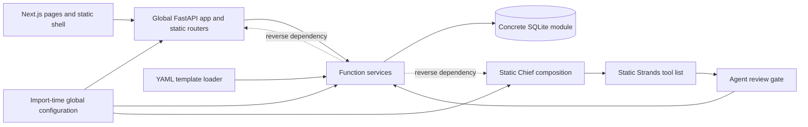
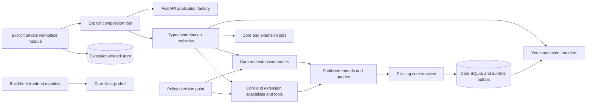

# Workplace extensibility execution plan

Status: active

## Mission

Make Skein demonstrably extensible and upgradeable without creating a workplace fork.

The implementation must preserve the deterministic core, current APIs, security controls, provenance, and content overlays.

## Repository state

- Base branch: `main`
- Base commit: `d3b0f2ebbb6437b9ba34afb398d548ec955d3ae3`
- Feature branch: `feature/workplace-extensibility`
- Historical assessment: `docs/WORKPLACE-EXTENSIBILITY.md`
- Historical scores: modularity 5/10, workplace extensibility 3/10, upgradeability 4/10
- Drift from assessed commit: none
- Pre-existing worktree item: the untracked historical assessment from the preceding architecture review

## Applicable repository instructions

`CLAUDE.md` is the instruction source for this work. This plan does not use `AGENTS.md`.

The implementation retains these constraints:

- The keyless mock-provider path remains functional.
- REST and agent tools use shared application services.
- Services keep ownership of business writes and provenance.
- Migrations remain append-only.
- Activity-chain rows remain immutable.
- Errors remain JSON and do not echo rejected input.
- Existing import paths and configuration names remain compatible.
- The main agent is the only code integrator.

## Current architecture

The directory structure separates concerns. Runtime composition still uses global objects, concrete imports, and fixed registries.

## Target architecture

The target keeps existing services where practical. Public facades protect extensions from private modules and SQLite row shapes.

## Verified baseline findings

| Finding | Status before changes | Evidence |
|---|---|---|
| FastAPI composition is global and static | Confirmed | `backend/app/main.py::app`, `lifespan`, and static `include_router` calls |
| Services are reused but not replaceable | Confirmed | Services import `app.db` and return dictionaries |
| Security registries are static | Confirmed | Review, scope, export, search, provenance, jobs, and tool lists |
| OIDC is configurable but policy is fixed | Confirmed | `routes/deps.py`, administrator list, and one OIDC administrator group |
| Specialist content overlays work | Confirmed | Playbook, persona, and flock overlay loaders |
| Private agent implementations do not compose | Confirmed | `agents/team_agent.py::build_agent` owns construction |
| MCP tool loading lacks Skein policy metadata | Confirmed | `agents/mcp_tools.py` attaches discovered tools directly |
| Frontend composition is static | Confirmed | `layout.tsx`, `nav.tsx`, `section-tabs.tsx`, and theme registries |
| Extension migrations do not exist | Confirmed | `db.MIGRATIONS_DIR` points to one core directory |
| REST is the safest current code boundary | Confirmed | Out-of-process access avoids private imports, but API versioning is absent |

## Baseline verification

| Command | Result | Duration | Notes |
|---|---|---:|---|
| `./scripts/lint.sh` | Passed | 13.74 seconds | Ruff, formatting, mypy, vulture, content validation, theme checks, TypeScript, ESLint, and knip passed |
| `backend/.venv/bin/pytest -q -n auto backend/tests` | Passed: 1,572 | 103.35 seconds | The first run found one date-dependent fixture. The corrected fixture passed alone and in the full suite. |
| `npm test` in `frontend/` | Passed: 225 | 10.45 seconds | 44 Vitest files passed. |
| `npm run build` in `frontend/` | Passed | 12.59 seconds | Production build and TypeScript check passed with network access for Google Fonts. |
| `uv build --out-dir /tmp/skein-baseline-dist backend` | Passed | Not recorded | Built the source distribution and wheel outside the worktree. |
| `scripts/upgrade-path.sh d3b0f2e...` | Passed | 0.80 seconds | Schemas matched and the activity chain verified through sequence 3. |
| `PW_REUSE=1 npx playwright test --reporter=dot` in `frontend/` | Passed: 25 | 138.05 seconds | Used the documented pre-started-server path after the host health poll stalled. |

The first backend run had 1 failure and 1,571 passes. The failing test froze the
schedule service clock at 2026-08-09 but used the real clock for fixture rows.
After UTC crossed into 2026-08-11, the row was two days old instead of three.
The fixture now uses its frozen clock for both service and database dates.

Sandboxed Starlette `TestClient` runs cannot wake a cross-thread asyncio event
loop on this host. A small standard-library diagnostic reproduced the block.
Backend HTTP tests therefore run outside the sandbox. This is an execution
environment constraint, not a Skein failure.

The first direct Playwright launch also stalled in its host-side health poll.
Both endpoints responded to `curl`. Starting the same configured fixtures
explicitly and using the documented `PW_REUSE=1` mode completed all 25 tests.

## Current write-path traces

### Human task update

1. A core page calls `frontend/lib/api.ts::api()` with `PATCH /api/tasks/{id}`.
2. `backend/app/main.py::perimeter_auth` checks the configured credential door.
3. `routes/api.py::patch_task` resolves `CurrentUser` and `ViewerDep`.
4. The route applies the shared write rate limit.
5. The route calls `services/work.py::update_task` with `origin="human"` by default.
6. The service validates status, dates, scope, assignee visibility, delegation, and relationship targets.
7. `db.execute()` writes the task through a concrete SQLite call.
8. `db.log_activity()` appends provenance activity through a second database operation.
9. The service refreshes search and mention projections, then returns a dictionary.
10. FastAPI serializes that dictionary as the response.

Current extension seam: the REST API only.

Current coupling: route models, service arguments, SQLite fields, and response dictionaries form one unversioned contract.

Transaction boundary: `update_task()` does not open a compound transaction. An ambient caller transaction can provide one.

### Agent task update

1. `tools/work.py::update_task` receives the model-selected tool arguments.
2. The tool builds a filtered payload and calls `tools/_gate.py::gated_write`.
3. The gate reads agent identity, requester identity, authority, and the global review setting.
4. A forbidden decision returns a refused receipt.
5. A review decision calls `services/review.py::propose_change`.
6. A direct decision calls the same `services/work.py::update_task` function as REST.
7. Direct service writes use `origin="agent"` and the agent identity.
8. Approved proposals call the registered service handler with `origin="agent_verified"`.
9. The gate records a wrote, queued, refused, or failed receipt.
10. The tool returns a JSON string to Strands.

Current extension seam: none for an in-process private tool. Remote MCP tools bypass this exact gate.

Current coupling: tool inclusion, review entities, authority families, and apply handlers use separate static registries.

### Playbook instantiation

1. REST uses `POST /api/playbooks/instantiate`. Agents use `start_engagement_from_playbook` through the gate.
2. The REST route resolves `CurrentUser`. The agent path resolves agent and requester context.
3. `services/playbooks.py::get_playbook` loads stock and deployment overlay YAML.
4. `playbooks.instantiate` opens `db.transaction()`.
5. `_instantiate` calls engagement, milestone, task, event, note, artifact, and activity services.
6. The ambient transaction gives all SQLite operations one commit boundary.
7. Each created entity receives the caller's actor and origin.
8. Core services append their activity rows. The playbook service appends its own summary row.
9. The service returns created entity dictionaries.

Current extension seam: static template content through `SKEIN_PLAYBOOKS_DIR`.

Current coupling: the interpreter recognizes one fixed YAML shape and directly imports concrete services.

## Assumptions

- The reference extension uses fictional Acme and Atlas names.
- Local fakes replace unavailable workplace credentials and systems.
- Explicit module composition is safer than automatic package discovery.
- One representative extension defines the first public contract surface.
- Existing global configuration remains behind a compatibility adapter.
- SQLite remains the core database.
- A SQLite outbox is sufficient for the first event contract.
- Trusted frontend extensions use build-time composition.

## Explicit non-goals

- No universal plugin base class
- No automatic execution of installed entry points
- No extension access to core SQLite connections
- No generic EAV model
- No arbitrary runtime JavaScript
- No PostgreSQL migration
- No whole-product service rewrite
- No Kafka or new distributed platform
- No repository protocol around every service
- No full workflow language
- No organization-specific condition inside core business logic

## Compatibility strategy

- Keep `app.main:app` as the default deployment entry point.
- Keep existing route paths, request fields, response fields, and configuration names.
- Build new registries from existing core registrations.
- Map current authority and review behavior into the default policy.
- Treat unversioned playbooks, personas, and flocks as schema version 1.
- Add migrations only through new numbered files.
- Add public facades before moving internal services.
- Keep current frontend pages as the default manifest.

## Milestones and dependency order

| Milestone | Depends on | Deliverable | Acceptance evidence | Status |
|---:|---|---|---|---|
| 0 | None | Baseline, traces, plan, and characterization tests | Baseline commands and plan | Complete |
| 1 | 0 | Immutable composition settings and application factory | Existing `app` and external factory tests | Complete |
| 2 | 1 | Typed module, route, job, tool, specialist, context, and handler registries | Collision and compatibility tests | Complete for current extension concerns |
| 3 | 2 | Core policy decision point and capability reporting | Existing behavior tests plus conditional workplace policy | Complete |
| 4 | 3 | Governed private and MCP tool wrappers | Policy, receipt, timeout, and provenance tests | Complete |
| 5 | 2 | Public commands, queries, results, and errors | Reference extension imports only public modules | Complete for task work |
| 6 | 5 | Versioned events and durable outbox | Delivery, retry, and idempotency tests | Complete |
| 7 | 2 | Extension-owned migration and data boundaries | Separate store and migration tests | Complete |
| 8 | 2, 3, 5 | Minimum typed workflow steps | Condition, approval, action, and checkpoint tests | Complete |
| 9 | 2 | Versioned content schemas and deployment validator | Version 1 compatibility and invalid-content tests | Complete |
| 10 | 2, 3 | Frontend extension manifest and UI primitives | External navigation and dashboard card tests | Complete |
| 11 | 3 through 10 | Atlas reference extension | Scenarios A through G | Complete |
| 12 | 11 | Package composition and upgrade rehearsal | Scenario H and derivative builds | Complete |
| 13 | All | Full verification and final documentation | CI-equivalent commands and score evidence | Pending |
| 14 | 13 | Five independent reviewer roles | Review reports and conservative scores | Pending |
| 15 | 14 | Review remediation and repeated verification | No blocker or high finding | Pending |

## Test strategy

- Add characterization tests before each sensitive refactor.
- Use current test registries as the compatibility source.
- Add contract tests that load the reference extension through the real factory.
- Test policy through REST, tools, workflow steps, and capability responses.
- Test outbox persistence, retries, and duplicate delivery.
- Test extension migrations against fresh and upgraded stores.
- Test content validation with legacy and versioned fixtures.
- Test the core frontend and reference manifest through the same composition path.
- Run targeted checks per milestone.
- Run full CI-equivalent checks before each milestone commit.
- Run the complete backend, frontend, build, upgrade, packaging, and end-to-end checks before final review.

## Scenario evidence matrix

| Scenario | Required executable proof | Planned contract | Status |
|---|---|---|---|
| A | Atlas reads and updates work without a core registration edit | Public command, query, event, job, and integration adapter | Complete: reference integration and event test |
| B | Regulated work requires manager review by subject, action, project, and risk | Policy decision and obligations | Complete: reference policy and playbook tests |
| C | Atlas adds navigation and a manager dashboard card | Frontend manifest and capability | Complete: packed-package production build |
| D | Delivery specialist adds prompt, context, tool, and permissions | Specialist, context, tool, and policy contributions | Complete: governed reference tool and specialist test |
| E | Atlas mappings use an extension-owned store and migration | Extension data contract | Complete: isolation and upgrade tests |
| F | Delivery playbook uses a condition, approval, registered action, and checkpoint | Versioned workflow steps | Complete: reference content and API tests |
| G | OIDC groups map to workplace capabilities | Identity attributes and policy | Complete: reference identity and policy test |
| H | The extension moves across compatible core versions without source patches | Compatibility metadata and upgrade test | Complete: installed-wheel upgrade rehearsal |

## Score-to-evidence matrix

Scores can increase only when core behavior and the reference extension use the contract.

| Area | Baseline | Target | Required evidence | Current justified score |
|---|---:|---:|---|---:|
| Overall modularity | 5/10 | 8/10 | Factory, typed registries, public contracts, dependency tests | 7.8/10 before final review |
| Workplace extensibility | 3/10 | 8/10 | Scenarios A through G and private package boundary | 8.0/10 before final review |
| Upgradeability | 4/10 | 8/10 | Compatibility metadata, package build, migration and upgrade rehearsal | 8.0/10 before final review |
| Domain model | 2/5 | 4/5 | Public typed commands, queries, results, and references | 4/5 |
| Service layer | 3/5 | 4/5 | Public facade and no private extension imports | 4/5 |
| API | 2/5 | 4/5 | Router contributions and stable error contracts | 4/5 |
| Authorization | 2/5 | 4/5 | Default and workplace policy tests | 4/5 |
| Agent registration | 2/5 | 4/5 | External specialist uses real Chief composition | 4/5 |
| Tool registration | 2/5 | 4/5 | Governed external tool with receipts | 4/5 |
| Frontend navigation | 1/5 | 4/5 | External manifest drives core shell | 4/5 |
| Policy enforcement | 2/5 | 4/5 | REST, agent, workflow, and capability enforcement | 3/5; core REST migration remains staged |

## Decision log

| Date | Decision | Rationale |
|---|---|---|
| 2026-08-10 | Use `CLAUDE.md` instead of `AGENTS.md` | The user specified the repository instruction source |
| 2026-08-10 | Keep the main agent as the only integrator | This avoids parallel edits and preserves coherent commits |
| 2026-08-10 | Run five reviewer roles in waves if needed | The environment has fewer concurrent subagent slots than reviewer roles |
| 2026-08-10 | Keep existing services behind public facades | A full service rewrite adds risk without extension value |
| 2026-08-10 | Use explicit module lists | Automatic discovery adds supply-chain and startup risk |
| 2026-08-10 | Keep SQLite and add a small outbox | Database replacement is outside the verified requirement |
| 2026-08-10 | Use frozen fixture time for schedule-age tests | Real wall time made the baseline test depend on the UTC date |
| 2026-08-10 | Run HTTP tests outside the sandbox | The host sandbox blocks cross-thread asyncio wakeups |
| 2026-08-10 | Use Playwright's documented pre-started-server mode | The host health poll stalled although both test endpoints responded |
| 2026-08-10 | Preserve request-time auth compatibility | Existing tests and callers can change the legacy config module before a request; the immutable snapshot owns composition, while the request gate keeps the compatibility adapter |
| 2026-08-10 | Require explicit, namespaced module routes | Private routes cannot collide with the core API and installed packages never execute automatically |
| 2026-08-10 | Combine policy by strongest result | A workplace permit cannot erase a core deny; deny outranks review, and review outranks permit |
| 2026-08-10 | Omit unclassified MCP tools | A remote tool with unknown effects cannot bypass Skein policy, review, and receipts |
| 2026-08-10 | Keep extension data in a separate store | This prevents private code from depending on core tables or migration order |
| 2026-08-10 | Send safe event summaries through the outbox | Subscribers receive identifiers and changed field names, not private row bodies |
| 2026-08-10 | Require subscribers to use the event ID for idempotency | A process can stop after an external side effect and before it stores the receipt |
| 2026-08-11 | Keep workflow steps limited to four types | Conditions, approvals, actions, and checkpoints cover the verified scenario |
| 2026-08-11 | Stop direct workflow-playbook instantiation | A caller without the composed action registry must not skip private steps |
| 2026-08-11 | Treat unversioned content as version 1 | Existing playbooks, personas, and flocks remain compatible |
| 2026-08-11 | Compose frontend code before the build | Trusted static imports preserve CSP controls and avoid remote runtime code |
| 2026-08-11 | Hide policy-bound UI until the backend permits it | A failed capability request must not show an action that the backend can refuse |
| 2026-08-11 | Publish JavaScript and declarations for frontend extensions | Next.js does not transpile TSX that a separate package ships from `node_modules` |
| 2026-08-11 | Include SQL migrations in the core wheel | An installed core artifact must initialize its schema without a source checkout |

## Risks

| Risk | Control | Status |
|---|---|---|
| App factory changes startup order | Characterization tests and default `app` parity | Open |
| Policy duplicates current authorization | Default policy delegates to current checks first | Open |
| Public facade leaks internal dictionaries | Typed task views and public errors hide service dictionaries | Controlled for task work |
| Extension migrations enter core security inventories | The store refuses both Skein database paths | Controlled |
| MCP wrappers cannot infer write effects | Explicit metadata and deny-unknown default | Open |
| Next.js build-time extension imports become core hard-coding | External composition manifest and generated build input | Open |
| Scope expands into unused abstractions | Remove any contract unused by core and Acme | Open |

## Progress log

### 2026-08-10

- Read `CLAUDE.md` and the feature reference.
- Confirmed `main` and the assessed commit as the exact base.
- Preserved the historical assessment as pre-existing work.
- Created `feature/workplace-extensibility`.
- Read deployment, CI, package, roadmap, visibility, persona, and flock guidance.
- Completed current architecture and write-path traces.
- Completed the full baseline verification.
- Corrected one date-dependent test fixture without changing product behavior.
- Confirmed 1,572 backend tests, 225 frontend tests, 25 browser tests, lint,
  production build, backend packaging, and the existing upgrade rehearsal.
- Added `create_app(settings, modules)` while retaining `app.main:app`.
- Added immutable settings and registry snapshots.
- Routed built-in routers and jobs through the same contribution types used by
  external modules.
- Added startup validation for versions, namespaces, duplicate IDs and names,
  dependencies, and dependency cycles.
- Added real composition tests for a private route, lifecycle, and catch-up job.
- The first full regression run exposed request-time auth and scheduler-call
  compatibility. Both adapters were restored, and their eight focused tests pass.
- The complete backend regression suite then passed with 1,582 tests in 92.67 seconds.
- Added typed policy, identity, context, tool, and specialist contributions.
- Mapped the existing authority and review behavior into the default policy.
- Applied workplace policy to the existing agent write gate.
- Added `/api/capabilities` for capability-aware presentation.
- Added governed Strands wrappers with typed input/output, stable names,
  effects, risk, allowlists, timeouts, safe error codes, and receipt behavior.
- Added private specialist prompt, context, and tool composition without a
  private import in the Chief-of-Staff implementation.
- Added MCP governance metadata and a deny-by-omission rule for unclassified
  remote tools.
- Confirmed the full backend suite passes with 1,592 tests after this slice.
- Added typed task commands, task views, command context, and machine-readable
  public errors for extension packages.
- Kept public task writes on the existing service path and in one transaction
  with their outbox event.
- Added versioned task events, durable retries, subscriber receipts, and
  visibility filters. Event payloads contain no task body text.
- Added extension-owned SQLite stores and isolated append-only migrations.
- Added a startup migration contribution that never opens a Skein database.
- Confirmed 65 focused contract, migration, scope, and composition tests.
- Confirmed the full backend suite passes with 1,601 tests after this slice.

### 2026-08-11

- Added governed workflow-action contributions with schemas, versions,
  effects, risk, policy actions, timeouts, and safe error codes.
- Added typed condition, approval, action, and checkpoint steps.
- Connected workflow-backed playbooks to the real application registry.
- Refused direct instantiation when a workflow needs composed actions.
- Added schema version 1 validation for playbooks, personas, and flocks.
- Added `python -m app.content` for deployment repository validation.
- Confirmed 102 focused workflow, content, persona, flock, and API tests.
- The first full suite found one missing activity-feed verb. The workflow
  action now has a registered reader-facing verb.
- Confirmed the full backend suite passes with 1,610 tests after remediation.
- Added a versioned frontend extension manifest with compatibility and
  namespace checks.
- Added build-time composition through `SKEIN_FRONTEND_EXTENSIONS`.
- Added policy-aware navigation and manager dashboard card contributions.
- Exported a narrow frontend API with the shared card and authenticated API
  client.
- Confirmed 229 frontend tests, TypeScript, ESLint, knip, and the production
  build pass.
- Added the fictional Atlas private extension with a router, scheduled job,
  integration, policy, identity map, governed tool, specialist, context source,
  event subscriber, workflow action, data store, and migration stream.
- Added versioned Atlas playbook, persona, and flock overlays.
- Added a separately packed frontend extension with policy-aware navigation and
  a manager dashboard card. Its real Next.js production build passes.
- Added a derivative image, Kustomize overlay, and external Secret reference.
- Added artifact-level compatibility metadata and an installed-wheel upgrade
  rehearsal. The rehearsal found and corrected missing migrations in the core
  wheel, then passed with separate Skein and Atlas artifacts.
- Confirmed 42 focused reference and extension tests and all reference content
  validation.

## Review findings

No independent review has run.

## Remediation status

No review remediation is pending.

## Final results

Pending implementation and independent review.
